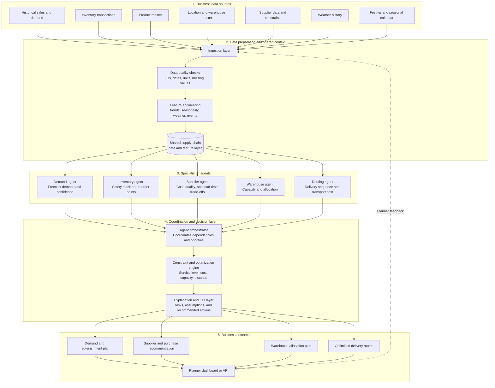
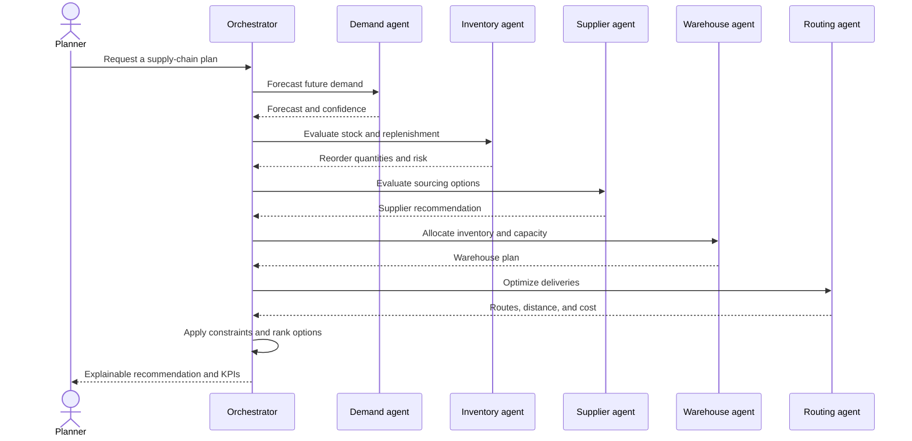
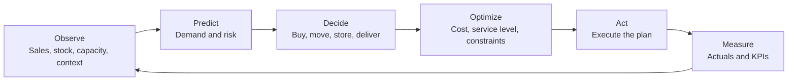
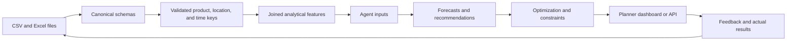

# AI Multi-Agent Supply Chain

An AI-powered decision platform for planning and optimizing an end-to-end supply chain. The project combines demand forecasting, inventory intelligence, supplier selection, warehouse planning, and route optimization into one coordinated workflow.

## End-to-End Project Blueprint

The diagram below shows how raw business data becomes an explainable supply-chain decision.



## How the Agents Work Together



## Core Decision Loop



## Main Capabilities

| Capability | Main question answered | Typical output |
| --- | --- | --- |
| Demand intelligence | What will customers need, and how certain is the forecast? | Forecast, confidence, and demand drivers |
| Inventory intelligence | What should be reordered, where, and when? | Safety stock, reorder point, and priority |
| Supplier selection | Which source best balances cost, quality, and lead time? | Ranked supplier and purchase recommendation |
| Warehouse management | Where should stock be stored or allocated? | Capacity-aware allocation plan |
| Route optimization | How should deliveries be sequenced? | Feasible route, distance, and transport estimate |
| Decision coordination | How do separate recommendations become one plan? | Explainable, constraint-aware action plan |

## Data Flow



## Recommended Project Structure

```text
ai-multi-agent-supply-chain/
├── Datasets/              # CSV and Excel source data
├── src/
│   ├── ingestion/          # Load and normalize source files
│   ├── features/           # Build shared analytical features
│   ├── agents/             # Demand, inventory, supplier, warehouse, route agents
│   ├── optimization/       # Constraints and objective functions
│   └── orchestration/      # Coordinate agents and decisions
├── tests/                  # Data, model, and workflow tests
├── notebooks/              # Exploration and evaluation
└── README.md
```

## Getting Started

Clone the repository and install Git LFS when working with large Excel datasets:

```bash
git clone https://github.com/mondalsahil302-ui/ai-multi-agent-supply-chain.git
cd ai-multi-agent-supply-chain
git lfs install
git lfs pull
```

The current `main` branch is the project documentation and architecture baseline. The data-backed implementation is being developed on the project feature branch.

## Data Quality Rules

Before training or running an agent:

- Validate product and location IDs against their master tables.
- Standardize dates, quantities, currencies, and units of measure.
- Check duplicate transactions and missing historical periods.
- Join weather by week and events by date or an explicitly defined look-ahead window.
- Record forecast accuracy, service level, stockout rate, inventory value, and route cost.
- Preserve the assumptions used by every recommendation so planners can audit decisions.

## Implementation Roadmap

1. Define canonical schemas for demand, inventory, suppliers, warehouses, and routes.
2. Add reproducible ingestion, validation, and feature-engineering pipelines.
3. Implement each specialist agent with measurable evaluation criteria.
4. Add the orchestrator and constraint-based optimization layer.
5. Expose recommendations through a planner dashboard or API.
6. Add monitoring for drift, forecast accuracy, service level, and operating cost.

## License and Data Use

Add the project license and dataset provenance before public distribution. Confirm that every third-party, synthetic, or organization-provided dataset is authorized for the intended use.
