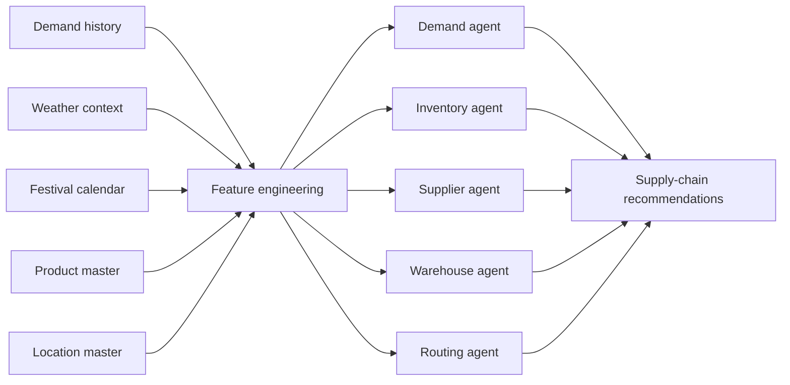
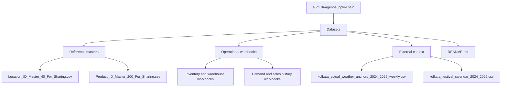
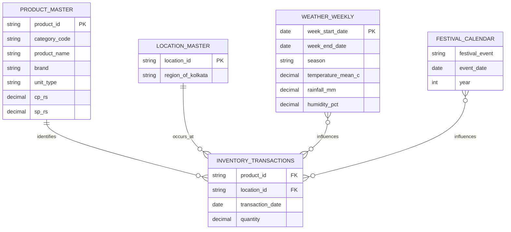
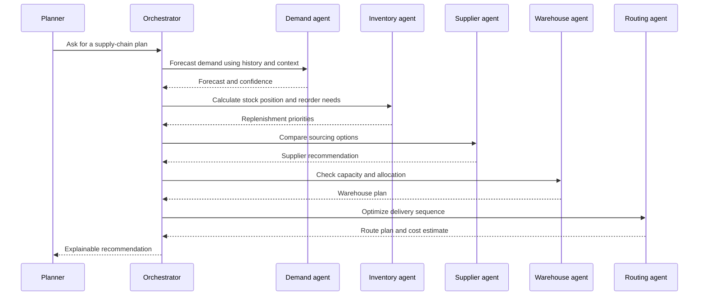

# AI Multi-Agent Supply Chain

An AI-powered supply-chain decision platform for demand planning, inventory intelligence, supplier selection, warehouse operations, and route optimization.

This repository currently provides the project data foundation: operational workbooks, product and location masters, and Kolkata weather and festival context. The workbook files are stored with [Git LFS](https://git-lfs.com/) because several are larger than GitHub's normal file-size limit.

## What This Project Connects



The agents are designed to share the same trusted product, location, and time-based context. This makes recommendations easier to compare and gives downstream optimization a consistent input layer.

## Repository Map



## Dataset Catalog

### Reference masters

| File | Purpose | Key fields |
| --- | --- | --- |
| `Location_ID_Master_40_For_Sharing.csv` | 40 Kolkata locations and their regions | `location_id`, `region_of_kolkata` |
| `Product_ID_Master_200_For_Sharing.csv` | Product, brand, category, pack-size, cost, and selling-price reference | `product_id`, `category_code`, `product_name`, `brand`, `unit_type`, `cp_*_rs`, `sp_*_rs` |

### Operational workbooks

| File | Intended use |
| --- | --- |
| `Complete dataset for inventory.xlsx` | Inventory analysis and replenishment inputs |
| `Inventory agent trasaction.xlsx` | Inventory transaction records |
| `Demand of last 2 years.xlsx` | Historical demand analysis |
| `SELL of past 2 years.xlsx` | Historical sales analysis |
| `Final product list.xlsx` | Product-level operational reference |
| `Warehouselist.xlsx` | Warehouse reference data |
| `final_warehouse_dataset_kolkata.xlsx` | Kolkata warehouse dataset |
| `final_demand_agent_training_2_years_kolkata (1).xlsx` | Demand-agent training data |

### Context datasets

| File | Purpose |
| --- | --- |
| `kolkata_actual_weather_anchors_2024_2025_weekly.csv` | Weekly temperature, rainfall, humidity, season, and weather condition |
| `kolkata_festival_calendar_2024_2025.csv` | Festival event dates for calendar-based demand features |

## Data Relationships



The exact columns in the Excel workbooks may vary by file. Treat the two CSV masters as the stable identifiers when joining product, location, and contextual data.

## Agent Decision Flow



## Typical Data Pipeline


## Getting Started

### 1. Clone the repository

```bash
git clone https://github.com/mondalsahil302-ui/ai-multi-agent-supply-chain.git
cd ai-multi-agent-supply-chain
```

### 2. Install Git LFS and fetch the workbooks

```bash
git lfs install
git lfs pull
```

Verify that LFS is active:

```bash
git lfs ls-files
```

### 3. Explore the data

The CSV files can be opened directly. The Excel workbooks require an Excel-compatible reader such as Microsoft Excel, LibreOffice, or a Python package such as `pandas` with `openpyxl`.

Example Python inspection:

```python
import pandas as pd

products = pd.read_csv("Datasets/Product_ID_Master_200_For_Sharing.csv")
locations = pd.read_csv("Datasets/Location_ID_Master_40_For_Sharing.csv")

print(products.shape)
print(locations.shape)
print(products[["product_id", "product_name", "brand"]].head())
```

## Data Quality Checks

Before training an agent or joining datasets, check that:

- `product_id` values exist in `Product_ID_Master_200_For_Sharing.csv`.
- `location_id` values exist in `Location_ID_Master_40_For_Sharing.csv`.
- Dates use a consistent format and timezone assumption.
- Quantity, cost, and price fields are numeric and use consistent units.
- Weather data is joined by week and festival data is joined by event date or a defined look-ahead window.
- Duplicate transaction rows are identified before aggregation.

## Large File Workflow

Excel files are tracked with Git LFS. Keep that enabled when adding or updating large workbooks:

```bash
git lfs track "Datasets/*.xlsx"
git add .gitattributes Datasets/
git commit -m "Update supply chain datasets"
git push
```

Do not commit generated exports, temporary Excel lock files such as `~$*.xlsx`, credentials, or API keys.

## Project Status

The current repository is the data layer for the multi-agent supply-chain project. The next implementation milestones are:

1. Define canonical schemas for demand, inventory, warehouse, supplier, and route records.
2. Add reproducible data validation and feature-engineering scripts.
3. Implement the agent orchestrator and model evaluation reports.
4. Add tests for joins, forecasts, inventory policies, and route constraints.

## License and Data Use

Add the project license and dataset provenance here before public distribution. Confirm that all third-party, synthetic, or organization-provided data is authorized for the intended use.
