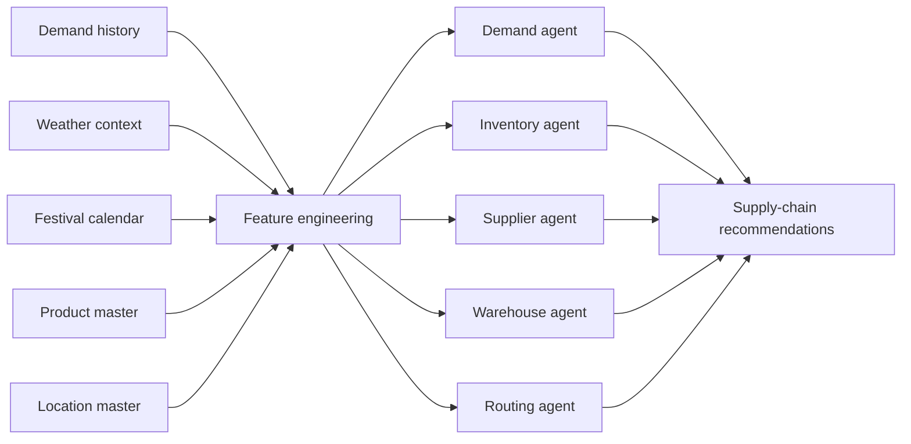
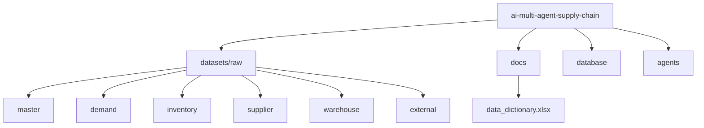
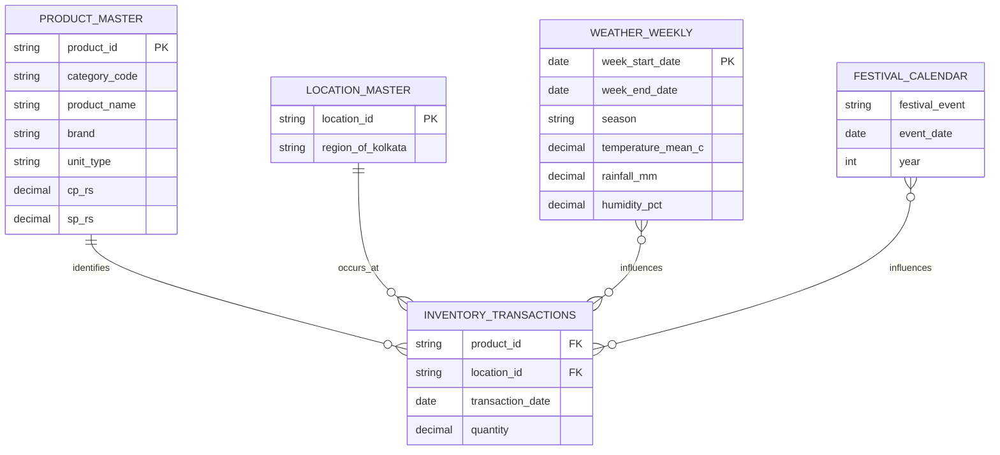
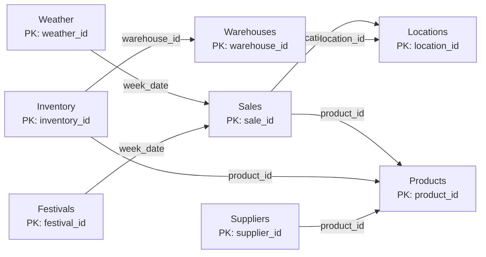
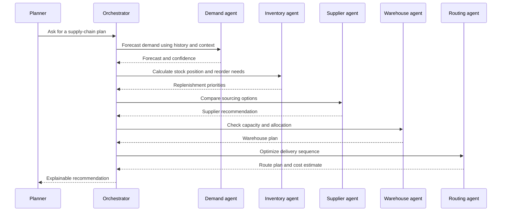

# AI Multi-Agent Supply Chain

An AI-powered supply-chain decision platform for demand planning, inventory intelligence, supplier selection, warehouse operations, and route optimization.

The project is being built in phases. The current focus is **Phase 1: Data Foundation**: establish a clean, reproducible, and documented data layer before preprocessing, PostgreSQL, machine learning, or agents are added. Excel workbooks are stored with [Git LFS](https://git-lfs.com/) because several are larger than GitHub's normal file-size limit.

## Current Phase

### Phase 1: Data Foundation

The data foundation follows this order:

1. Audit and inventory the raw datasets.
2. Organize raw files by business domain.
3. Define the logical database design in the [data dictionary](docs/data_dictionary.xlsx).
4. Add preprocessing and validation without changing raw files.
5. Create PostgreSQL tables from the approved dictionary.

The repository currently completes the first three design activities. PostgreSQL tables, preprocessing pipelines, and AI agents are intentionally not part of the raw-data foundation yet.

## Phase 1 Progress

- ✅ Phase 1.1 Dataset Organization
- ✅ Phase 1.2 Data Dictionary
- ✅ Phase 1.3 Data Lineage & Entity Mapping
- ⏳ Phase 1.4 Data Validation

## What This Project Connects



The agents are designed to share the same trusted product, location, and time-based context. This makes recommendations easier to compare and gives downstream optimization a consistent input layer.

## Repository Map



Only raw data is stored under `datasets/raw`. The raw files keep their original filenames and must not be edited in place. `database/` and `agents/` are reserved for later phases.

## Dataset Catalog

The audit found 13 datasets across six domains. The names below are the filenames currently present in the repository; no duplicate datasets have been merged or renamed.

### 1. Master data

Master data identifies the entities used throughout the system. These files should change less frequently than operational data.

| File | What it represents | Planned logical table |
| --- | --- | --- |
| `datasets/raw/master/products.csv` | Product identity and reference records | Products |
| `datasets/raw/master/locations.csv.csv` | Kolkata location and region records | Locations |
| `datasets/raw/master/Final product list.xlsx` | Product-level reference data | Products |

### 2. Demand data

Demand data records historical customer activity and provides the main training inputs for the future Demand Agent.

| File | What it represents | Planned logical table |
| --- | --- | --- |
| `datasets/raw/demand/sales_history.xlsx` | Historical sales observations | Sales |
| `datasets/raw/demand/Demand of last 2 years.xlsx` | Two-year demand history | Sales |
| `datasets/raw/demand/final_demand_agent_training_2_years_kolkata (1).xlsx` | Demand-agent training dataset | Sales |

### 3. Inventory data

Inventory data describes current stock and stock movements. It will support replenishment calculations and the future Inventory Agent.

| File | What it represents | Planned logical table |
| --- | --- | --- |
| `datasets/raw/inventory/inventory_stock.xlsx` | Current inventory stock snapshot | Inventory |
| `datasets/raw/inventory/inventory_transactions.xlsx` | Inventory stock movements | Inventory or inventory transactions |

### 4. Supplier data

Supplier data supports procurement decisions, including supplier-product relationships, lead times, and cost comparisons.

| File | What it represents | Planned logical table |
| --- | --- | --- |
| `datasets/raw/supplier/supplier_inventory.xlsx` | Supplier and supply inventory information | Suppliers |

### 5. Warehouse data

Warehouse data describes warehouse identity, capacity, and the locations served. It will later support allocation and warehouse planning.

| File | What it represents | Planned logical table |
| --- | --- | --- |
| `datasets/raw/warehouse/warehouses.xlsx` | Warehouse reference records | Warehouses |
| `datasets/raw/warehouse/final_warehouse_dataset_kolkata.xlsx` | Kolkata warehouse dataset | Warehouses |

### 6. External intelligence

External data provides context that can influence demand. Weather joins by week or reference date, while festival information joins by event date or an agreed look-ahead window.

| File | What it represents | Planned logical table |
| --- | --- | --- |
| `datasets/raw/external/weather_weekly.csv` | Weekly weather observations | Weather & Festival |
| `datasets/raw/external/festival_calendar.csv` | Festival and holiday calendar | Weather & Festival |

The initial planning notes referenced several different filenames, such as `Product_ID_Master_200_For_Sharing.csv` and `SELL of past 2 years.xlsx`. Those files were not present during the repository audit, so the actual files above are the source of truth for the current phase.

## Data Dictionary

[docs/data_dictionary.xlsx](docs/data_dictionary.xlsx) is the database blueprint for Phase 1.2. It contains seven sheets:

| Sheet | Purpose |
| --- | --- |
| `Products` | Product identifiers, names, brands, categories, units, and prices |
| `Locations` | Location identifiers, region names, and coordinates |
| `Warehouses` | Warehouse identifiers, locations, capacities, and service radii |
| `Sales` | Weekly product sales, units, revenue, and business keys |
| `Inventory` | Warehouse-product stock, shelf, quantity, and reorder information |
| `Suppliers` | Supplier-product relationships, lead times, and cost prices |
| `Weather_Festival` | Weather measures, festival names, and holiday flags |

Each sheet records the proposed column name, PostgreSQL type, key or foreign-key constraint, nullability, description, and source dataset. The workbook defines the logical design; it does not create PostgreSQL tables or alter raw files.

## Data Relationships



The exact columns in the raw workbooks may vary by file. Treat the approved data dictionary as the target logical design and the raw files as immutable source material until a preprocessing decision has been documented.

## Entity Mapping



This mapping is the reference layer used before feature engineering and 30-day demand prediction. See [Entity Mapping](docs/Entity_Mapping.md) for the collection definitions and lineage notes.

## Agent Decision Flow



## Phase 1 Data Rules

- Never edit raw files in place.
- Keep every dataset under its assigned `datasets/raw/<domain>/` directory.
- Preserve the original filename of every raw dataset.
- Do not merge duplicate or overlapping datasets during the audit stage.
- Do not create processed folders until preprocessing is approved.
- Do not create PostgreSQL tables until the data dictionary is approved.

## Typical Data Pipeline


## Getting Started

### 1. Clone the repository

```bash
git clone https://github.com/mondalsahil302-ui/ai-multi-agent-supply-chain.git
cd ai-multi-agent-supply-chain
```

### 2. Install Git LFS and fetch the workbooks

```bash
git lfs install
git lfs pull
```

Verify that LFS is active:

```bash
git lfs ls-files
```

### 3. Explore the data

The CSV files can be opened directly. The Excel workbooks require an Excel-compatible reader such as Microsoft Excel, LibreOffice, or a Python package such as `pandas` with `openpyxl`.

Example Python inspection:

```python
import pandas as pd

products = pd.read_csv("datasets/raw/master/products.csv")
locations = pd.read_csv("datasets/raw/master/locations.csv.csv")

print(products.shape)
print(locations.shape)
print(products[["product_id", "product_name", "brand"]].head())
```

## Data Quality Checks

Before training an agent or joining datasets, check that:

- `product_id` values exist in `datasets/raw/master/products.csv` or the approved product reference.
- `location_id` values exist in `datasets/raw/master/locations.csv.csv`.
- Dates use a consistent format and timezone assumption.
- Quantity, cost, and price fields are numeric and use consistent units.
- Weather data is joined by week and festival data is joined by event date or a defined look-ahead window.
- Duplicate transaction rows are identified before aggregation.

## Large File Workflow

Excel files are tracked with Git LFS. Keep that enabled when adding or updating large workbooks:

```bash
git lfs track "datasets/raw/**/*.xlsx"
git add .gitattributes datasets/
git commit -m "Update supply chain datasets"
git push
```

Do not commit generated exports, temporary Excel lock files such as `~$*.xlsx`, credentials, or API keys.

## Project Status

The current repository is the data layer for the multi-agent supply-chain project. The next implementation milestones are:

1. Define canonical schemas for demand, inventory, warehouse, supplier, and route records.
2. Add reproducible data validation and feature-engineering scripts.
3. Implement the agent orchestrator and model evaluation reports.
4. Add tests for joins, forecasts, inventory policies, and route constraints.

## License and Data Use

Add the project license and dataset provenance here before public distribution. Confirm that all third-party, synthetic, or organization-provided data is authorized for the intended use.
