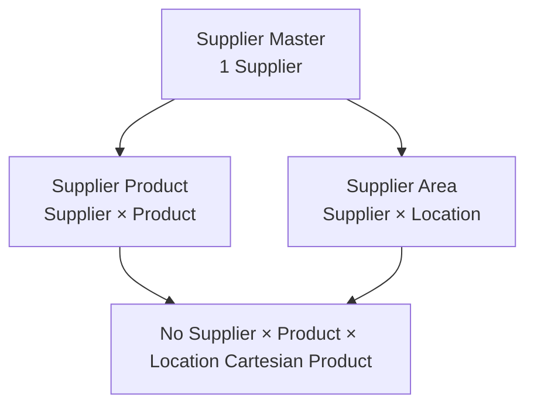
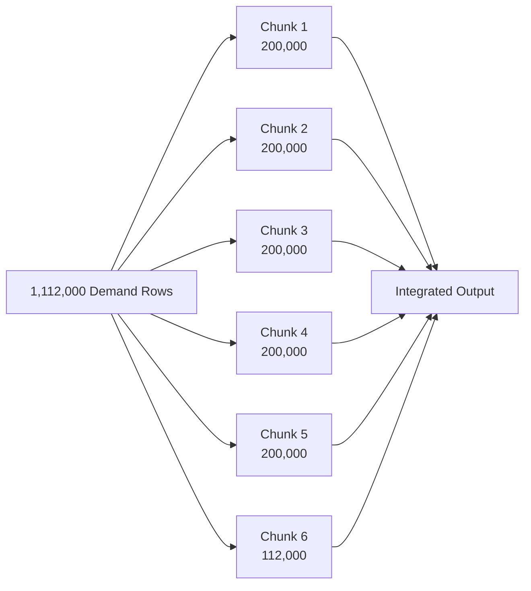
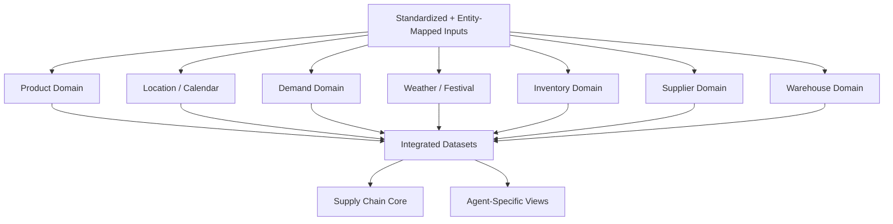
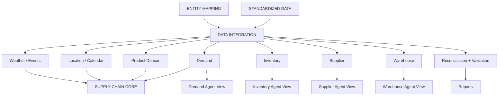

# Data Integration Layer README

## 1. What is Data Integration?

**Data Integration** is the process of combining related standardized datasets using verified entity mappings so that information describing the same business entities, places, products, warehouses, suppliers, and time periods can be used together.

In this project, Data Integration is the layer after:

```text
RAW DATA
    ↓
STAGING
    ↓
STANDARDIZATION
    ↓
ENTITY MAPPING
    ↓
DATA INTEGRATION
```

The integration layer takes:

```text
Standardized Datasets
        +
Canonical Entity Maps
        ↓
Controlled Joins / Enrichment
        ↓
Integrated Domain Datasets
        ↓
Cross-Domain Core
        ↓
Agent-Specific Integrated Views
```

The notebook implements this layer in:

```text
04_data_integration.ipynb
```

---

# 2. What Does Data Integration Do?

The integration layer performs:

```text
✓ Controlled entity joins
✓ Dimensional enrichment
✓ Attribute alignment
✓ Relationship assembly
✓ Weekly aggregation where needed to preserve grain
✓ Primary-key checks
✓ Foreign-key checks
✓ Duplicate checks
✓ Grain checks
✓ Row reconciliation
✓ Provenance preservation
✓ Cross-domain validation
```

The layer does **not** perform:

```text
✗ Feature engineering
✗ Lag features
✗ Rolling averages
✗ Forecasting
✗ Target generation
✗ ML model training
✗ LLM reasoning
✗ Agent prompts
✗ Route optimization
✗ Risk scoring
✗ Kafka / MongoDB streaming
✗ Synthetic entity creation
```

These scope boundaries are explicitly defined in the notebook.

---

# 3. Simple Meaning

A simple way to understand Data Integration is:

> **Take separate but related datasets and connect them using verified keys without changing what their rows mean.**

### Example

Suppose we have:

```text
Product Master

product_id | product_name
P001       | Rice
```

and:

```text
Sales

product_id | units_sold
P001       | 500
```

Integration connects them:

```text
P001
 ↓
Product Master
 ↓
Rice

+
Sales
 ↓
500 units sold
```

Integrated result:

```text
product_id | product_name | units_sold
P001       | Rice         | 500
```

---

# 4. Integration vs Previous Layers

| Layer | Main Purpose |
|---|---|
| Staging | Make source data technically valid |
| Standardization | Make representations consistent |
| Entity Mapping | Establish canonical identities and relationships |
| Data Integration | Combine related datasets safely |
| Feature Engineering | Derive analytical/model features |

### Example

```text
Staging:
" P001 "

↓

Standardization:
"P001"

↓

Entity Mapping:
P001 → Canonical Product P001

↓

Integration:
P001 + sales + category + location + week

↓

Feature Engineering:
lag_1_demand, rolling_mean_4, etc.
```

---

# 5. Core Principle: Grain

## What is Grain?

**Grain tells us what exactly one row represents.**

This is one of the most important concepts in Data Integration.

### Example

If a dataset has:

```text
1 row = 1 product
```

its grain is:

```text
Product
```

If a dataset has:

```text
1 row = 1 location × 1 product × 1 week
```

its grain is:

```text
Location × Product × Week
```

If a dataset has:

```text
1 row = 1 warehouse × 1 product × 1 snapshot date
```

its grain is:

```text
Warehouse × Product × Snapshot
```

---

# 6. Why Grain Matters

Suppose the demand table contains:

```text
Garia × P001 × W10 = 100 units
```

Now imagine a supplier table has:

```text
P001 × Supplier-A
P001 × Supplier-B
```

If we join demand to supplier only using `product_id`, the result becomes:

```text
Garia × P001 × W10 × Supplier-A
Garia × P001 × W10 × Supplier-B
```

One demand row became two rows.

This is called **row multiplication**.

Therefore, the integration layer must check whether a join preserves the intended grain.

---

# 7. Row Multiplication

### Meaning

**Row multiplication** occurs when a join produces more rows than expected.

### Example

Input:

```text
Demand
1 row
```

Right table:

```text
Supplier
2 matching rows
```

Join:

```text
1 × 2 = 2 rows
```

This may be wrong when the output is supposed to remain at:

```text
1 location × 1 product × 1 week
```

---

# 8. Cartesian Explosion

### Meaning

A **Cartesian product** occurs when combinations between multiple dimensions grow excessively.

The notebook explicitly warns about:

```text
Supplier × Product × Location
```

With:

```text
200 suppliers
200 products
40 locations
```

a theoretical full Cartesian combination would be:

```text
200 × 200 × 40 = 1,600,000 rows
```

The project does **not** create that unnecessary combination.

Instead, supplier information is kept in separate relationship-aware datasets:

```text
Supplier
Supplier × Product
Supplier × Location
```

---

# 9. Anti-Cartesian Architecture



---

# 10. Join

### Meaning

A **join** combines rows from two datasets using one or more matching columns.

### Example

```text
Product

product_id | product_name
P001       | Rice
```

```text
Sales

product_id | units_sold
P001       | 500
```

Join:

```text
product_id
```

Result:

```text
product_id | product_name | units_sold
P001       | Rice         | 500
```

---

# 11. Join Key

### Meaning

The **join key** is the field used to connect two datasets.

Examples:

```text
product_id
location_id
warehouse_id
supplier_id
week_id
```

### Example

```text
Product.product_id
        =
Sales.product_id
```

---

# 12. Composite Join Key

Sometimes one field is not enough.

### Example

Inventory may require:

```text
warehouse_id + product_id + snapshot_date
```

A relationship is then verified using the full combination.

Example:

```text
WH-KOL-001
+
P001
+
2026-08-31
```

---

# 13. Deterministic Join

### Meaning

A **deterministic join** is a join where the relationship is defined by known keys and expected cardinality.

Example:

```text
Product Master
product_id = P001

        ↓ exact key

Product Mapping
product_id = P001
```

No guessing is required.

---

# 14. Canonical Entity

### Meaning

A **canonical entity** is the single trusted representation of an entity used across datasets.

Example:

```text
P001
```

should refer to the same product wherever it appears.

The Entity Mapping layer creates these canonical relationships before Data Integration uses them.

---

# 15. Dimensional Enrichment

### Meaning

**Dimensional enrichment** means adding descriptive attributes from a dimension table to a fact table.

### Example

Demand:

```text
location_id = LOC001
product_id = P001
units_sold = 500
```

Product dimension:

```text
P001 = Rice
category = Rice & Staples
brand = India Gate
```

After enrichment:

```text
LOC001 | P001 | Rice | Rice & Staples | India Gate | 500
```

The demand record remains a demand record.

---

# 16. Attribute Alignment

### Meaning

**Attribute alignment** means ensuring related datasets refer to the same entity using the same verified identity and compatible representation.

Example:

```text
Demand:
product_id = P001

Product:
product_id = P001
```

The attributes are aligned through the canonical product key.

---

# 17. Bridge Table

### Meaning

A **bridge table** stores a relationship between two entities, especially when the relationship is many-to-many.

### Example — Supplier and Product

One supplier can supply many products.

One product can be supplied by many suppliers.

So:

```text
Supplier
    ↓
Supplier × Product
    ↑
Product
```

The bridge table is:

```text
supplier_product_integrated.csv
```

---

# 18. Relationship Example

```text
Supplier SUP001
    ├── Product P001
    ├── Product P002
    └── Product P003

Product P001
    ├── Supplier SUP001
    └── Supplier SUP002
```

This is a many-to-many relationship represented using the bridge table.

---

# 19. Referential Integrity

### Meaning

**Referential integrity** means foreign keys must resolve to valid master entities.

Example:

```text
Inventory
warehouse_id = WH-KOL-001
```

must resolve to:

```text
Warehouse Master
warehouse_id = WH-KOL-001
```

If the master record does not exist, the relationship is invalid.

---

# 20. Row Reconciliation

### Meaning

**Row reconciliation** compares input and output row counts after an integration operation.

Example:

```text
Input = 3,000
Output = 3,000
```

This indicates that no rows were unexpectedly added or lost.

### Example of Failure

```text
Input = 3,000
Output = 3,400
```

There are:

```text
400 unexpected additional rows
```

This requires investigation.

---

# 21. Why Reconciliation Matters

A join can technically execute without any Python or SQL error while still producing incorrect data.

Example:

```text
Expected:
1,112,000 demand rows

Actual:
1,180,000 rows
```

The join has probably multiplied some records.

Therefore:

> **Successful execution does not mean successful integration.**

The notebook explicitly performs reconciliation checks.

---

# 22. Cardinality

### Meaning

**Cardinality** describes how many records are expected to match between two datasets.

Examples:

```text
1 : 1
1 : Many
Many : Many
```

### Example — Product

```text
1 Product → 1 Product Master row
```

### Example — Warehouse Picker

```text
1 Warehouse → Many Pickers
```

### Example — Supplier Product

```text
1 Supplier ↔ Many Products
1 Product  ↔ Many Suppliers
```

This many-to-many relationship requires a bridge table.

---

# 23. One-to-One Example

Inventory integration expects:

```text
Storage Assignment
1 warehouse × 1 product
```

to match the corresponding operational record deterministically.

The notebook verifies that storage assignment is exactly **1:1 on `(warehouse_id, product_id)`**.

---

# 24. One-to-Many Example

Warehouse to Picker:

```text
WH-KOL-001
    ↓
PKR-001
PKR-002
...
PKR-050
```

One warehouse has many picker records.

The integrated grain becomes:

```text
warehouse × picker
```

not simply:

```text
warehouse
```

---

# 25. Many-to-Many Example

Supplier and Product:

```text
Supplier A → P001, P002, P003
Supplier B → P001, P003
Product P001 → Supplier A, Supplier B
```

This requires:

```text
supplier_product_integrated.csv
```

rather than storing everything in a single supplier row.

---

# 26. Weekly Aggregation

### Meaning

Some source information has a finer grain than the integrated dataset requires.

The notebook aggregates festival information at the **weekly level** before joining it with weekly facts.

### Why?

Suppose a week contains:

```text
Monday → Festival A
Wednesday → Festival B
Saturday → Festival C
```

A direct join would create multiple rows for the same week.

Instead, the notebook creates one weekly record:

```text
week_id
holiday_flag
festival_count
festival_names
```

---

# 27. Weekly Aggregation Example

Before:

```text
Week W050

Festival A
Festival B
Festival C
```

After weekly aggregation:

```text
week_id = W050
holiday_flag = True
festival_count = 3
festival_names = "Festival A; Festival B; Festival C"
```

Now:

```text
1 week = 1 row
```

The weekly grain is preserved.

---

# 28. Chunked Processing

### Meaning

Large datasets are processed in smaller chunks instead of loading everything into memory.

The notebook processes demand integration using:

```text
200,000 records per chunk
```

### Example

```text
1,112,000 records
        ↓
200,000
200,000
200,000
200,000
200,000
112,000
```

Each chunk is integrated and written to the output.

---

# 29. Chunked Processing Visualization



The notebook reports:

```text
Completed demand_integrated.csv:
1,112,000 rows
```

---

# 30. Provenance

### Meaning

**Provenance** describes where the data came from and what its source status is.

This is especially important for reconstructed data.

The inventory transaction dataset is classified as:

```text
RECONSTRUCTED_SYNTHETIC
```

---

# 31. Synthetic Provenance Example

The integrated transaction data retains:

```text
record_status = RECONSTRUCTED_SYNTHETIC
source_basis = preserved
```

It must not be presented as observed real-world telemetry.

The notebook's QA confirms:

```text
417,000 input rows
417,000 output rows
100% RECONSTRUCTED_SYNTHETIC
```

---

# 32. Deferred Dataset

### Meaning

A **deferred dataset** is intentionally excluded because an authoritative source is not available.

The notebook marks:

```text
Vehicle Master = DEFERRED
Order Data     = DEFERRED
```

No dummy records are generated.

---

# 33. Deferred Example — Vehicle Master

The integration layer does not create:

```text
Vehicle-001
Vehicle-002
Vehicle-003
```

just because routing may eventually need vehicles.

Instead:

```text
Vehicle Master
     ↓
DEFERRED
```

This keeps the dataset governance honest.

---

# 34. Deferred Example — Order Data

Demand records are not converted into fabricated customer orders.

For example:

```text
Demand = 500 units
```

does **not** automatically become:

```text
Order ID = ORD001
Customer = Unknown
Quantity = 500
```

The notebook explicitly prohibits this inference.

---

# 35. Integrated Dataset Structure

The integration notebook organizes outputs by business domain:



---

# 36. Block-by-Block Integration Workflow

The notebook contains **15 integration blocks**:

```text
Block 1  → Data Integration Setup & Governance
Block 2  → Integration Input Catalog
Block 3  → Product & Variant Integration
Block 4  → Location & Calendar Integration
Block 5  → Demand Integration
Block 6  → Weather & Festival Integration
Block 7  → Inventory Integration
Block 8  → Inventory Transaction Integration
Block 9  → Supplier Integration
Block 10 → Warehouse Integration
Block 11 → Cross-Domain Supply-Chain Core
Block 12 → Agent-Specific Integrated Views
Block 13 → Integration Reconciliation Report
Block 14 → Integration Validation Report
Block 15 → Final Integration Report & Manifest
```

---

# 37. Block 1 — Data Integration Setup & Governance

The notebook initializes:

```text
Datasets/standardized/
Datasets/entity_mapping/
Datasets/integrated/
Datasets/reports/
```

It also sets:

```text
integration_timestamp
integration_version = v1.0
```

### Important Rule

The following layers remain immutable:

```text
raw_dataset
staging
standardized
entity_mapping
```

Only:

```text
Datasets/integrated/
Datasets/reports/
```

receive outputs from this phase.

---

# 38. Block 1 — Join Cardinality Guard

The notebook defines:

```text
check_join_cardinality()
```

This helper verifies that the right-side join keys are unique.

### Example

Right table:

```text
product_id | product_name
P001       | Rice
P002       | Oil
```

Keys are unique.

```text
PASS
```

But:

```text
product_id | product_name
P001       | Rice
P001       | Premium Rice
```

contains a duplicate join key.

The helper raises a cardinality violation instead of allowing uncontrolled row multiplication.

---

# 39. Block 2 — Integration Input Catalog

Before joins begin, the notebook creates an **Integration Input Catalog**.

It documents:

```text
dataset name
input file
grain
primary key
entity type
row count
mapping dependency
availability status
```

The notebook registers:

```text
19 datasets
```

including deferred entries.

The QA reports:

```text
17 available datasets
Vehicle Master = DEFERRED
Order Data = DEFERRED
Inventory Transactions =
INCLUDED_RECONSTRUCTED_SYNTHETIC
```

---

# 40. Block 3 — Product & Variant Integration

### Product

```text
Input = 200
Output = 200
Grain = 1 product
Key = product_id
```

### Product Variant

```text
Input = 1,000
Output = 1,000
Grain = 1 product × 1 variant
Key = variant_id
```

### Why separate them?

A product may have multiple pack sizes.

Example:

```text
P001
 ├── 100 g
 ├── 250 g
 ├── 500 g
 ├── 1 kg
 └── 2 kg
```

If pack-size rows were merged into the single product grain, product rows could multiply.

Therefore the notebook keeps:

```text
product_integrated.csv
product_variant_integrated.csv
```

separate.

---

# 41. Block 4 — Location & Calendar Integration

### Location

```text
40 rows
Grain = 1 location
Key = location_id
```

### Calendar

```text
139 rows
Grain = 1 week
Key = week_id
```

Example:

```text
Location
LOC001 = Garia
```

and:

```text
Calendar
W050 = one planning week
```

These become trusted spatial and temporal reference dimensions.

---

# 42. Block 5 — Demand Integration

This is the primary demand fact.

```text
Input = 1,112,000
Output = 1,112,000
Grain = location × product × week
Key = region_product_week_key
```

The notebook combines:

```text
Sales Demand
+
Product
+
Location
+
Calendar
+
Weather / Events
```

### Example

```text
Garia
+
P001
+
W050
+
Rice
+
Weather context
+
Holiday context
```

becomes one enriched demand record.

---

# 43. Demand Integration Safety

The notebook explicitly validates:

```text
Input vs Output = 1,112,000 vs 1,112,000
Zero row multiplication = 0
Provenance = SOURCE
```

This means the integration did not create extra demand rows.

---

# 44. Block 6 — Weather & Festival Integration

The output is:

```text
weather_event_integrated.csv
```

with:

```text
139 rows
Grain = 1 week
```

Weather and festival information are combined with calendar weeks.

### Example

```text
W050
Temperature = ...
Rainfall = ...
Humidity = ...
Festival Count = 2
Festival Names = ...
```

The notebook verifies:

```text
139 output rows
139 unique week keys
0 Cartesian duplication
```

---

# 45. Block 7 — Inventory Integration

The inventory domain combines:

```text
Inventory Position
+
Warehouse
+
Product
+
Storage Assignment
+
Shelf Master
```

Output:

```text
inventory_integrated.csv
```

### Grain

```text
warehouse × product × snapshot_date
```

### Row count

```text
3,000
```

### Example

```text
WH-KOL-001
+
P001
+
2026-08-31
```

becomes one inventory position.

---

# 46. Inventory Join Verification

The notebook verifies:

```text
Storage Assignment = 1:1 on (warehouse_id, product_id)

Shelf Master = 1:1 on
(warehouse_id, shelf_id)
```

This prevents storage joins from unexpectedly multiplying inventory rows.

---

# 47. Block 8 — Inventory Transaction Integration

Output:

```text
inventory_transactions_integrated.csv
```

### Grain

```text
warehouse × product × week
```

### Row count

```text
417,000
```

### Provenance

```text
RECONSTRUCTED_SYNTHETIC
```

The notebook confirms:

```text
417,000 input rows
417,000 output rows
417,000 unique keys
source basis intact
synthetic provenance intact
```

---

# 48. Block 9 — Supplier Integration

The supplier domain is intentionally separated into three datasets.

### Supplier

```text
200 rows
Grain = 1 supplier
```

### Supplier Product

```text
8,000 rows
Grain = supplier × product
```

### Supplier Area

```text
200 rows
Grain = supplier × location
```

This avoids:

```text
Supplier × Product × Location
```

Cartesian multiplication.

---

# 49. Supplier Example

Suppose:

```text
SUP001
```

supplies:

```text
P001
P002
P003
```

and serves:

```text
LOC001
LOC002
```

The integration layer stores these relationships separately:

```text
Supplier:
SUP001

Supplier Product:
SUP001 × P001
SUP001 × P002
SUP001 × P003

Supplier Area:
SUP001 × LOC001
SUP001 × LOC002
```

This is much safer than creating every possible combination.

---

# 50. Block 10 — Warehouse Integration

The warehouse domain is split into:

```text
warehouse_integrated.csv
warehouse_picker_integrated.csv
warehouse_location_integrated.csv
```

### Warehouse

```text
15 rows
1 warehouse
```

### Warehouse Picker

```text
750 rows
warehouse × picker
```

### Warehouse Location

```text
75 rows
warehouse × location
```

---

# 51. Warehouse Example

```text
WH-KOL-001
```

may have:

```text
Picker 001
Picker 002
...
Picker 050
```

and may serve:

```text
Location A
Location B
...
Location E
```

The relationships are stored in separate integrated datasets.

---

# 52. Block 11 — Supply Chain Core

The notebook creates:

```text
supply_chain_core.csv
```

This is the cross-domain analytical backbone.

### Grain

```text
1 location × 1 product × 1 week
```

### Row count

```text
1,112,000
```

It integrates only deterministic 1:1 attributes such as:

```text
Demand
+
Product
+
Location
+
Calendar
+
Weather / Events
```

---

# 53. What Does NOT Go Into the Core?

The following remain separate because their grains differ:

```text
Inventory:
warehouse × product × snapshot

Supplier:
supplier
supplier × product
supplier × location

Warehouse:
warehouse
warehouse × picker
warehouse × location
```

Putting them directly into the core could create row multiplication.

---

# 54. Supply Chain Core Example

Core row:

```text
Garia
×
P001
×
W050
```

Can contain:

```text
product_name
category_name
location_name
units_sold
week information
temperature
rainfall
humidity
holiday information
festival information
```

It does not need to contain every warehouse-supplier relationship in the same row.

---

# 55. Block 12 — Agent-Specific Integrated Views

The notebook creates four operational views:

```text
agent_demand_integrated.csv
agent_inventory_integrated.csv
agent_warehouse_integrated.csv
agent_supplier_integrated.csv
```

### Demand Agent View

```text
1,112,000 rows
location × product × week
```

### Inventory Agent View

```text
3,000 rows
warehouse × product × snapshot
```

### Warehouse Agent View

```text
15 rows
1 warehouse
```

### Supplier Agent View

```text
200 rows
1 supplier
```

---

# 56. Agent View Example

### Demand View

The Demand Agent receives a demand-centered integrated record:

```text
Location
+
Product
+
Week
+
Sales
+
Weather
+
Holiday
+
Stockout Context
```

### Inventory View

The Inventory Agent receives:

```text
Warehouse
+
Product
+
Stock Position
+
Storage Information
+
Sourcing Availability
```

The purpose is to give each operational domain the data relevant to that domain without forcing everything into one oversized table.

---

# 57. Block 13 — Integration Reconciliation Report

The notebook compiles:

```text
14 reconciliation checks
```

The report compares:

```text
Input Rows
vs
Output Rows
```

### Notebook Result

```text
14 checks
14 PASS
0 unintended rows added
```

This acts as the numerical accounting check for the integration operations.

---

# 58. Block 14 — Integration Validation Report

The notebook compiles:

```text
13 validation checks
```

The validation covers:

```text
1. Primary-key integrity
2. Business-grain conformity
3. Foreign-key completeness
4. Duplicate-key absence
5. Lineage preservation
6. Synthetic provenance preservation
7. Deferred-entity exclusion
```

Notebook QA result:

```text
Critical checks passed = 11
Deferred policy checks = 2
Failed checks = 0
```

---

# 59. Block 15 — Final Integration Report

The notebook produces the final integration manifest and summary.

The final QA confirms:

```text
All 19 integrated files exist     → PASS
All 5 report files exist          → PASS
Vehicle Master = DEFERRED         → PASS
Order Data = DEFERRED             → PASS
Stop condition                    → PASS
```

The notebook enforces:

```text
STOP_AFTER_INTEGRATION
```

before the next feature-engineering stage.

---

# 60. Integrated Output Inventory

The notebook's actual integrated output inventory contains:

### Product

```text
product_integrated.csv
product_variant_integrated.csv
```

### Location / Calendar

```text
location_integrated.csv
calendar_integrated.csv
weather_event_integrated.csv
```

### Demand

```text
demand_integrated.csv
```

### Inventory

```text
inventory_integrated.csv
inventory_transactions_integrated.csv
```

### Supplier

```text
supplier_integrated.csv
supplier_product_integrated.csv
supplier_area_integrated.csv
```

### Warehouse

```text
warehouse_integrated.csv
warehouse_picker_integrated.csv
warehouse_location_integrated.csv
```

### Cross-Domain

```text
supply_chain_core.csv
```

### Agent-Specific

```text
agent_demand_integrated.csv
agent_inventory_integrated.csv
agent_warehouse_integrated.csv
agent_supplier_integrated.csv
```

Total:

```text
19 integrated output files
```

---

# 61. Governance Reports

The notebook writes these reports:

```text
integration_input_catalog.csv
integration_reconciliation_report.csv
integration_validation_report.csv
integration_summary.csv
integration_final_report.csv
```

Total:

```text
5 governance reports
```

---

# 62. Integrated Layer Architecture



---

# 63. Complete Data Integration Mental Model

Remember the integration layer as:

```text
"What datasets describe the same thing?"
            ↓
"What key connects them?"
            ↓
"How many matches should exist?"
            ↓
"Will the join preserve the grain?"
            ↓
"Will rows multiply?"
            ↓
"Can I enrich the main record safely?"
            ↓
"Do input and output row counts reconcile?"
            ↓
"Are PKs, FKs and provenance still valid?"
            ↓
"Store the integrated dataset"
```

---

# 64. Practical Example From Start to Finish

Suppose we want the integrated weekly demand record for:

```text
Location = Garia
Product = P001
Week = W050
```

### Product

```text
P001
Rice
Rice & Staples
India Gate
```

### Location

```text
LOC005
Garia
Kolkata
```

### Calendar

```text
W050
Week Start
Week End
Year
Week Number
```

### Sales

```text
LOC005
P001
W050
Units Sold = 500
```

### Weather

```text
W050
Temperature = ...
Humidity = ...
Rainfall = ...
```

### Festival

```text
W050
Festival Count = 2
```

### Integrated Record

```text
Location
+
Product
+
Week
+
Sales
+
Product Attributes
+
Calendar
+
Weather
+
Festival Context
```

The output is still:

```text
1 location × 1 product × 1 week
```

One row.

---

# 65. Why Integration Must Be Controlled

A careless join can produce:

```text
Wrong grain
Wrong row count
Duplicate records
Incorrect relationships
Inflated quantities
Misleading analysis
```

A controlled integration process protects against these problems by checking:

```text
Keys
+
Cardinality
+
Grain
+
Row Counts
+
Foreign Keys
+
Provenance
```

---

# 66. Notebook References

This README follows the implementation and terminology documented in:

```text
04_data_integration.ipynb
```

### Block References

| README Topic | Notebook Block |
|---|---|
| Setup and governance | Block 1 |
| Input catalog | Block 2 |
| Product / variants | Block 3 |
| Location / calendar | Block 4 |
| Demand | Block 5 |
| Weather / festival | Block 6 |
| Inventory | Block 7 |
| Inventory transactions | Block 8 |
| Supplier | Block 9 |
| Warehouse | Block 10 |
| Supply-chain core | Block 11 |
| Agent views | Block 12 |
| Reconciliation | Block 13 |
| Validation | Block 14 |
| Final manifest | Block 15 |

---

# 67. Notebook Execution Evidence

The executed notebook reports the following key results:

```text
Demand Integration
Input  = 1,112,000
Output = 1,112,000
Status = PASS

Supply Chain Core
Input  = 1,112,000
Output = 1,112,000
Status = PASS

Inventory Integration
Input  = 3,000
Output = 3,000
Status = PASS

Inventory Transactions
Input  = 417,000
Output = 417,000
Status = PASS

Supplier Master
Input  = 200
Output = 200
Status = PASS

Supplier Catalog
Input  = 8,000
Output = 8,000
Status = PASS

Supplier Area
Input  = 200
Output = 200
Status = PASS

Warehouse Master
Input  = 15
Output = 15
Status = PASS

Warehouse-Picker
Input  = 750
Output = 750
Status = PASS

Warehouse-Location
Input  = 75
Output = 75
Status = PASS
```

---

# 68. Important Documentation Note

The notebook's Block 15 narrative states **"15 Domain Datasets"**, but the actual listed integrated outputs consist of:

```text
14 domain datasets
+
1 cross-domain core
+
4 agent-specific views
=
19 integrated files
```

The final QA in the notebook explicitly checks:

```text
All 19 Integrated Files Exist
```

Therefore, this README uses **19 integrated output files** as the final file-count reference while preserving the notebook's wording where it says "15 Domain Datasets."

---

# 69. What Data Integration Produces

At the end of this layer, the project has:

```text
✓ Integrated product data
✓ Integrated location data
✓ Integrated calendar data
✓ Integrated environmental/event data
✓ Integrated demand data
✓ Integrated inventory data
✓ Integrated inventory movement data
✓ Integrated supplier data
✓ Integrated supplier-product data
✓ Integrated supplier-area data
✓ Integrated warehouse data
✓ Integrated warehouse-picker data
✓ Integrated warehouse-location data
✓ Cross-domain supply-chain core
✓ Agent-specific integrated views
✓ Reconciliation reports
✓ Validation reports
✓ Final integration manifest
```

---

# 70. One-Line Definition

> **Data Integration is the controlled process of combining standardized datasets through verified entity relationships and deterministic joins while preserving business grain, preventing unintended row multiplication, maintaining provenance, and validating the resulting integrated data.**
