# Entity Mapping Layer README

## Layer 3 — Entity Mapping
### Notebook: `03_entity_mapping.ipynb`

---

## 1. What is Entity Mapping?

**Entity Mapping** is the process of connecting records from different datasets to one **canonical identity**.

After standardization, the same business entity may appear in several datasets:

```text
Product Master
        ↓
product_id = ICE-001

Inventory
        ↓
product_id = ICE-001

Sales / Demand
        ↓
product_id = ICE-001

Supplier Product Catalog
        ↓
product_supplied_id = ICE-001
```

Entity Mapping establishes that these references point to the same canonical product:

```text
ICE-001
   ↓
Canonical Product Entity
```

In simple terms:

> **Entity Mapping answers: "Which real entity does this record refer to?"**

---

# 2. Why Entity Mapping is Needed

Different datasets describe different parts of the same supply chain.

For example:

```text
Product Master
    product_id = ICE-001

Inventory
    warehouse_id = WH-KOL-001
    product_id = ICE-001

Sales
    region_id = KOL-LOC-001
    product_id = ICE-001
    week_number = 1

Supplier Catalog
    supplier_id = SUP-KOL-001-01
    product_supplied_id = ICE-001
```

Without mapping, each table could be treated as an independent source.

After mapping:

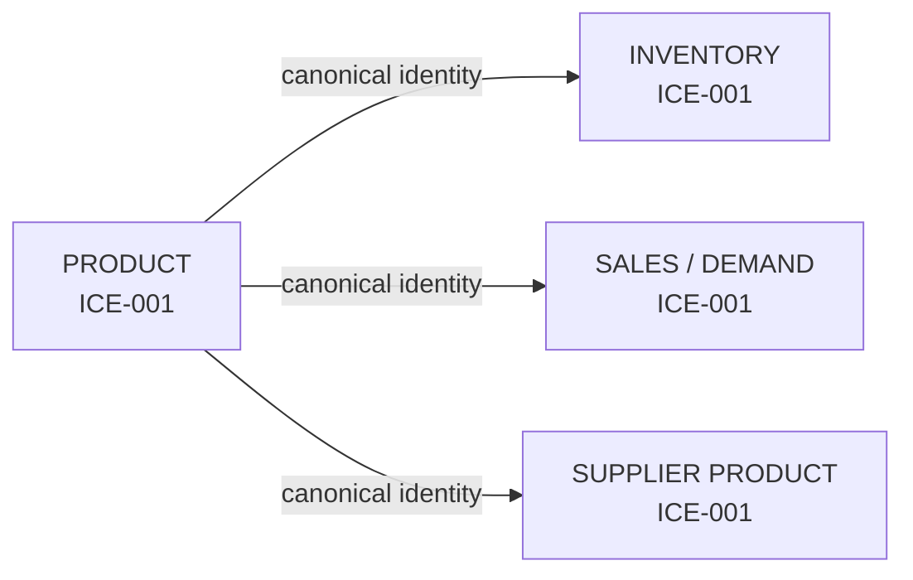

All downstream tables can therefore refer to one consistent product identity.

---

# 3. Entity Mapping vs Standardization

These stages solve different problems.

| Layer | Main Question | Example |
|---|---|---|
| Staging | Is the record technically valid? | Is `product_id` present? |
| Standardization | Is the representation consistent? | `" ICE-001 "` → `"ICE-001"` |
| Entity Mapping | Does the identifier refer to a known canonical entity? | `ICE-001` → canonical Product `ICE-001` |

### Example

Before mapping:

```text
Inventory.product_id = "ICE-001"
```

Entity Mapping checks:

```text
Does ICE-001 exist in Product Master?
        ↓
YES
        ↓
MAPPED
```

If it does not exist:

```text
ICE-999
   ↓
NOT FOUND
   ↓
UNMATCHED
   ↓
QUARANTINE
```

---

# 4. Main Objective of This Layer

The objective is to create:

```text
Canonical Entity Maps
+
Relationship / Bridge Maps
+
Foreign-Key Validation
+
Quarantine Accounting
+
Mapping Manifest
```

The notebook creates these under:

```text
Datasets/entity_mapping/
```

and uses:

```text
Datasets/quarantine/
```

for unmatched or ambiguous records.

---

# 5. Entity Mapping Architecture

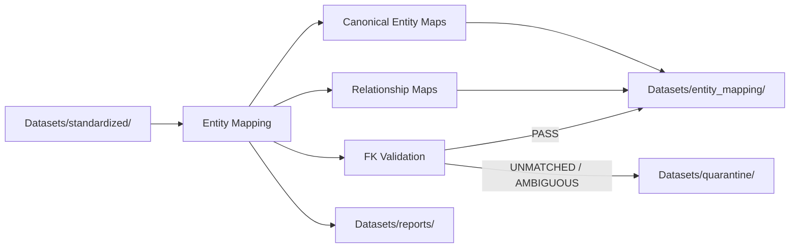

---

# 6. Input, Output and Governance

### Input

The primary mapping input is:

```text
Datasets/standardized/
```

The notebook explicitly states:

> Read only from the standardized layer for the main entity-mapping inputs.

Some reference datasets are handled according to their documented source location, including:

```text
02_DERIVED_REFERENCE/product_variant_master.csv
01_RAW_SOURCE/supplier_area_options.csv
```

### Output

```text
Datasets/entity_mapping/
```

### Quarantine

```text
Datasets/quarantine/
```

### Reports

```text
Datasets/reports/
```

---

# 7. Important Mapping Terms

---

# 8. Entity

### Meaning

An **entity** is a distinct business object that the system needs to identify.

Examples:

```text
Product
Location
Warehouse
Supplier
Calendar Week
Picker
```

Example:

```text
Product:
ICE-001
```

is one entity instance.

---

# 9. Canonical Entity

### Meaning

A **canonical entity** is the authoritative identity used to represent an entity throughout the data model.

Example:

```text
Canonical Product
    canonical_product_id = ICE-001
```

The Product Master is used as the authoritative source for Product identity.

---

# 10. Canonical ID

### Meaning

The **canonical ID** is the identifier used as the common reference.

Examples:

```text
canonical_product_id
canonical_location_id
canonical_warehouse_id
canonical_supplier_id
canonical_week_id
```

Example:

```text
product_id = ICE-001
        ↓
canonical_product_id = ICE-001
```

The mapping does not invent a replacement ID.

---

# 11. Authoritative Master

### Meaning

An **authoritative master** is the dataset chosen as the official source of identity for a specific entity.

The notebook uses these authoritative masters:

| Entity | Authoritative Source | Canonical Key |
|---|---|---|
| Product | `std_product_master` | `product_id` |
| Location | `std_location_master` | `location_id` |
| Warehouse | `std_warehouse_master` | `warehouse_id` |
| Supplier | `std_supplier_master` | `supplier_id` |
| Calendar Week | `std_calendar_week` | `week_id` |

---

# 12. Exact Match

### Meaning

An **exact match** means the identifier must exist exactly in the authoritative master after normal representation cleanup.

Example:

```text
Reference ID:
ICE-001

Master ID:
ICE-001
```

Result:

```text
MAPPED
```

---

# 13. Exact Match Example

Suppose Product Master contains:

```text
ICE-001
ICE-002
ICE-003
```

Inventory contains:

```text
ICE-001
ICE-002
ICE-999
```

Mapping result:

```text
ICE-001 → MAPPED
ICE-002 → MAPPED
ICE-999 → UNMATCHED
```

The notebook uses exact matching for Product entity mapping.

---

# 14. No Fuzzy Matching

### Meaning

**Fuzzy matching** would attempt to guess that two similar values refer to the same entity.

Example:

```text
"ICE-001"
"ICE 001"
"ICE_001"
```

The entity-mapping notebook does **not** perform fuzzy entity guessing for canonical product mapping.

Instead:

```text
Exact match → MAPPED
No exact match → UNMATCHED
```

This protects identity integrity.

---

# 15. Primary Key

A **Primary Key (PK)** uniquely identifies an entity record.

Examples:

```text
Product:
product_id

Location:
location_id

Warehouse:
warehouse_id

Supplier:
supplier_id

Calendar:
week_id
```

Example:

```text
product_id = ICE-001
```

must represent exactly one Product master entity.

---

# 16. Foreign Key

A **Foreign Key (FK)** references a canonical entity in another map.

Example:

```text
Inventory.product_id
        ↓
Product.product_id
```

If:

```text
Inventory.product_id = ICE-001
```

and:

```text
Product.product_id = ICE-001
```

exists:

```text
FK = VALID
```

---

# 17. Orphan / Dangling Foreign Key

### Meaning

An **orphan** is a foreign-key value that does not exist in its referenced master.

Example:

```text
Inventory.product_id = ICE-999
```

but Product Master contains:

```text
ICE-001
ICE-002
ICE-003
```

Therefore:

```text
ICE-999
   ↓
Not found
   ↓
ORPHAN
```

The notebook tracks these during cross-entity validation.

---

# 18. Mapping Status

Each mapped record receives a status.

Typical values:

```text
MAPPED
UNMATCHED
```

Example:

| product_id | mapping_status |
|---|---|
| ICE-001 | MAPPED |
| ICE-002 | MAPPED |
| ICE-999 | UNMATCHED |

---

# 19. Mapping Source

### Meaning

`mapping_source` records which dataset supplied or supported the mapping.

Example:

```text
mapping_source = std_product_master
```

For inventory transactions:

```text
mapping_source = std_inventory_transactions
```

This preserves traceability.

---

# 20. Mapping Timestamp

### Meaning

`mapping_ts` records when the mapping operation occurred.

Example from the notebook:

```text
2026-09-26T22:48:47+05:30
```

---

# 21. Mapping Version

### Meaning

`mapping_version` identifies the rule version used to perform the mapping.

The notebook uses:

```text
v1.0
```

Example:

```text
mapping_version = v1.0
```

---

# 22. Composite Key

### Meaning

A **composite key** uses more than one column to identify a relationship or record.

Example:

```text
warehouse_id + picker_id
```

becomes:

```text
WH-KOL-001 + WH-KOL-001-PKR-001
```

This identifies one specific picker assignment.

---

# 23. Grain

### Meaning

**Grain means what one row represents.**

Entity mapping must preserve this meaning.

Examples:

```text
Product
    1 row = 1 product

Location
    1 row = 1 location

Warehouse
    1 row = 1 warehouse

Inventory
    1 row = 1 warehouse × product

Sales / Demand
    1 row = 1 region × product × week

Supplier Product
    1 row = 1 supplier × product

Supplier Area
    1 row = 1 supplier × location
```

---

# 24. Why Grain Matters During Mapping

Suppose Sales has:

```text
KOL-LOC-001 × ICE-001 × Week 1
```

This is one row.

A mapping operation should still produce:

```text
KOL-LOC-001 × ICE-001 × Week 1
```

The entity map should identify the referenced Product, Location and Week without changing the intended row meaning.

---

# 25. Relationship Map

A **relationship map** represents how two or more entities are connected.

Examples:

```text
Warehouse ↔ Location
Warehouse ↔ Picker
Supplier ↔ Product
Supplier ↔ Location
Warehouse ↔ Product
```

---

# 26. Bridge / Junction Table

### Meaning

A **bridge table** represents a relationship between entities, especially many-to-many relationships.

Example:

```text
SUPPLIER
   ↕
SUPPLIER_PRODUCT
   ↕
PRODUCT
```

One supplier can offer many products.

One product can be offered by many suppliers.

Therefore:

```text
Supplier ↔ Product
```

is represented through:

```text
supplier_product
```

---

# 27. Block 1 — Entity Mapping Setup & Governance

## Purpose

Initializes the environment and governance structures for all mapping blocks.

The notebook records:

```text
STD_DIR
    ↓
Datasets/standardized/

EM_DIR
    ↓
Datasets/entity_mapping/

QUAR_DIR
    ↓
Datasets/quarantine/

RPT_DIR
    ↓
Datasets/reports/
```

It also initializes:

```text
mapping_timestamp
mapping_version = v1.0
```

### Important Rule

Inventory transaction provenance:

```text
record_status = RECONSTRUCTED_SYNTHETIC
```

must never be removed.

### Notebook Reference

`03_entity_mapping.ipynb` → **BLOCK 1**

### Example

```text
Standardized Product
        ↓
Entity Mapping
        ↓
em_product.csv
```

---

# 28. Block 1 Visualization

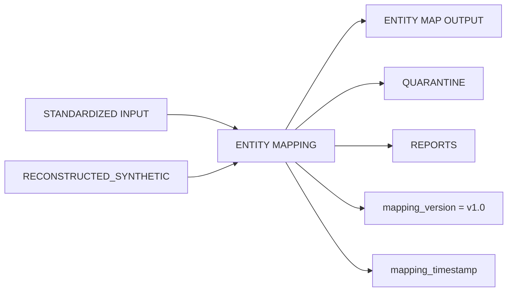

---

# 29. Block 2 — Standardized Dataset Discovery & Inventory

## Purpose

Before mapping begins, the notebook verifies which standardized datasets are available.

The discovery catalogue records dataset:

```text
name
row count
status
availability
```

### Notebook Result

The notebook discovers:

```text
std_product_master          200
std_location_master          40
std_warehouse_master         15
std_supplier_master         200
std_calendar_week           139
std_warehouse_picker        750
std_inventory_position     3000
std_supplier_product       8000
std_storage_assignment     3000
std_sales_demand       1,112,000
std_inventory_transactions 417,000
```

Additional status:

```text
std_product_variant_master → NOT IN STD → use derived reference
std_supplier_area_options  → NOT IN STD → use raw source
vehicle_master             → DEFERRED
order_data                 → DEFERRED
```

### Why This Matters

The discovery step prevents silent mapping against:

```text
empty file
missing file
truncated file
unexpected file
```

### Notebook Reference

`03_entity_mapping.ipynb` → **BLOCK 2**

---

# 30. Block 2 Example

Suppose mapping expects:

```text
std_product_master.csv
```

Discovery finds:

```text
200 rows
```

Therefore:

```text
Status = LOADED
```

If the file is absent:

```text
Status = NOT AVAILABLE / DEFERRED
```

This decision is recorded instead of silently failing.

---

# 31. Block 3 — Product Entity Mapping

## Purpose

Creates the canonical Product entity.

### Authoritative Master

```text
std_product_master
```

### Canonical ID

```text
product_id
```

### Mapping Rule

```text
product_id (exact)
        ↓
canonical_product_id
```

### Referencing Datasets

```text
std_inventory_position
std_sales_demand
std_supplier_product_catalog
std_inventory_transactions
```

### Example

Product Master:

```text
ICE-001
ICE-002
ICE-003
```

Inventory:

```text
ICE-001
ICE-002
```

Result:

```text
ICE-001 → canonical Product ICE-001
ICE-002 → canonical Product ICE-002
```

### Notebook Result

```text
Canonical Products = 200
```

Cross-reference:

```text
Inventory distinct products = 200
Matched = 200
Unmatched = 0

Sales/Demand distinct products = 200
Matched = 200
Unmatched = 0

Supplier Catalog distinct products = 200
Matched = 200
Unmatched = 0

Inventory Transactions distinct products = 200
Matched = 200
Unmatched = 0
```

### Output

```text
em_product.csv
```

### Notebook Reference

`03_entity_mapping.ipynb` → **BLOCK 3**

---

# 32. Product Relationship Visualization

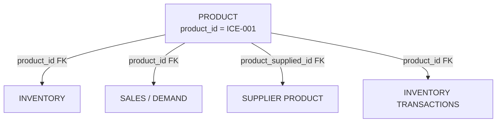

---

# 33. Block 4 — Location Entity Mapping

## Purpose

Creates the canonical Location entity for Kolkata delivery regions.

### Authoritative Master

```text
std_location_master
```

### Canonical ID

```text
location_id
```

### Mapping Rule

```text
location_id (exact)
        ↓
canonical_location_id
```

### Referencing Datasets

```text
std_sales_demand
std_supplier_master
supplier_area_options
```

### Example

Location Master:

```text
KOL-LOC-001 → Lake Gardens
KOL-LOC-002 → Jadavpur
KOL-LOC-003 → Dhakuria
```

Sales:

```text
region_id = KOL-LOC-001
```

Mapping:

```text
KOL-LOC-001 → Lake Gardens
```

### Notebook Result

```text
Canonical Locations = 40
```

All three reference sources reported:

```text
40 distinct IDs
40 matched
0 unmatched
```

### Output

```text
em_location.csv
```

### Notebook Reference

`03_entity_mapping.ipynb` → **BLOCK 4**

---

# 34. Location Visualization

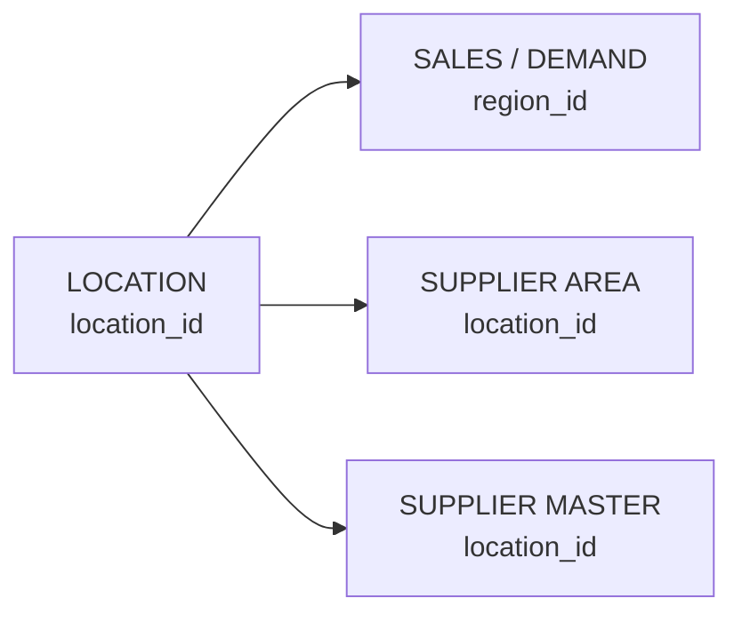

---

# 35. Block 5 — Warehouse Entity Mapping

## Purpose

Creates the canonical Warehouse entity.

### Authoritative Master

```text
std_warehouse_master
```

### Canonical ID

```text
warehouse_id
```

### Mapping Rule

```text
warehouse_id (exact)
        ↓
canonical_warehouse_id
```

### Referencing Datasets

```text
std_inventory_position
std_storage_assignment
std_shelf_master
std_warehouse_picker_mapping
std_inventory_transactions
warehouse_location_mapping
```

### Example

```text
WH-KOL-001
```

must resolve to exactly one warehouse entity.

### Notebook Result

```text
Canonical Warehouses = 15
```

Reference checks:

```text
Inventory Position    15 / 15
Storage Assignment    15 / 15
Warehouse-Picker      15 / 15
Inventory Transactions 15 / 15
Shelf Master           15 / 15
```

All:

```text
Unmatched = 0
```

### Output

```text
em_warehouse.csv
```

### Notebook Reference

`03_entity_mapping.ipynb` → **BLOCK 5**

---

# 36. Warehouse Example

```text
Warehouse Master
WH-KOL-001
        ↓
Warehouse entity
        ↓
Referenced by:
    Inventory
    Picker
    Storage
    Transactions
    Warehouse-Location
```

---

# 37. Block 6 — Supplier Entity Mapping

## Purpose

Creates the canonical Supplier entity.

### Authoritative Master

```text
std_supplier_master
```

### Canonical ID

```text
supplier_id
```

### Mapping Rule

```text
supplier_id (exact)
        ↓
canonical_supplier_id
```

### Referencing Datasets

```text
std_supplier_product_catalog
supplier_area_options
```

### Example

```text
SUP-KOL-001-01
```

resolves to one canonical supplier.

### Notebook Result

```text
Canonical Suppliers = 200
```

Reference checks:

```text
Supplier Catalog:
200 distinct suppliers
200 matched
0 unmatched

Supplier Area:
200 distinct suppliers
200 matched
0 unmatched
```

### Output

```text
em_supplier.csv
```

### Notebook Reference

`03_entity_mapping.ipynb` → **BLOCK 6**

---

# 38. Supplier Visualization

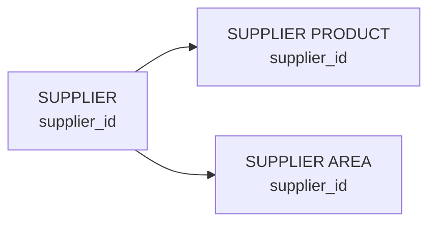

---

# 39. Block 7 — Calendar Week Entity Mapping

## Purpose

Creates the canonical time reference used by weekly datasets.

### Authoritative Master

```text
std_calendar_week
```

### Canonical ID

```text
week_id
```

### Mapping Rule

```text
week_id (exact)
        ↓
canonical_week_id
```

### Referencing Datasets

```text
std_inventory_transactions
std_sales_demand
```

### Example

```text
W001
W002
W003
...
W139
```

### Notebook Result

```text
Canonical Calendar Weeks = 139
```

Both checked references had:

```text
139 distinct
139 matched
0 unmatched
```

### Output

```text
em_calendar_week.csv
```

### Notebook Reference

`03_entity_mapping.ipynb` → **BLOCK 7**

---

# 40. Calendar Visualization

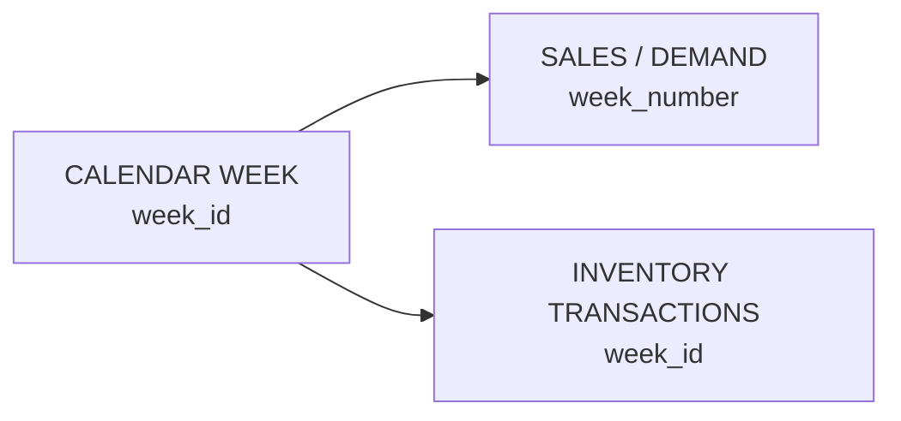

---

# 41. Block 8 — Product Variant Mapping

## Purpose

Maps product variants back to their parent Product entity.

### Source

The notebook notes that:

```text
std_product_variant_master.csv
```

is not present in the standardized directory.

Therefore the block reads:

```text
02_DERIVED_REFERENCE/product_variant_master.csv
```

### Mapping Rule

```text
variant_id
    ↓
product_id
    ↓
Product Master
```

### Example

```text
ICE-001-V01 → ICE-001
ICE-001-V02 → ICE-001
ICE-001-V03 → ICE-001
```

This means one Product can have multiple variants.

### Notebook Result

```text
Total Variants = 1,000
Distinct parent products = 200
Matched parent products = 200
Unmatched = 0
Mapped Variant Records = 1,000
```

### Example Variant Records

```text
ICE-001-V01 → 80 ml  → cost 36 → selling 41
ICE-001-V02 → 125 ml → cost 52 → selling 60
ICE-001-V03 → 250 ml → cost 82 → selling 94
ICE-001-V04 → 500 ml → cost 120 → selling 138
ICE-001-V05 → 1 L    → cost 218 → selling 251
```

### Output

```text
em_product_variant.csv
```

### Notebook Reference

`03_entity_mapping.ipynb` → **BLOCK 8**

---

# 42. Product Variant Visualization

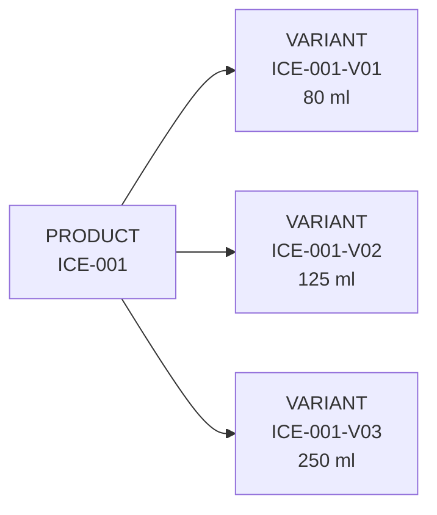

This is a **one-to-many** relationship:

```text
1 Product → Many Variants
```

---

# 43. Block 9 — Warehouse-Location Service Area Mapping

## Purpose

Maps which warehouse serves which Kolkata location.

### Source

```text
warehouse_location_mapping
```

This is a derived reference dataset.

### Mapping Rule

Both must resolve:

```text
warehouse_id → em_warehouse
location_id  → em_location
```

Only then:

```text
mapping_status = MAPPED
```

### Grain

```text
1 row = 1 warehouse × 1 location service relationship
```

### Example

```text
WH-KOL-001 × KOL-LOC-006
WH-KOL-001 × KOL-LOC-001
WH-KOL-001 × KOL-LOC-002
```

### Notebook Result

```text
Total pairs = 75
Mapped pairs = 75
Unmatched = 0
Unique warehouses = 15
Unique locations in map = 33
Average Haversine distance = 2.01 km
```

### Example Mapping

```text
Warehouse: WH-KOL-001
Location:  KOL-LOC-006
Mapping rank: 1
Haversine distance: 0.773 km
Method: nearest_5_by_haversine
```

### Important Terminology

The notebook identifies the distance as:

```text
haversine_distance_km
```

It is therefore a geographic Haversine measure, not a road-network travel distance.

### Output

```text
em_warehouse_location.csv
```

### Notebook Reference

`03_entity_mapping.ipynb` → **BLOCK 9**

---

# 44. Warehouse-Location Visualization

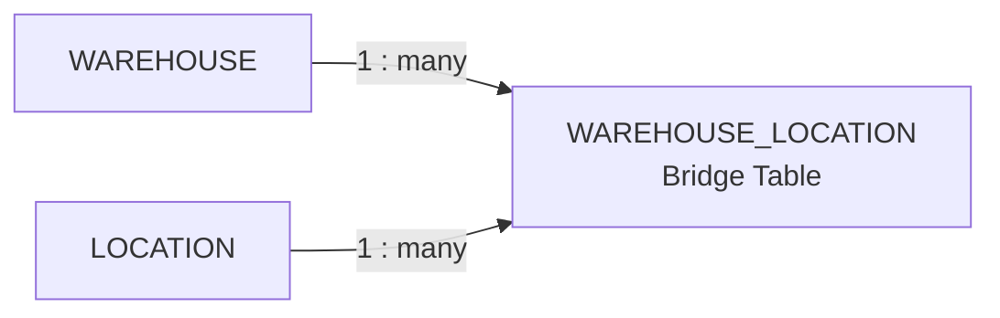

The bridge table connects:

```text
Warehouse ↔ Location
```

---

# 45. Block 10 — Warehouse-Picker Relationship Mapping

## Purpose

Maps warehouse staff assignments.

### Grain

```text
1 row = 1 warehouse × 1 picker
```

### Composite Key

```text
warehouse_id + picker_id
```

### Mapping Rule

```text
warehouse_id (exact)
+
picker_id (exact)
        ↓
picker composite entity
```

### Example

```text
WH-KOL-001 + WH-KOL-001-PKR-001
```

becomes:

```text
picker_composite_key =
WH-KOL-001_WH-KOL-001-PKR-001
```

### Notebook Result

```text
Total Picker Assignments = 750
Mapped = 750
Unmatched = 0
Unique Warehouses = 15
Unique Pickers = 750
Average Pickers per Warehouse = 50
```

### Output

```text
em_warehouse_picker.csv
```

### Notebook Reference

`03_entity_mapping.ipynb` → **BLOCK 10**

---

# 46. Warehouse-Picker Visualization

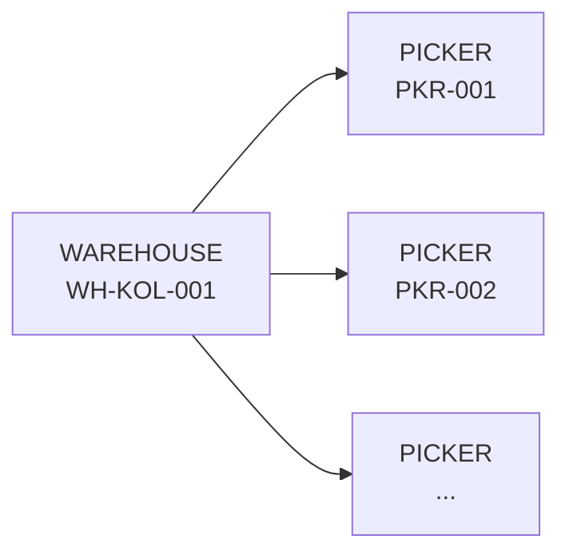

One warehouse can employ many pickers.

---

# 47. Block 11 — Inventory Entity Mapping

## Purpose

Maps each warehouse-product inventory position to both canonical entities.

### Grain

```text
1 row = 1 warehouse × 1 product
```

### Composite Business Key

```text
warehouse_id + product_id
```

### Mapping Rule

```text
warehouse_id (exact)
+
product_id (exact)
        ↓
mapped inventory record
```

### Example

```text
WH-KOL-001 + ICE-001
```

### Notebook Result

```text
Total Inventory Records = 3,000
Mapped = 3,000
Unmatched = 0
Unique Warehouses = 15
Unique Products = 200
Unique Composite Keys = 3,000
```

The record:

```text
WH-KOL-001_ICE-001
```

therefore represents one warehouse-product inventory relationship.

### Output

```text
em_inventory_position.csv
```

### Notebook Reference

`03_entity_mapping.ipynb` → **BLOCK 11**

---

# 48. Inventory Visualization

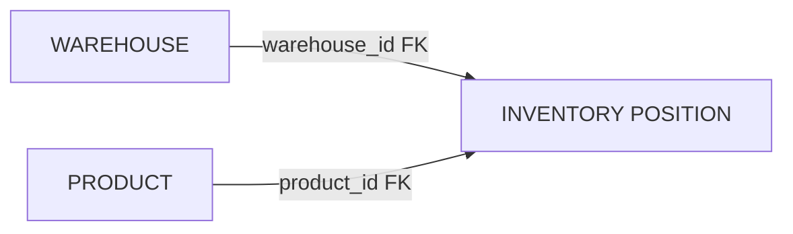

---

# 49. Block 12 — Sales / Demand Entity Mapping

## Purpose

Maps the largest fact dataset to canonical:

```text
Location
Product
Week
```

### Grain

```text
1 row = 1 region × 1 product × 1 week
```

### Mapping Rule

```text
region_id
+
product_id
+
week_number
        ↓
mapped demand record
```

### Important Implementation Detail

The notebook performs the large-scale mapping using **set-based matching rather than row-by-row loops**.

This is important for performance.

### Example

```text
KOL-LOC-001
+
DAI-005
+
Week 1
```

maps to:

```text
Location = KOL-LOC-001
Product  = DAI-005
Week     = 1
```

### Notebook Result

```text
Total Demand Records = 1,112,000
Mapped = 1,112,000
Unmatched = 0

Unique Locations = 40
Unique Products = 200
Unique Week Numbers = 139
```

### Example Output Key

```text
KOL-LOC-001_20240101_DAI-005
```

### Output

```text
em_sales_demand.csv
```

### Notebook Reference

`03_entity_mapping.ipynb` → **BLOCK 12**

---

# 50. Sales / Demand Visualization

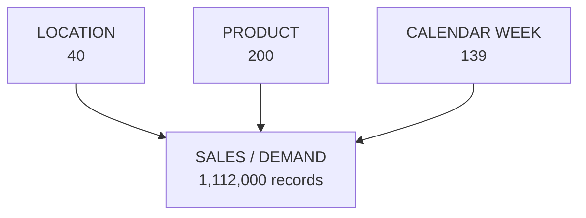

---

# 51. Why the Sales/Demand Map is Important

The notebook identifies Sales/Demand as the largest entity-mapping dataset.

It contains:

```text
40 locations
×
200 products
×
139 weeks
=
1,112,000 records
```

The mapping therefore confirms that every record refers to valid canonical Location and Product identities.

---

# 52. Block 13 — Supplier-Product Relationship Mapping

## Purpose

Creates the supplier-to-product relationship map.

### Grain

```text
1 row = 1 supplier × 1 product relationship
```

### Mapping Rule

```text
supplier_id (exact)
+
product_supplied_id (exact)
        ↓
supplier-product relationship
```

### Example

```text
SUP-KOL-001-01 + ICE-001
```

means:

```text
Supplier SUP-KOL-001-01
supplies Product ICE-001
```

### Notebook Result

```text
Total Catalog Records = 8,000
Mapped = 8,000
Unmatched = 0
Unique Suppliers = 200
Unique Products = 200
```

### Important Point

This is a relationship table.

It does not mean:

```text
1 supplier = 1 product
```

Instead:

```text
Many suppliers ↔ many products
```

with the catalog acting as the bridge.

### Output

```text
em_supplier_product.csv
```

### Notebook Reference

`03_entity_mapping.ipynb` → **BLOCK 13**

---

# 53. Supplier-Product Visualization

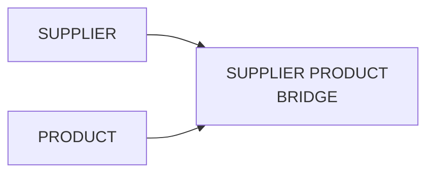

---

# 54. Block 14 — Supplier-Area Service Mapping

## Purpose

Maps supplier coverage to delivery locations.

### Source

```text
01_RAW_SOURCE/supplier_area_options.csv
```

The notebook records:

```text
200 service-area records
```

### Grain

```text
1 row = 1 supplier × 1 location service relationship
```

### Mapping Rule

```text
supplier_id (exact)
+
location_id (exact)
        ↓
supplier-area relationship
```

### Example

```text
SUP-KOL-001-01
+
KOL-LOC-001
```

means the supplier is associated with that service area.

### Notebook Result

```text
Total records = 200
Mapped = 200
Unmatched = 0
Unique Suppliers = 200
Unique Locations Served = 40
Service Available = Yes → 200
```

### Example

```text
Supplier:
SUP-KOL-001-01

Location:
KOL-LOC-001

Location Name:
Lake Gardens

Distance:
0.198 km

Supplier Option Rank:
1

Service Available:
Yes
```

### Output

```text
em_supplier_area.csv
```

### Notebook Reference

`03_entity_mapping.ipynb` → **BLOCK 14**

---

# 55. Supplier-Area Visualization

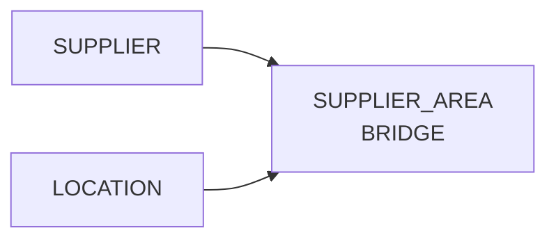

---

# 56. Block 15 — Inventory Transaction Entity Mapping

## Purpose

Maps inventory movement records to:

```text
Warehouse
Product
Calendar Week
```

### Critical Provenance

The notebook explicitly preserves:

```text
record_status = RECONSTRUCTED_SYNTHETIC
source_basis
```

These records are:

> **not observed transaction logs**

They are reconstructed synthetic operational movement records.

### Grain

```text
1 row = 1 warehouse × 1 product × 1 week
```

### Mapping Rule

```text
warehouse_id
+
product_id
+
week_id
        ↓
mapped transaction
```

### Example

```text
INV-TXN-000001

Warehouse = WH-KOL-001
Product   = ICE-001
Week      = W001
Sold Units = 67
Transaction Type = SALE
Direction = OUT
```

### Notebook Result

```text
Total Transaction Records = 417,000
Mapped = 417,000
Unmatched = 0
Unique Warehouses = 15
Unique Products = 200
Unique Weeks = 139
Total Sold Units (synthetic) = 9,398,170
```

The notebook also verifies:

```text
record_status = RECONSTRUCTED_SYNTHETIC
source_basis is not null
```

for the mapped records.

### Output

```text
em_inventory_transactions.csv
```

### Notebook Reference

`03_entity_mapping.ipynb` → **BLOCK 15**

---

# 57. Inventory Transaction Visualization

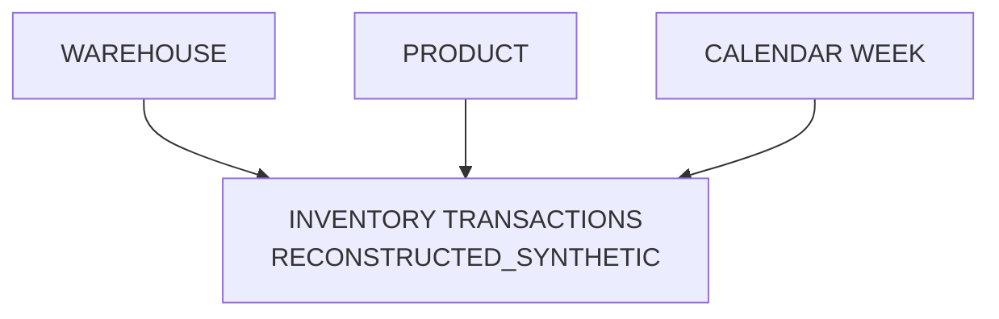

---

# 58. Block 16 — Cross-Entity Referential Integrity Validation

## Purpose

This is the main quality gate for the Entity Mapping layer.

It verifies that all mapped foreign keys resolve to canonical masters.

### What is Referential Integrity?

Referential integrity means:

> Every foreign-key reference points to an existing canonical entity.

### Example

```text
em_inventory_position
warehouse_id = WH-KOL-001
```

Check:

```text
Does WH-KOL-001 exist in em_warehouse?
```

Result:

```text
YES → PASS
```

### Notebook Checks

The notebook executes **14 FK checks**:

| Entity Map | FK Column | Reference |
|---|---|---|
| `em_inventory_position` | `warehouse_id` | `em_warehouse` |
| `em_inventory_position` | `product_id` | `em_product` |
| `em_sales_demand` | `region_id` | `em_location` |
| `em_sales_demand` | `product_id` | `em_product` |
| `em_supplier_product` | `supplier_id` | `em_supplier` |
| `em_supplier_product` | `product_supplied_id` | `em_product` |
| `em_warehouse_location` | `warehouse_id` | `em_warehouse` |
| `em_warehouse_location` | `location_id` | `em_location` |
| `em_warehouse_picker` | `warehouse_id` | `em_warehouse` |
| `em_supplier_area` | `supplier_id` | `em_supplier` |
| `em_supplier_area` | `location_id` | `em_location` |
| `em_inventory_transactions` | `warehouse_id` | `em_warehouse` |
| `em_inventory_transactions` | `product_id` | `em_product` |
| `em_inventory_transactions` | `week_id` | `em_calendar_week` |

### Notebook Result

```text
14 / 14 FK checks passed
0 orphan FK values
Overall match rate = 100.00%
```

### Output

```text
em_cross_entity_fk_report.csv
```

### Notebook Reference

`03_entity_mapping.ipynb` → **BLOCK 16**

---

# 59. Cross-Entity Validation Visualization

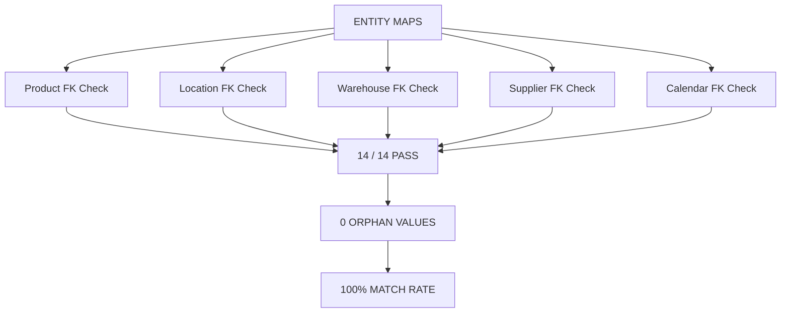

---

# 60. Block 17 — Unmapped / Ambiguous Entity Quarantine

## Purpose

Collects and documents records that could not be mapped.

### Important Policy

> No unmatched record is silently dropped.

Every quarantine record should retain information such as:

```text
entity
source_dataset
key
reason
quarantine_ts
```

### Example

Suppose:

```text
Inventory:
warehouse_id = WH-KOL-999
```

and:

```text
WH-KOL-999
```

does not exist in the Warehouse Master.

The result is:

```text
Entity = Warehouse
Source Dataset = Inventory
Key = WH-KOL-999
Reason = warehouse_id not in master
Status = UNMATCHED
```

and the record is written to quarantine.

---

# 61. Quarantine vs Deferred

These are different concepts.

### Quarantine

Means:

> A record exists, but its reference could not be mapped correctly.

Example:

```text
Unknown product ID
```

### Deferred

Means:

> The dataset/entity is intentionally not processed because an authoritative source or pipeline instruction is not currently available.

The notebook explicitly marks:

```text
Vehicle Master → DEFERRED
Order Data → DEFERRED
```

These are **not mapping errors**.

---

# 62. Notebook Quarantine Result

The notebook reports:

```text
Quarantined Entity Records = 0
Quarantine Entities Affected = 0
```

It also creates:

```text
em_quarantine_log.csv
em_deferred_entities.csv
```

### Deferred Entities

```text
VehicleMaster
OrderData
```

### Notebook Reference

`03_entity_mapping.ipynb` → **BLOCK 17**

---

# 63. Deferred Governance Visualization

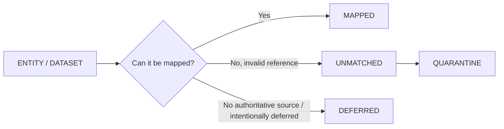

---

# 64. Block 18 — Final Entity Mapping Report & Manifest

## Purpose

Generates the final completion manifest for Layer 3.

The manifest records:

```text
Entity
Output file
Mapped count
Unmatched count
Status
mapping_ts
mapping_version
```

### Notebook Result

| Entity | Output File | Mapped Records |
|---|---|---:|
| Product | `em_product.csv` | 200 |
| Location | `em_location.csv` | 40 |
| Warehouse | `em_warehouse.csv` | 15 |
| Supplier | `em_supplier.csv` | 200 |
| CalendarWeek | `em_calendar_week.csv` | 139 |
| ProductVariant | `em_product_variant.csv` | 1,000 |
| WarehouseLocation | `em_warehouse_location.csv` | 75 |
| WarehousePicker | `em_warehouse_picker.csv` | 750 |
| InventoryPosition | `em_inventory_position.csv` | 3,000 |
| SalesDemand | `em_sales_demand.csv` | 1,112,000 |
| SupplierProduct | `em_supplier_product.csv` | 8,000 |
| SupplierArea | `em_supplier_area.csv` | 200 |
| InventoryTransactions | `em_inventory_transactions.csv` | 417,000 |

### Final Notebook Result

```text
Total entities mapped     : 13
Total mapped records      : 1,542,619
Total unmatched records   : 0
Output files created      : 13
Vehicle Master            : DEFERRED
Order Data                : DEFERRED
Ready for Layer 4         : Data Integration
```

### Final QA Gates

```text
Manifest saved               PASS
Entity map files created     13
FK report saved              PASS
Pipeline status updated      PASS
Vehicle Master DEFERRED      PASS
Order Data DEFERRED          PASS
```

The notebook reports:

```text
ALL QA GATES PASSED
```

### Outputs

```text
em_final_manifest.csv
em_cross_entity_fk_report.csv
pipeline_dataset_status.csv
```

### Notebook Reference

`03_entity_mapping.ipynb` → **BLOCK 18**

---

# 65. Complete Entity Relationship Architecture

The notebook provides a complete ER architecture for the mapped supply-chain entities.

```mermaid
erDiagram

    PRODUCT {
        string product_id PK
        string category_code
        string category_name
        string product_name
        string brand
        string unit_type
    }

    PRODUCT_VARIANT {
        string variant_id PK
        string product_id FK
        string unit_size
        decimal cost_price_rs
        decimal selling_price_rs
    }

    LOCATION {
        string location_id PK
        string region_of_kolkata
        string city
    }

    WAREHOUSE {
        string warehouse_id PK
        string warehouse_name
        string area
        string city
        int capacity_units
    }

    SUPPLIER {
        string supplier_id PK
        string supplier_name
        string supplier_type_name
        int lead_time_days
    }

    CALENDAR_WEEK {
        string week_id PK
        date week_start_date
        date week_end_date
        int year
        int week_number
    }

    PICKER {
        string picker_composite_key PK
        string picker_id
        string warehouse_id FK
    }

    WAREHOUSE_LOCATION {
        string warehouse_id FK
        string location_id FK
        decimal haversine_distance_km
        int mapping_rank
    }

    INVENTORY_POSITION {
        string warehouse_id FK
        string product_id FK
        int current_stock_units
        string stock_status
    }

    SALES_DEMAND {
        string region_product_week_key PK
        string region_id FK
        string product_id FK
        int week_number FK
        int units_sold
    }

    SUPPLIER_PRODUCT {
        string supplier_product_key PK
        string supplier_id FK
        string product_supplied_id FK
        decimal supplier_cost_price_rs
        string supply_status
    }

    SUPPLIER_AREA {
        string supplier_id FK
        string location_id FK
        decimal distance_km
        int supplier_option_rank
    }

    INVENTORY_TRANSACTIONS {
        string transaction_id PK
        string warehouse_id FK
        string product_id FK
        string week_id FK
        int sold_units
        string record_status
    }

    PRODUCT ||--o{ PRODUCT_VARIANT : "has variants"
    PRODUCT ||--o{ INVENTORY_POSITION : "stocked in"
    PRODUCT ||--o{ SALES_DEMAND : "demanded"
    PRODUCT ||--o{ SUPPLIER_PRODUCT : "supplied by"

    LOCATION ||--o{ SALES_DEMAND : "region demand"
    LOCATION ||--o{ SUPPLIER_AREA : "covered by"
    LOCATION ||--o{ WAREHOUSE_LOCATION : "served by"

    WAREHOUSE ||--o{ WAREHOUSE_LOCATION : "serves"
    WAREHOUSE ||--o{ PICKER : employs
    WAREHOUSE ||--o{ INVENTORY_POSITION : holds
    WAREHOUSE ||--o{ INVENTORY_TRANSACTIONS : "dispatches from"

    SUPPLIER ||--o{ SUPPLIER_PRODUCT : offers
    SUPPLIER ||--o{ SUPPLIER_AREA : covers

    CALENDAR_WEEK ||--o{ SALES_DEMAND : weekly
    CALENDAR_WEEK ||--o{ INVENTORY_TRANSACTIONS : "within week"
```

---

# 66. Complete Entity Cross-Reference

| Entity | Primary Key | Important Foreign Keys | Meaning |
|---|---|---|---|
| PRODUCT | `product_id` | — | Canonical product identity |
| LOCATION | `location_id` | — | Canonical location identity |
| WAREHOUSE | `warehouse_id` | — | Canonical warehouse identity |
| SUPPLIER | `supplier_id` | `location_id` | Canonical supplier identity |
| CALENDAR_WEEK | `week_id` | — | Canonical weekly time identity |
| PICKER | `warehouse_id + picker_id` | `warehouse_id` | Warehouse staff relationship |
| PRODUCT_VARIANT | `variant_id` | `product_id` | Product-to-variant relationship |
| WAREHOUSE_LOCATION | `warehouse_id + location_id` | `warehouse_id`, `location_id` | Warehouse service-area relationship |
| INVENTORY_POSITION | `warehouse_id + product_id` | `warehouse_id`, `product_id` | Warehouse-product stock relationship |
| SALES_DEMAND | `region_product_week_key` | `region_id`, `product_id`, `week_number` | Weekly regional demand |
| SUPPLIER_PRODUCT | `supplier_product_key` | `supplier_id`, `product_supplied_id` | Supplier-product relationship |
| SUPPLIER_AREA | `supplier_id + location_id` | `supplier_id`, `location_id` | Supplier service-area relationship |
| INVENTORY_TRANSACTIONS | `transaction_id` | `warehouse_id`, `product_id`, `week_id` | Weekly warehouse-product movement |

---

# 67. Canonical Mapping Flow

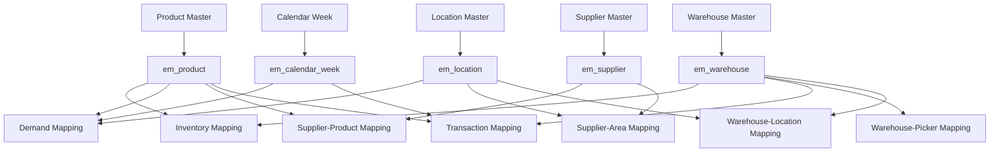

---

# 68. Entity Mapping Output Directory

The notebook creates the following entity-map outputs:

```text
Datasets/entity_mapping/
│
├── em_product.csv
├── em_location.csv
├── em_warehouse.csv
├── em_supplier.csv
├── em_calendar_week.csv
├── em_product_variant.csv
├── em_warehouse_location.csv
├── em_warehouse_picker.csv
├── em_inventory_position.csv
├── em_sales_demand.csv
├── em_supplier_product.csv
├── em_supplier_area.csv
└── em_inventory_transactions.csv
```

---

# 69. Quarantine Output Directory

```text
Datasets/quarantine/
│
├── em_quarantine_log.csv
├── em_deferred_entities.csv
└── [unmatched entity files, when required]
```

When no records are unmatched, the notebook reports:

```text
No quarantine records — all entities mapped cleanly.
```

---

# 70. Report Output Directory

```text
Datasets/reports/
│
├── em_cross_entity_fk_report.csv
├── em_final_manifest.csv
└── pipeline_dataset_status.csv
```

---

# 71. Lineage and Governance

Mapped records carry:

```text
mapping_source
mapping_ts
mapping_version
```

The broader pipeline also preserves source-level provenance.

For reconstructed synthetic inventory transactions, the following remain explicit:

```text
record_status = RECONSTRUCTED_SYNTHETIC
source_basis
```

### Example

```text
transaction_id = INV-TXN-000001
record_status = RECONSTRUCTED_SYNTHETIC
mapping_source = std_inventory_transactions
mapping_version = v1.0
```

---

# 72. What Entity Mapping Does

```text
✓ Identifies canonical entities
✓ Uses authoritative master datasets
✓ Resolves exact foreign-key references
✓ Creates entity maps
✓ Creates relationship / bridge maps
✓ Preserves source provenance
✓ Records mapping status
✓ Records mapping source
✓ Records mapping timestamp
✓ Versions mapping rules
✓ Validates cross-entity foreign keys
✓ Records unmatched entities
✓ Separates deferred datasets
✓ Produces final mapping manifest
```

---

# 73. What Entity Mapping Does NOT Do

```text
✗ Does not perform ML training
✗ Does not create demand forecasts
✗ Does not engineer ML features
✗ Does not optimize routes
✗ Does not select suppliers
✗ Does not select warehouses
✗ Does not generate customer orders
✗ Does not invent vehicle entities
✗ Does not use fuzzy guessing for canonical product identity
✗ Does not silently drop unmatched records
```

---

# 74. Special Governance Rules

## Rule 1 — Exact Identity Preservation

```text
Source ID
   ↓
Exact canonical identity
```

No arbitrary ID replacement.

---

## Rule 2 — Authoritative Master First

Example:

```text
Product references
      ↓
std_product_master
      ↓
canonical product identity
```

The master is the identity authority.

---

## Rule 3 — No Silent Drops

Invalid references are:

```text
UNMATCHED
    ↓
QUARANTINE
```

not deleted.

---

## Rule 4 — Deferred Does Not Mean Error

```text
Vehicle Master → DEFERRED
Order Data → DEFERRED
```

These are explicit governance decisions.

---

## Rule 5 — Synthetic Provenance Must Survive

```text
RECONSTRUCTED_SYNTHETIC
```

remains attached to the inventory transaction entity in the downstream entity map.

---

# 75. Notebook Validation Summary

The executed notebook records:

```text
Canonical Product Entities        = 200
Canonical Location Entities       = 40
Canonical Warehouse Entities      = 15
Canonical Supplier Entities       = 200
Canonical Calendar Weeks          = 139
Product Variants                  = 1,000
Warehouse-Location Pairs          = 75
Warehouse-Picker Assignments      = 750
Inventory Positions               = 3,000
Sales / Demand Records            = 1,112,000
Supplier-Product Records          = 8,000
Supplier-Area Records             = 200
Inventory Transaction Records     = 417,000
```

Final quality state:

```text
Mapped entities                   = 13
Mapped records                    = 1,542,619
Unmatched records                 = 0
Orphan FK values                  = 0
FK checks passed                  = 14 / 14
Overall FK match rate             = 100.00%
```

---

# 76. Final Mental Model

The easiest way to understand Entity Mapping is:

```text
STANDARDIZED DATA
        ↓
"Who is this record talking about?"
        ↓
Find authoritative master
        ↓
Exact ID match
        ↓
Canonical entity
        ↓
Create relationship map
        ↓
Validate all foreign keys
        ↓
PASS → Entity Mapping
FAIL → Quarantine
DEFERRED → Governance Log
```

---

# 77. One-Line Definition

> **Entity Mapping is the controlled process of linking standardized records to authoritative canonical entities and relationships using verified identifiers, while preserving provenance, preventing identity guessing, validating foreign-key integrity, and explicitly handling unmatched or deferred data.**

---

# 78. Notebook Reference

This README is based on:

```text
03_entity_mapping.ipynb
```

### Block Reference

```text
Block 1  → Entity Mapping Setup & Environment
Block 2  → Standardized Dataset Discovery & Inventory
Block 3  → Product Entity Mapping
Block 4  → Location Entity Mapping
Block 5  → Warehouse Entity Mapping
Block 6  → Supplier Entity Mapping
Block 7  → Calendar Week Entity Mapping
Block 8  → Product Variant Mapping
Block 9  → Warehouse-Location Service Area Mapping
Block 10 → Warehouse-Picker Relationship Mapping
Block 11 → Inventory Entity Mapping
Block 12 → Sales/Demand Entity Mapping
Block 13 → Supplier-Product Relationship Mapping
Block 14 → Supplier-Area Service Mapping
Block 15 → Inventory Transaction Entity Mapping
Block 16 → Cross-Entity Referential Integrity Validation
Block 17 → Unmapped / Ambiguous Entity Quarantine Report
Block 18 → Final Entity Mapping Report & Manifest
```

---

# 79. Visual References

The project contains block-level entity-mapping diagrams corresponding to the notebook blocks.

Recommended project structure:

```text
docs/
└── entity_mapping_diagrams/
    ├── block01_setup_er.jpg
    ├── block02_discovery_er.jpg
    ├── block03_product_er.jpg
    ├── block04_location_er.jpg
    ├── block05_warehouse_er.jpg
    ├── block06_supplier_er.jpg
    ├── block07_calendar_er.jpg
    ├── block08_variant_er.jpg
    ├── block09_whloc_er.jpg
    ├── block10_picker_er.jpg
    ├── block11_invpos_er.jpg
    ├── block12_sales_er.jpg
    ├── block13_supprod_er.jpg
    ├── block14_suparea_er.jpg
    ├── block15_txn_er.jpg
    ├── block16_fk_audit_er.jpg
    ├── block17_quarantine_er.jpg
    └── full_er_diagram.jpg
```

Example Markdown reference:

```markdown

```

Full architecture:

```markdown

```
