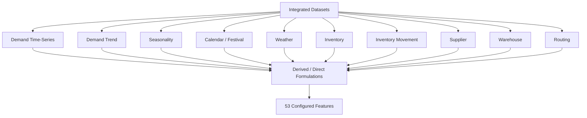
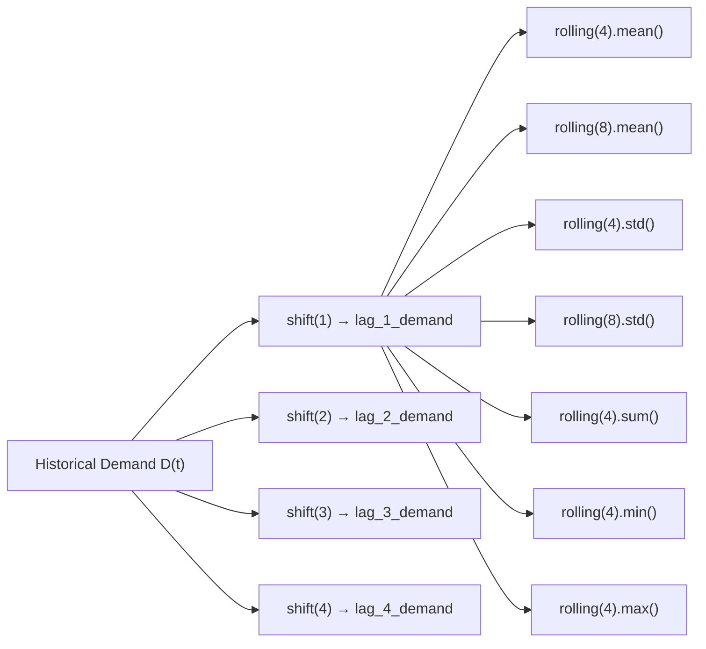
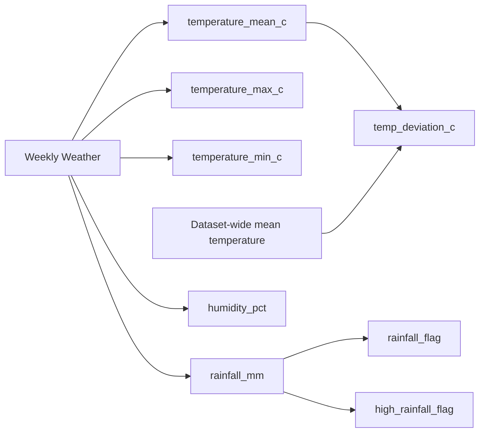
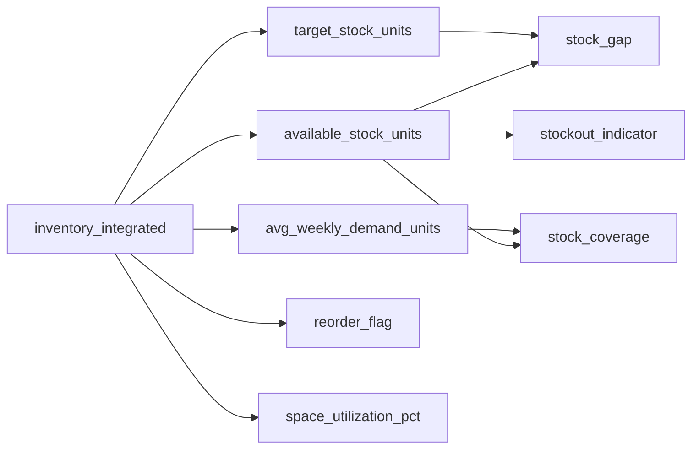
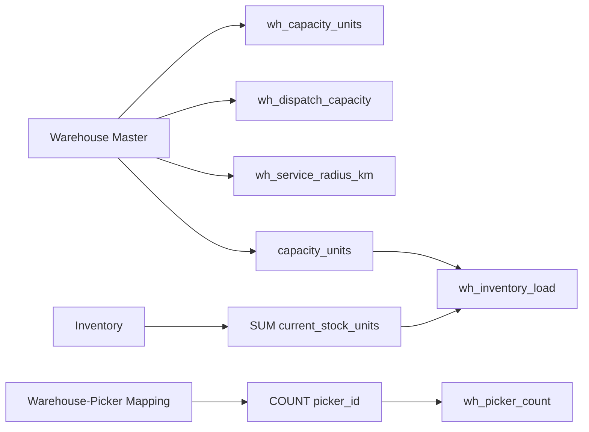
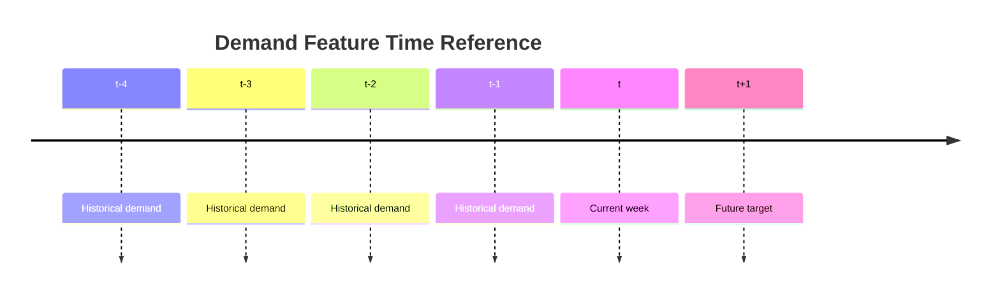
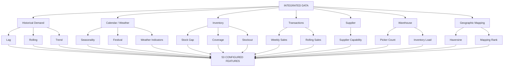

# Feature Formulation README

## 1. Purpose

This README documents the **feature formulations used in `05_feature_engineering.ipynb`**.

It explains:

- every configured feature
- the exact formula or notebook operation
- the source data used
- the feature grain
- the time dependency
- one numerical example for every feature
- special null / zero-denominator rules
- anti-lookahead rules
- which values are directly carried from source data

> **Notebook reference:** `05_feature_engineering.ipynb`  
> **Configured feature count:** **53 features across 11 groups**.

The notebook's centralized `FEATURE_CONFIG` records the feature name, group, source dataset, source columns, formula, grain, time dependency, unit, and description. filecitefile_00000000aaf0820897ba444515e04fb9L1452-L1738

---

# 2. What is Feature Formulation?

A **feature formulation** is the exact rule used to obtain a feature value.

There are two broad cases:

### A. Derived / calculated feature

A mathematical or logical operation is applied to existing data.

Example:

```text
demand_change
= current_week_demand - previous_week_demand
```

If:

```text
current = 150
previous = 120
```

then:

```text
150 - 120 = 30
```

### B. Direct feature

The value already exists in the integrated source and is carried into the feature dataset.

Example:

```text
lead_time_days = 3
```

The feature remains:

```text
lead_time_days = 3
```

No new number is generated.

---

# 3. Complete Formulation Flow



---

# 4. Feature Count

| Feature Group | Count |
|---|---:|
| Demand Time-Series | 11 |
| Demand Trend | 2 |
| Seasonality | 6 |
| Calendar | 1 |
| Festival | 2 |
| Weather | 8 |
| Inventory | 6 |
| Inventory Movement | 2 |
| Supplier | 8 |
| Warehouse | 5 |
| Routing | 2 |
| **Total** | **53** |

The notebook execution reports:

```text
Feature Configuration: 53 features across 11 groups
```

---

# 5. Notation Used

For demand features:

```text
D_t     = demand in current week t
D_(t-1) = demand in previous week
D_(t-2) = demand two weeks earlier
```

For inventory:

```text
A = available stock
T = target stock
W = average weekly demand
```

For warehouse:

```text
S = total current stock in warehouse
C = warehouse capacity
```

For weekly weather:

```text
R = rainfall in mm
Temp = weekly mean temperature
```

---

# 6. GROUP 1 — Demand Time-Series Formulations

The notebook groups demand by:

```text
region_id + product_id
```

and sorts by:

```text
week_start_date
```

before applying shifts and rolling calculations. This preserves the time order within each location-product series. filecitefile_00000000aaf0820897ba444515e04fb9L1650-L1665

---

## 6.1 `lag_1_demand`

### Exact notebook formulation

```text
shift(1) within group
```

### Mathematical form

\[
lag1_t = D_{t-1}
\]

### Example

```text
W10 = 100
W11 = 120
```

At W11:

```text
lag_1_demand = 100
```

### Meaning

Demand observed one week before the current week for the same location-product pair.

---

## 6.2 `lag_2_demand`

### Exact notebook formulation

```text
shift(2)
```

### Mathematical form

\[
lag2_t = D_{t-2}
\]

### Example

```text
W09 = 90
W10 = 100
W11 = 120
```

At W11:

```text
lag_2_demand = 90
```

---

## 6.3 `lag_3_demand`

### Exact notebook formulation

```text
shift(3)
```

### Mathematical form

\[
lag3_t = D_{t-3}
\]

### Example

```text
W08 = 80
W09 = 90
W10 = 100
W11 = 120
```

At W11:

```text
lag_3_demand = 80
```

---

## 6.4 `lag_4_demand`

### Exact notebook formulation

```text
shift(4)
```

### Mathematical form

\[
lag4_t = D_{t-4}
\]

### Example

```text
W07 = 70
W08 = 80
W09 = 90
W10 = 100
W11 = 120
```

At W11:

```text
lag_4_demand = 70
```

---

## 6.5 `rolling_mean_4`

### Exact notebook formulation

```text
lag_1_demand.rolling(4, min_periods=1).mean()
```

### Mathematical form

\[
RM4_t =
\frac{1}{n}
\sum_{k=1}^{n} D_{t-k}
\]

where:

```text
n = min(4, number of available historical observations)
```

### Example

Previous four weeks:

```text
100, 120, 110, 130
```

Then:

```text
(100 + 120 + 110 + 130) / 4
= 115
```

So:

```text
rolling_mean_4 = 115
```

### Important

The notebook calculates the rolling statistic on `lag_1_demand`, not directly on current `units_sold`. This is the anti-lookahead design. filecitefile_00000000aaf0820897ba444515e04fb9L1654-L1659

---

## 6.6 `rolling_mean_8`

### Exact notebook formulation

```text
lag_1_demand.rolling(8, min_periods=1).mean()
```

### Example

Previous eight weeks:

```text
80, 90, 100, 110, 120, 130, 140, 150
```

Sum:

```text
920
```

Mean:

```text
920 / 8 = 115
```

Therefore:

```text
rolling_mean_8 = 115
```

---

## 6.7 `rolling_std_4`

### Exact notebook formulation

```text
lag_1_demand.rolling(4, min_periods=2).std()
```

This uses Pandas' standard deviation operation as implemented in the notebook.

### Example

Previous four values:

```text
100, 120, 110, 130
```

Mean:

```text
115
```

Squared deviations:

```text
(100-115)^2 = 225
(120-115)^2 = 25
(110-115)^2 = 25
(130-115)^2 = 225
```

Sum:

```text
500
```

Sample variance:

```text
500 / (4-1)
= 166.6667
```

Sample standard deviation:

```text
sqrt(166.6667)
≈ 12.91
```

Therefore:

```text
rolling_std_4 ≈ 12.91
```

---

## 6.8 `rolling_std_8`

### Exact notebook formulation

```text
lag_1_demand.rolling(8, min_periods=2).std()
```

### Example

Previous eight values:

```text
80, 90, 100, 110, 120, 130, 140, 150
```

Mean:

```text
115
```

The sample standard deviation is approximately:

```text
24.49
```

Therefore:

```text
rolling_std_8 ≈ 24.49
```

---

## 6.9 `rolling_sum_4`

### Exact notebook formulation

```text
lag_1_demand.rolling(4, min_periods=1).sum()
```

### Example

```text
100 + 120 + 110 + 130
= 460
```

Therefore:

```text
rolling_sum_4 = 460
```

---

## 6.10 `recent_min_demand`

### Exact notebook formulation

```text
lag_1_demand.rolling(4, min_periods=1).min()
```

### Example

```text
100, 120, 110, 130
```

Minimum:

```text
100
```

Therefore:

```text
recent_min_demand = 100
```

---

## 6.11 `recent_max_demand`

### Exact notebook formulation

```text
lag_1_demand.rolling(4, min_periods=1).max()
```

### Example

```text
100, 120, 110, 130
```

Maximum:

```text
130
```

Therefore:

```text
recent_max_demand = 130
```

---

# 7. Demand Time-Series Formula Map



---

# 8. GROUP 2 — Demand Trend Formulations

The notebook defines two trend features. filecitefile_00000000aaf0820897ba444515e04fb9L1665-L1672

---

## 8.1 `demand_change`

### Exact notebook formulation

```text
units_sold_t - units_sold_(t-1)
```

### Mathematical form

\[
\Delta D_t = D_t - D_{t-1}
\]

### Example

```text
D_t = 150
D_(t-1) = 120
```

Then:

```text
150 - 120 = 30
```

Therefore:

```text
demand_change = +30
```

---

## 8.2 `demand_growth_rate`

### Exact notebook formulation

```text
(D_t - D_(t-1)) / D_(t-1)
```

### Example

```text
Current = 150
Previous = 120
```

Then:

```text
(150 - 120) / 120
= 30 / 120
= 0.25
```

Therefore:

```text
demand_growth_rate = 0.25
= 25%
```

### Zero-denominator rule

If:

```text
D_(t-1) = 0
```

then the notebook returns:

```text
NaN
```

not zero and not infinity.

The notebook's executed QA reports:

```text
zero-denominator cases → NaN: 8,000
infinite growth values: 0
```

filecitefile_00000000aaf0820897ba444515e04fb9L2448-L2478

---

# 9. GROUP 3 — Seasonality Formulations

The notebook defines six seasonality features. filecitefile_00000000aaf0820897ba444515e04fb9L1670-L1679

---

## 9.1 `week_of_year`

### Exact notebook operation

```text
week_number.astype(int)
```

### Example

```text
week_number = 20
```

Therefore:

```text
week_of_year = 20
```

> **Notebook implementation note:** the configuration describes the feature as week number `1–52`, but the executed notebook output reported a range of `1–139`. The README records the implemented operation rather than silently correcting it. filecitefile_00000000aaf0820897ba444515e04fb9L2700-L2728

---

## 9.2 `month`

### Exact notebook operation

```text
month from week_start_date
```

In the implementation, the integrated `month` column is validated as already present.

### Example

```text
August
```

becomes:

```text
month = 8
```

---

## 9.3 `quarter`

### Exact notebook operation

```text
quarter from calendar_integrated
```

### Example

```text
August
```

belongs to:

```text
Q3
```

Therefore:

```text
quarter = 3
```

---

## 9.4 `season`

### Exact notebook operation

```text
season label from weather data
```

### Example

Suppose the source value is:

```text
Monsoon
```

Then:

```text
season = "Monsoon"
```

---

## 9.5 `sin_week`

### Exact notebook formula

\[
sin\_week =
\sin\left(
\frac{2\pi \times week\_number}{52}
\right)
\]

### Example

For week 13:

\[
\sin(2\pi \times 13/52)
=
\sin(\pi/2)
=
1
\]

Therefore:

```text
sin_week = 1
```

---

## 9.6 `cos_week`

### Exact notebook formula

\[
cos\_week =
\cos\left(
\frac{2\pi \times week\_number}{52}
\right)
\]

### Example

For week 26:

\[
\cos(2\pi \times 26/52)
=
\cos(\pi)
=
-1
\]

Therefore:

```text
cos_week = -1
```

The actual notebook implementation uses `np.sin(...)` and `np.cos(...)`. filecitefile_00000000aaf0820897ba444515e04fb9L2718-L2724

---

# 10. GROUP 4 — Calendar Formulation

## 10.1 `holiday_flag`

### Exact notebook formulation

```text
direct from source (0/1)
```

### Example

If the weekly source says:

```text
holiday_flag = 1
```

then the feature is:

```text
holiday_flag = 1
```

No additional calculation is performed.

---

# 11. GROUP 5 — Festival Formulations

## 11.1 `festival_count`

### Exact notebook operation

```text
direct from source
```

### Example

If:

```text
festival_count = 3
```

then:

```text
festival_count = 3
```

---

## 11.2 `festival_flag`

### Exact notebook formula

```text
1 if festival_count > 0 else 0
```

### Example

```text
festival_count = 3

3 > 0
→ festival_flag = 1
```

For:

```text
festival_count = 0
```

the result is:

```text
festival_flag = 0
```

---

# 12. GROUP 6 — Weather Formulations

The notebook uses the weekly weather/event table with one row per week. filecitefile_00000000aaf0820897ba444515e04fb9L1684-L1697

---

## 12.1 `temperature_mean_c`

### Exact operation

```text
direct
```

### Example

Source:

```text
31.5°C
```

Feature:

```text
temperature_mean_c = 31.5
```

---

## 12.2 `temperature_max_c`

### Exact operation

```text
direct
```

### Example

```text
temperature_max_c = 36.0°C
```

Feature:

```text
36.0
```

---

## 12.3 `temperature_min_c`

### Exact operation

```text
direct
```

### Example

```text
temperature_min_c = 27.0°C
```

Feature:

```text
27.0
```

---

## 12.4 `rainfall_mm`

### Exact operation

```text
direct
```

### Example

```text
rainfall_mm = 42.5
```

Feature:

```text
42.5 mm
```

---

## 12.5 `humidity_pct`

### Exact operation

```text
direct
```

### Example

```text
humidity_pct = 78
```

Feature:

```text
78%
```

---

## 12.6 `rainfall_flag`

### Exact notebook formula

```text
1 if rainfall_mm > 0 else 0
```

### Example

```text
rainfall_mm = 42.5
```

Because:

```text
42.5 > 0
```

the result is:

```text
rainfall_flag = 1
```

For:

```text
rainfall_mm = 0
```

the result is:

```text
rainfall_flag = 0
```

---

## 12.7 `high_rainfall_flag`

### Exact notebook formula

```text
1 if rainfall_mm > 50 else 0
```

### Example

```text
rainfall_mm = 80
```

Because:

```text
80 > 50
```

the result is:

```text
high_rainfall_flag = 1
```

If:

```text
rainfall_mm = 40
```

then:

```text
high_rainfall_flag = 0
```

### Threshold

```text
50 mm/week
```

is a **project-defined operational threshold** documented in the notebook. filecitefile_00000000aaf0820897ba444515e04fb9L2940-L3007

---

## 12.8 `temp_deviation_c`

### Exact notebook formula

```text
temperature_mean_c
-
mean(temperature_mean_c over all weeks)
```

The implementation first calculates:

```python
overall_mean_temp = df_cal["temperature_mean_c"].mean()
```

then:

```python
temp_deviation_c =
    temperature_mean_c - overall_mean_temp
```

filecitefile_00000000aaf0820897ba444515e04fb9L2997-L3005

### Example

Dataset-wide mean:

```text
29.5°C
```

Current week:

```text
32.0°C
```

Then:

```text
32.0 - 29.5
= +2.5°C
```

Therefore:

```text
temp_deviation_c = +2.5
```

---

# 13. Weather Formulation Map



---

# 14. GROUP 7 — Inventory Formulations

Inventory features operate at:

```text
warehouse × product
```

The notebook uses the inventory snapshot as the source. filecitefile_00000000aaf0820897ba444515e04fb9L1697-L1706

---

## 14.1 `available_stock_units`

### Exact operation

```text
direct
```

The source itself defines available units.

The feature configuration describes it as:

```text
current_stock - reserved_stock
```

### Example

```text
current_stock = 500
reserved_stock = 100
```

Then the source-level available stock is:

```text
500 - 100
= 400
```

Therefore:

```text
available_stock_units = 400
```

> In the FE code itself this feature is selected from the existing `available_stock_units` column rather than recomputed again.

---

## 14.2 `stock_gap`

### Exact notebook formula

```text
available_stock_units - target_stock_units
```

### Example

```text
available = 300
target = 500
```

Then:

```text
300 - 500
= -200
```

Therefore:

```text
stock_gap = -200
```

Interpretation:

```text
200 units below target
```

If:

```text
target_stock_units = NaN
```

the notebook sets:

```text
stock_gap = NaN
```

instead of inventing a target.

filecitefile_00000000aaf0820897ba444515e04fb9L3528-L3542

---

## 14.3 `stock_coverage`

### Exact notebook formula

```text
available_stock_units / avg_weekly_demand_units
```

with:

```text
NaN if denominator <= 0 or null
```

### Example

```text
available_stock = 500
average weekly demand = 100
```

Then:

```text
500 / 100
= 5
```

Therefore:

```text
stock_coverage = 5 weeks
```

### Zero / null denominator

If:

```text
avg_weekly_demand = 0
```

then:

```text
stock_coverage = NaN
```

The notebook explicitly forbids infinity in this case. filecitefile_00000000aaf0820897ba444515e04fb9L3471-L3555

---

## 14.4 `stockout_indicator`

### Exact notebook formula

```text
1 if available_stock_units <= 0 else 0
```

### Example

```text
available_stock = 0
```

Then:

```text
0 <= 0
→ True
→ stockout_indicator = 1
```

For:

```text
available_stock = 50
```

then:

```text
50 <= 0
→ False
→ stockout_indicator = 0
```

---

## 14.5 `reorder_flag`

### Exact operation

```text
direct from source
```

### Example

If the integrated inventory record contains:

```text
reorder_flag = 1
```

the feature is:

```text
reorder_flag = 1
```

It is not recalculated in this block.

---

## 14.6 `space_utilization_pct`

### Exact operation

```text
direct from source
```

### Example

Source:

```text
space_utilization_pct = 85
```

Feature:

```text
85%
```

---

# 15. Inventory Formulation Map



---

# 16. GROUP 8 — Inventory Movement Formulations

The source is:

```text
inventory_transactions_integrated.csv
```

The notebook verifies that these records are:

```text
RECONSTRUCTED_SYNTHETIC
```

for 100% of the transaction feature dataset. filecitefile_00000000aaf0820897ba444515e04fb9L1705-L1708 filecitefile_00000000aaf0820897ba444515e04fb9L3833-L3846

---

## 16.1 `weekly_sold_units`

### Exact operation

```text
sold_units
```

direct carry-through.

### Example

```text
sold_units = 250
```

Therefore:

```text
weekly_sold_units = 250
```

---

## 16.2 `rolling_sold_4w`

### Exact notebook formulation

```text
lag_1_sold.rolling(4, min_periods=1).mean()
```

within:

```text
warehouse_id + product_id
```

### Example

Previous four weekly sold values:

```text
100
120
110
130
```

Then:

```text
(100 + 120 + 110 + 130) / 4
= 115
```

Therefore:

```text
rolling_sold_4w = 115
```

The notebook first creates:

```text
lag_1_sold = sold_units.shift(1)
```

and then calculates the rolling mean on the lagged series. filecitefile_00000000aaf0820897ba444515e04fb9L3833-L3843

---

# 17. GROUP 9 — Supplier Formulations

The notebook states that supplier features are primarily **direct carry-throughs** from integrated supplier datasets. filecitefile_00000000aaf0820897ba444515e04fb9L1708-L1718

---

## 17.1 `lead_time_days`

### Exact operation

```text
direct
```

### Example

```text
lead_time_days = 3
```

Result:

```text
3 days
```

---

## 17.2 `min_order_qty`

### Exact operation

```text
minimum_order_qty_units
```

### Example

```text
minimum_order_qty_units = 100
```

Result:

```text
min_order_qty = 100 units
```

---

## 17.3 `max_order_qty`

### Exact operation

```text
max_order_qty_units
```

### Example

```text
max_order_qty_units = 5000
```

Result:

```text
max_order_qty = 5000 units
```

---

## 17.4 `supplier_capacity`

### Exact operation

```text
supplier_storage_capacity_units
```

### Example

```text
supplier_storage_capacity_units = 20,000
```

Result:

```text
supplier_capacity = 20,000 units
```

---

## 17.5 `vehicle_load_capacity`

### Exact operation

```text
vehicle_load_capacity_units
```

### Example

```text
vehicle_load_capacity_units = 800
```

Result:

```text
vehicle_load_capacity = 800 units
```

---

## 17.6 `supplier_cost_price`

### Exact operation

```text
supplier_cost_price_rs
```

### Example

```text
supplier_cost_price_rs = 125
```

Result:

```text
supplier_cost_price = ₹125
```

---

## 17.7 `supply_status`

### Exact operation

```text
direct
```

### Example

```text
supply_status = Active
```

Result:

```text
supply_status = Active
```

---

## 17.8 `area_coverage_km`

### Exact operation

```text
distance_from_location_center_km
```

The notebook describes this as:

```text
direct (Haversine)
```

### Example

```text
distance_from_location_center_km = 6.7
```

Result:

```text
area_coverage_km = 6.7 km
```

This is geographic Haversine distance, not road distance.

---

# 18. Supplier Formulation Summary

```text
lead_time_days             → direct
min_order_qty              → direct
max_order_qty              → direct
supplier_capacity          → direct
vehicle_load_capacity      → direct
supplier_cost_price        → direct
supply_status              → direct
area_coverage_km           → direct Haversine distance
```

No:

```text
best_supplier
supplier_score
supplier_rank generated by optimization
recommended_order_qty
```

is created in this feature block. filecitefile_00000000aaf0820897ba444515e04fb9L4000-L4018

---

# 19. GROUP 10 — Warehouse Formulations

The warehouse feature dataset has one row per warehouse. The notebook derives picker count and warehouse inventory load while carrying other warehouse fields directly. filecitefile_00000000aaf0820897ba444515e04fb9L1718-L1727

---

## 19.1 `wh_capacity_units`

### Exact operation

```text
direct from capacity_units
```

### Example

```text
capacity_units = 50,000
```

Result:

```text
wh_capacity_units = 50,000
```

---

## 19.2 `wh_dispatch_capacity`

### Exact operation

```text
direct from daily_dispatch_capacity_units
```

### Example

```text
daily_dispatch_capacity_units = 8,000
```

Result:

```text
wh_dispatch_capacity = 8,000 units/day
```

---

## 19.3 `wh_picker_count`

### Exact notebook formula

```text
COUNT(picker_id) GROUP BY warehouse_id
```

### Example

Suppose:

```text
WH-KOL-001
```

has:

```text
50 picker records
```

Then:

```text
COUNT(picker_id) = 50
```

Therefore:

```text
wh_picker_count = 50
```

The notebook implements the aggregation by grouping the warehouse-picker dataset on `warehouse_id`. filecitefile_00000000aaf0820897ba444515e04fb9L4388-L4393

---

## 19.4 `wh_inventory_load`

### Exact notebook formula

```text
SUM(current_stock_units) / capacity_units
```

with:

```text
NaN if capacity_units = 0
```

### Example

Suppose a warehouse contains:

```text
Product A = 10,000
Product B = 8,000
Product C = 7,000
```

Then:

```text
total_current_stock_units = 10,000 + 8,000 + 7,000
                           = 25,000
```

Suppose capacity is:

```text
50,000
```

Then:

```text
25,000 / 50,000
= 0.50
```

Therefore:

```text
wh_inventory_load = 0.50
```

or:

```text
50%
```

The notebook explicitly aggregates stock by warehouse before dividing by capacity. filecitefile_00000000aaf0820897ba444515e04fb9L4397-L4411

---

## 19.5 `wh_service_radius_km`

### Exact operation

```text
direct from service_radius_km
```

### Example

```text
service_radius_km = 15
```

Result:

```text
wh_service_radius_km = 15 km
```

---

# 20. Warehouse Formulation Map



---

# 21. GROUP 11 — Routing Formulations

The Feature Engineering notebook does not newly calculate road-network distance.

The warehouse-location distance is already present from the entity-mapping stage and is carried into the routing feature dataset. filecitefile_00000000aaf0820897ba444515e04fb9L1727-L1734

---

## 21.1 `haversine_distance_km`

### Exact FE operation

```text
direct
```

from:

```text
warehouse_location_integrated.haversine_distance_km
```

### Underlying mathematical formula

\[
d =
2r\arcsin
\left(
\sqrt{
\sin^2\left(\frac{\phi_2-\phi_1}{2}\right)
+
\cos(\phi_1)\cos(\phi_2)
\sin^2\left(\frac{\lambda_2-\lambda_1}{2}\right)
}
\right)
\]

where:

```text
r = 6371 km
```

### Example

Suppose two points produce an upstream Haversine result of:

```text
8.42 km
```

Then the FE output is:

```text
haversine_distance_km = 8.42
```

The FE implementation renames the field to:

```text
wh_location_haversine_km
```

and stamps:

```text
distance_type = HAVERSINE_GEOGRAPHIC_NOT_ROAD
```

filecitefile_00000000aaf0820897ba444515e04fb9L4638-L4660

### Critical distinction

```text
Haversine distance
=
straight-line geographic distance
```

It is not automatically:

```text
road distance
travel distance
travel time
```

---

## 21.2 `mapping_rank`

### Exact operation

```text
direct from entity mapping
```

### Example

Suppose a location has warehouse proximity:

```text
WH-A = 2.0 km
WH-B = 5.0 km
WH-C = 9.0 km
```

and the mapping table records the order:

```text
WH-A → 1
WH-B → 2
WH-C → 3
```

Then:

```text
mapping_rank = 1
```

means the warehouse is ranked first in the existing mapping.

The FE notebook does not create a new optimization decision here.

---

# 22. Direct vs Derived Formula Summary

## Derived / Calculated

```text
lag_1_demand
lag_2_demand
lag_3_demand
lag_4_demand

rolling_mean_4
rolling_mean_8
rolling_std_4
rolling_std_8
rolling_sum_4
recent_min_demand
recent_max_demand

demand_change
demand_growth_rate

sin_week
cos_week

festival_flag
rainfall_flag
high_rainfall_flag
temp_deviation_c

stock_gap
stock_coverage
stockout_indicator

rolling_sold_4w

wh_picker_count
wh_inventory_load
```

## Direct / Carry-Through

```text
week_of_year
month
quarter
season
holiday_flag
festival_count

temperature_mean_c
temperature_max_c
temperature_min_c
rainfall_mm
humidity_pct

available_stock_units
reorder_flag
space_utilization_pct

weekly_sold_units

lead_time_days
min_order_qty
max_order_qty
supplier_capacity
vehicle_load_capacity
supplier_cost_price
supply_status
area_coverage_km

wh_capacity_units
wh_dispatch_capacity
wh_service_radius_km

haversine_distance_km
mapping_rank
```

The exact distinction follows the notebook's centralized feature configuration, where each feature is documented as either a mathematical operation, aggregation, or direct source field. filecitefile_00000000aaf0820897ba444515e04fb9L1650-L1738

---

# 23. Zero / Null Handling Rules

These rules are important because the notebook does **not** silently replace undefined mathematical results with arbitrary values.

| Feature | Condition | Notebook result |
|---|---|---|
| `demand_growth_rate` | previous demand = 0 | `NaN` |
| `demand_growth_rate` | previous demand = null | `NaN` |
| `stock_gap` | target stock = null | `NaN` |
| `stock_coverage` | average demand <= 0 | `NaN` |
| `stock_coverage` | average demand = null | `NaN` |
| `wh_inventory_load` | warehouse capacity = 0 | `NaN` |

Infinity is explicitly prevented in the relevant calculations. filecitefile_00000000aaf0820897ba444515e04fb9

---

# 24. Anti-Lookahead Formulation

For time-series features, the notebook uses historical information only.



For example:

```text
rolling_mean_4 at t
=
mean(D_(t-4), D_(t-3), D_(t-2), D_(t-1))
```

not:

```text
mean(D_(t-3), D_(t-2), D_(t-1), D_t)
```

This is why the implementation calculates rolling statistics on `lag_1_demand`. The notebook's time-series QA checks grain preservation and zero infinite values. filecitefile_00000000aaf0820897ba444515e04fb9L2300-L2365

---

# 25. Synthetic-Provenance Rule

The inventory transaction source is explicitly:

```text
RECONSTRUCTED_SYNTHETIC
```

Therefore:

```text
weekly_sold_units
rolling_sold_4w
```

inherit that provenance.

The notebook's executed check reports:

```text
RECONSTRUCTED_SYNTHETIC 100%: True
```

filecitefile_00000000aaf0820897ba444515e04fb9L3850-L3855

---

# 26. Formulation Examples — One Line Each

```text
lag_1_demand
= D(t-1)
Example: 120 → 120

lag_2_demand
= D(t-2)
Example: 100 → 100

lag_3_demand
= D(t-3)
Example: 90 → 90

lag_4_demand
= D(t-4)
Example: 80 → 80

rolling_mean_4
= mean(previous 4)
Example: [100,120,110,130] → 115

rolling_mean_8
= mean(previous 8)
Example: [80..150] → 115

rolling_std_4
= std(previous 4)
Example: [100,120,110,130] → 12.91

rolling_std_8
= std(previous 8)
Example: [80..150] → 24.49

rolling_sum_4
= sum(previous 4)
Example: [100,120,110,130] → 460

recent_min_demand
= min(previous 4)
Example: [100,120,110,130] → 100

recent_max_demand
= max(previous 4)
Example: [100,120,110,130] → 130

demand_change
= D(t)-D(t-1)
Example: 150-120 → 30

demand_growth_rate
= (D(t)-D(t-1))/D(t-1)
Example: (150-120)/120 → 0.25

week_of_year
= week_number
Example: 20 → 20

month
= source month
Example: August → 8

quarter
= source quarter
Example: August → 3

season
= source season
Example: Monsoon → Monsoon

sin_week
= sin(2πw/52)
Example: w=13 → 1

cos_week
= cos(2πw/52)
Example: w=26 → -1

holiday_flag
= direct source
Example: 1 → 1

festival_count
= direct source
Example: 3 → 3

festival_flag
= 1(count>0) else 0
Example: 3 → 1

temperature_mean_c
= direct source
Example: 31.5 → 31.5

temperature_max_c
= direct source
Example: 36 → 36

temperature_min_c
= direct source
Example: 27 → 27

rainfall_mm
= direct source
Example: 42.5 → 42.5

humidity_pct
= direct source
Example: 78 → 78

rainfall_flag
= 1(rainfall>0) else 0
Example: 42.5 → 1

high_rainfall_flag
= 1(rainfall>50) else 0
Example: 80 → 1

temp_deviation_c
= temp - dataset_mean_temp
Example: 32-29.5 → 2.5

available_stock_units
= direct source
Example: 400 → 400

stock_gap
= available-target
Example: 300-500 → -200

stock_coverage
= available/avg_weekly_demand
Example: 500/100 → 5

stockout_indicator
= 1(available<=0) else 0
Example: 0 → 1

reorder_flag
= direct source
Example: 1 → 1

space_utilization_pct
= direct source
Example: 85 → 85

weekly_sold_units
= sold_units
Example: 250 → 250

rolling_sold_4w
= mean(previous 4 sold units)
Example: [100,120,110,130] → 115

lead_time_days
= direct source
Example: 3 → 3

min_order_qty
= direct source
Example: 100 → 100

max_order_qty
= direct source
Example: 5000 → 5000

supplier_capacity
= direct source
Example: 20,000 → 20,000

vehicle_load_capacity
= direct source
Example: 800 → 800

supplier_cost_price
= direct source
Example: 125 → ₹125

supply_status
= direct source
Example: Active → Active

area_coverage_km
= direct Haversine distance
Example: 6.7 → 6.7 km

wh_capacity_units
= direct source
Example: 50,000 → 50,000

wh_dispatch_capacity
= direct source
Example: 8,000 → 8,000

wh_picker_count
= COUNT(picker_id) by warehouse
Example: 50 picker records → 50

wh_inventory_load
= SUM(current_stock)/capacity
Example: 25,000/50,000 → 0.50

wh_service_radius_km
= direct source
Example: 15 → 15 km

haversine_distance_km
= direct upstream Haversine result
Example: 8.42 → 8.42 km

mapping_rank
= direct entity-mapping rank
Example: mapped rank 2 → 2
```

---

# 27. What These Formulas Do NOT Do

Feature formulation does not mean:

```text
✗ Randomly assigning values
✗ Guessing missing business values
✗ Generating future demand targets
✗ Selecting the best supplier
✗ Selecting the best warehouse
✗ Optimizing routes
✗ Running a Genetic Algorithm
✗ Running Simulated Annealing
✗ Training the ML model
```

The feature formulas create or carry **descriptive input variables**. Model training and downstream optimization occur later.

---

# 28. Final Formulation Architecture



---

# 29. Final Rule

The Feature Engineering notebook follows this general formulation principle:

\[
\boxed{
\text{Feature Value}
=
\text{Existing Source Value}
\quad\text{or}\quad
\text{Deterministic Function of Existing Values}
}
\]

There is **no random-value assignment in the 53-feature configuration**. The formulas and operations are explicitly defined in the notebook's centralized feature specification and implementation blocks. filecitefile_00000000aaf0820897ba444515e04fb9L1452-L1738

