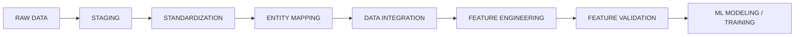
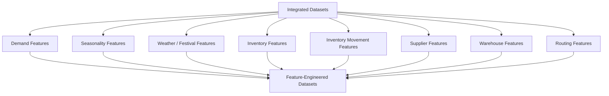
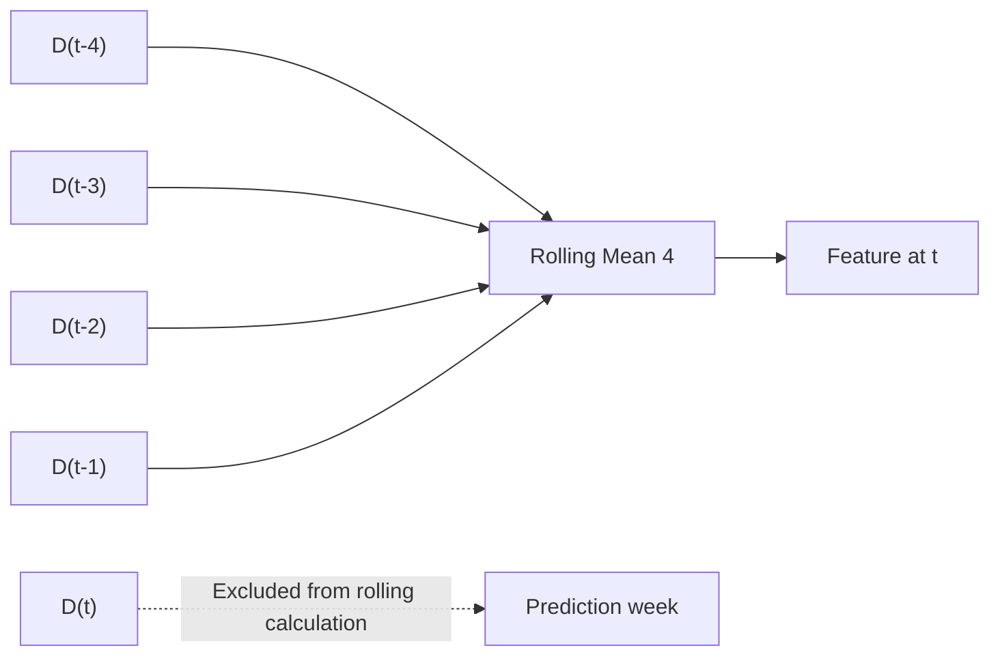
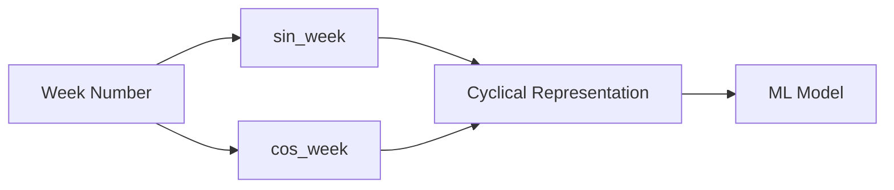
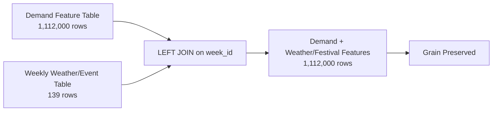
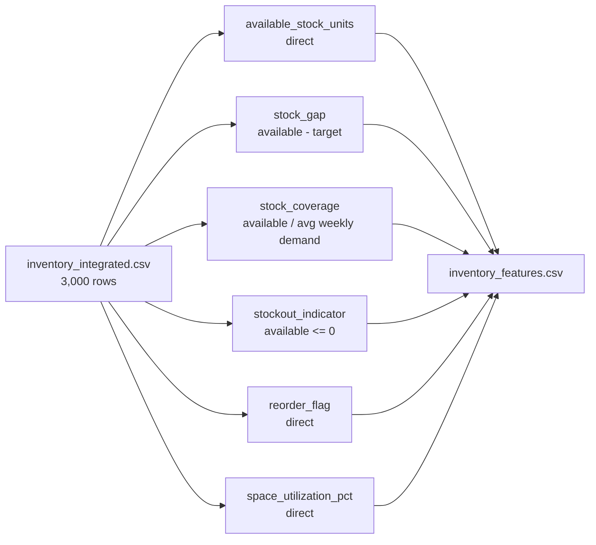
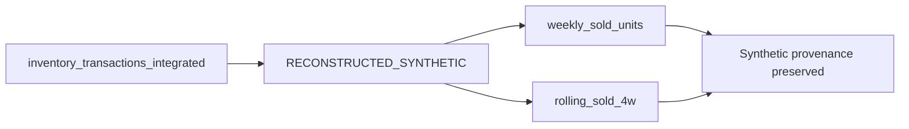
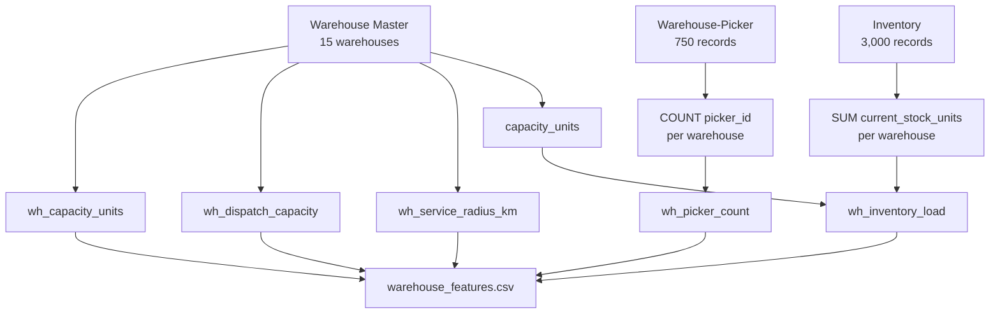
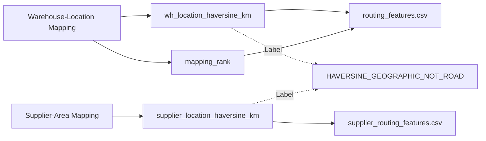

# Feature Engineering Layer README

## 1. What is Feature Engineering?

**Feature Engineering** is the process of converting integrated data into variables that contain useful information for machine-learning models, forecasting, monitoring, and downstream decision-support components.

In this project, Feature Engineering starts from the integrated datasets and creates measurable variables such as:

- previous-week demand
- rolling demand statistics
- demand change and growth
- seasonal indicators
- festival and weather indicators
- inventory coverage and stock gap
- supplier capability variables
- warehouse capacity variables
- geographic distance variables

The important idea is:

```text
Integrated Data
      ↓
Feature Engineering
      ↓
Useful Model / Decision Variables
```

### Simple Example

Suppose the integrated demand data contains:

| Location | Product | Week | Units Sold |
|---|---|---|---:|
| Garia | P001 | W10 | 100 |
| Garia | P001 | W11 | 120 |
| Garia | P001 | W12 | 150 |

Feature Engineering can create:

| Week | Units Sold | lag_1_demand | demand_change |
|---|---:|---:|---:|
| W10 | 100 | NaN | NaN |
| W11 | 120 | 100 | 20 |
| W12 | 150 | 120 | 30 |

The new columns give the model information about the recent demand pattern.

---

# 2. Where Feature Engineering Fits



Feature Engineering consumes the **integrated datasets** and produces feature-engineered datasets.

---

# 3. What Feature Engineering Does



---

# 4. Very Important Boundary

This stage creates **inputs**, not final decisions.

### Allowed

```text
✓ Lag features
✓ Rolling statistics
✓ Demand trend variables
✓ Seasonality variables
✓ Festival indicators
✓ Weather indicators
✓ Inventory ratios
✓ Supplier capability variables
✓ Warehouse operational variables
✓ Geographic distance variables
```

### Not done here

```text
✗ ML model training
✗ Forecast generation
✗ Target generation
✗ Supplier selection
✗ Warehouse selection
✗ Route optimization
✗ TSP solving
✗ Genetic Algorithm
✗ Simulated Annealing
✗ Business recommendations
✗ Synthetic entity creation
```

---

# 5. What is a Feature?

A **feature** is a variable used to provide information to a model or downstream process.

### Example

Original field:

```text
units_sold = 150
```

Engineered feature:

```text
demand_change = 30
```

Another:

```text
stock_coverage = 4.5
```

Another:

```text
high_rainfall_flag = 1
```

A feature can therefore be:

1. directly carried from an existing field, or
2. calculated from one or more existing fields.

---

# 6. Direct Feature vs Derived Feature

This distinction is important in this notebook.

### Direct carry-through

The value already exists in the integrated data.

Example:

```text
lead_time_days
```

The feature is copied into the feature dataset.

### Derived feature

The value is calculated.

Example:

```text
stock_gap =
available_stock_units - target_stock_units
```

Therefore:

```text
Feature Engineering Output
=
Existing useful variables
+
New derived variables
```

---

# 7. What is Grain?

**Grain tells us what one row represents.**

Examples in this stage:

| Dataset | Grain |
|---|---|
| Demand Features | location × product × week |
| Inventory Features | warehouse × product |
| Inventory Transaction Features | warehouse × product × week |
| Supplier Features | supplier |
| Supplier-Product Features | supplier × product |
| Supplier-Area Features | supplier × location |
| Warehouse Features | warehouse |
| Routing Features | warehouse × location |
| Supplier Routing Features | supplier × location |

### Example

A demand row:

```text
Garia × P001 × W12
```

means:

> Demand for product P001 in Garia during week W12.

---

# 8. Feature Groups Configured in the Notebook

The notebook defines **54 configured feature entries across 11 functional groups**.

| Feature Group | Count |
|---|---:|
| `demand_timeseries` | 11 |
| `demand_trend` | 2 |
| `seasonality` | 6 |
| `calendar` | 2 |
| `festival` | 2 |
| `weather` | 8 |
| `inventory` | 6 |
| `inv_movement` | 2 |
| `supplier` | 8 |
| `warehouse` | 5 |
| `routing` | 2 |
| **Total** | **54** |

> Some output datasets also carry existing contextual fields and governance metadata. The 54 figure refers to the feature configuration table defined in the notebook.

---

# 9. BLOCK 1 — Environment Setup

### Purpose

Prepares the Feature Engineering environment.

The notebook configures:

```text
INT_DIR
FE_DIR
RPT_DIR
QUAR_DIR
```

and uses:

```text
FE_VERSION = v1.0.0
CHUNK_SIZE = 100,000
```

### Example

```text
Integrated data
    ↓
Datasets/integrated/

Feature outputs
    ↓
Datasets/feature_engineered/

Reports
    ↓
Datasets/reports/

Issues
    ↓
Datasets/quarantine/
```

No dataset is engineered in this block.

---

# 10. BLOCK 2 — Integrated Dataset Discovery

The notebook discovers the integrated inputs before calculating features.

Important input datasets include:

```text
demand_integrated.csv
inventory_integrated.csv
inventory_transactions_integrated.csv
supplier_integrated.csv
supplier_product_integrated.csv
supplier_area_integrated.csv
warehouse_integrated.csv
warehouse_picker_integrated.csv
warehouse_location_integrated.csv
weather_event_integrated.csv
```

### Why this matters

Before creating a feature, the notebook needs to know:

```text
Does the source exist?
What is its grain?
What columns does it contain?
How many rows are available?
```

---

# 11. BLOCK 3 — Grain and Primary-Key Verification

Before calculating time-series features, the notebook verifies the source grain and key.

### Example

Demand grain:

```text
location × product × week
```

Key:

```text
region_product_week_key
```

If the order of weeks is wrong, a lag feature can be wrong even when the formula itself is correct.

### Correct

```text
W10
W11
W12
W13
```

### Incorrect

```text
W12
W10
W13
W11
```

The notebook therefore sorts chronologically before feature creation.

---

# 12. BLOCK 4 — Centralized Feature Configuration

The notebook creates a **single feature specification** before generating features.

Each configured feature contains:

```text
feature_name
feature_group
source_dataset
source_columns
formula
grain
time_dependency
unit
description
```

### Example

For `lag_1_demand`:

```text
Feature:
lag_1_demand

Source:
demand_integrated

Source column:
units_sold

Formula:
shift(1)

Time dependency:
t-1

Unit:
units

Grain:
location × product × week
```

This configuration becomes the reference for:

```text
Feature generation
Feature dictionary
Feature lineage
Feature validation
```

---

# 13. Demand Time-Series Features

## BLOCK 5 — Lag and Rolling Features

This is the largest demand feature group.

The notebook creates **11 time-series features**:

```text
lag_1_demand
lag_2_demand
lag_3_demand
lag_4_demand

rolling_mean_4
rolling_mean_8
rolling_std_4
rolling_std_8
rolling_sum_4

recent_min_demand
recent_max_demand
```

All temporal operations are performed within:

```text
region_id + product_id
```

---

# 14. lag_1_demand

### Meaning

Demand in the previous week.

Formula:

```text
lag_1_demand(t) = demand(t-1)
```

### Example

| Week | Units Sold | lag_1_demand |
|---|---:|---:|
| W10 | 100 | NaN |
| W11 | 120 | 100 |
| W12 | 150 | 120 |

For W12:

```text
lag_1_demand = 120
```

because the previous week W11 had 120 units sold.

---

# 15. lag_2_demand

### Meaning

Demand two weeks earlier.

```text
lag_2_demand(t) = demand(t-2)
```

### Example

| Week | Units Sold | lag_2_demand |
|---|---:|---:|
| W10 | 100 | NaN |
| W11 | 120 | NaN |
| W12 | 150 | 100 |

For W12:

```text
lag_2_demand = 100
```

---

# 16. lag_3_demand

### Meaning

Demand three weeks earlier.

```text
lag_3_demand(t) = demand(t-3)
```

Example:

```text
W09 = 80
W10 = 100
W11 = 120
W12 = 150
```

At W12:

```text
lag_3_demand = 80
```

---

# 17. lag_4_demand

### Meaning

Demand four weeks earlier.

```text
lag_4_demand(t) = demand(t-4)
```

Example:

```text
W08 = 75
W09 = 80
W10 = 100
W11 = 120
W12 = 150
```

At W12:

```text
lag_4_demand = 75
```

---

# 18. Why Lag Features Are Useful

They tell a model what demand looked like recently.

Example:

```text
lag_1 = 120
lag_2 = 110
lag_3 = 105
lag_4 = 100
```

This gives a clear historical sequence:

```text
100 → 105 → 110 → 120
```

The model can use this information to learn demand patterns.

---

# 19. rolling_mean_4

### Meaning

Average demand over the previous four weeks.

The notebook calculates it on `lag_1_demand`, so the current week's value is excluded.

Formula:

```text
rolling_mean_4(t)
=
mean(D[t-4], D[t-3], D[t-2], D[t-1])
```

### Example

Previous four weeks:

```text
100, 110, 120, 130
```

Then:

```text
rolling_mean_4 = (100+110+120+130)/4
               = 115
```

---

# 20. rolling_mean_8

### Meaning

Average demand over the previous eight weeks.

Example:

```text
80, 90, 100, 110, 120, 130, 140, 150
```

Then:

```text
rolling_mean_8 = 115
```

This smooths short-term fluctuations and represents a longer historical demand level.

---

# 21. rolling_std_4

### Meaning

Measures how variable demand has been during the previous four weeks.

Example A:

```text
100, 100, 100, 100
```

Standard deviation:

```text
0
```

Demand is very stable.

Example B:

```text
50, 100, 150, 100
```

Standard deviation is higher.

So:

```text
Higher rolling_std_4
→ higher recent demand variability
```

---

# 22. rolling_std_8

Same concept, but over eight previous weeks.

It captures longer-term variability.

Example:

```text
Last 8 weeks:
80, 90, 85, 95, 100, 110, 105, 120
```

The standard deviation summarizes how much those values fluctuate around their mean.

---

# 23. rolling_sum_4

### Meaning

Total demand across the previous four weeks.

Formula:

```text
rolling_sum_4
=
D(t-4)+D(t-3)+D(t-2)+D(t-1)
```

Example:

```text
100 + 120 + 110 + 130
= 460 units
```

So:

```text
rolling_sum_4 = 460
```

---

# 24. recent_min_demand

### Meaning

Minimum observed demand during the previous four weeks.

Example:

```text
100
120
90
110
```

Then:

```text
recent_min_demand = 90
```

This shows the lower end of recent demand.

---

# 25. recent_max_demand

### Meaning

Maximum observed demand during the previous four weeks.

Example:

```text
100
120
90
150
```

Then:

```text
recent_max_demand = 150
```

This shows the upper end of recent demand.

---

# 26. Anti-Lookahead Design

A critical part of this notebook is:

```text
rolling feature
    ↓
calculated from lag_1_demand
    ↓
current week is excluded
```

### Wrong approach

```text
rolling_mean(units_sold)
```

At week t, this can include:

```text
D(t)
```

### Notebook approach

```text
rolling_mean(lag_1_demand)
```

which uses:

```text
D(t-4) ... D(t-1)
```

### Visualization



---

# 27. Intentional Lag Nulls

The first records in each group naturally do not have historical values.

Example:

```text
First row:
lag_1 = NaN

First 2 rows:
lag_2 = NaN

First 3 rows:
lag_3 = NaN

First 4 rows:
lag_4 = NaN
```

These are **expected burn-in nulls**.

They are not automatically replaced with zero.

---

# 28. BLOCK 6 — Demand Trend Features

The notebook creates two trend features:

```text
demand_change
demand_growth_rate
```

These describe whether demand is:

```text
increasing
decreasing
stable
```

---

# 29. demand_change

Formula:

```text
demand_change
=
D(t) - D(t-1)
```

### Example

Current week:

```text
D(t) = 150
```

Previous week:

```text
D(t-1) = 120
```

Therefore:

```text
demand_change = 150 - 120
              = +30
```

Interpretation:

```text
Demand increased by 30 units.
```

---

# 30. Negative demand_change

Example:

```text
Current = 100
Previous = 130
```

Then:

```text
demand_change = 100 - 130
              = -30
```

Interpretation:

```text
Demand decreased by 30 units.
```

---

# 31. Stable demand

Example:

```text
Current = 100
Previous = 100
```

Then:

```text
demand_change = 0
```

Meaning demand remained stable.

---

# 32. demand_growth_rate

Formula:

```text
(D(t) - D(t-1)) / D(t-1)
```

### Example

Previous week:

```text
100
```

Current week:

```text
125
```

Then:

```text
growth = (125-100)/100
       = 0.25
```

So:

```text
25% growth
```

---

# 33. Negative Growth Rate

Example:

```text
Previous = 200
Current = 180
```

Then:

```text
growth = (180-200)/200
       = -0.10
```

Meaning:

```text
10% decline
```

---

# 34. Zero-Denominator Policy

If:

```text
previous demand = 0
```

then:

```text
(D(t)-0)/0
```

is mathematically undefined.

The notebook therefore sets:

```text
demand_growth_rate = NaN
```

not:

```text
0
```

and not:

```text
inf
```

This prevents invalid infinity values from entering downstream processing.

---

# 35. BLOCK 7 — Seasonality Features

The notebook creates **6 seasonality features**:

```text
week_of_year
month
quarter
season
sin_week
cos_week
```

These describe recurring calendar patterns.

---

# 36. week_of_year

### Meaning

The week number within the year.

Example:

```text
week_number = 32
```

becomes:

```text
week_of_year = 32
```

This allows models to learn patterns occurring at particular times of the year.

---

# 37. month

Example:

```text
August → month = 8
```

Month can capture broad seasonal behavior.

---

# 38. quarter

Example:

```text
January → Q1
April → Q2
July → Q3
October → Q4
```

Stored numerically as:

```text
1, 2, 3, 4
```

---

# 39. season

The notebook uses the season label from the integrated data.

Examples:

```text
Winter
Summer
Pre-Monsoon
Monsoon
Post-Monsoon
```

A model can then compare demand behavior across seasonal periods.

---

# 40. Why Week Number Alone Can Be a Problem

Suppose:

```text
Week 52
Week 1
```

These are actually adjacent in the yearly cycle.

But numerically:

```text
52 - 1 = 51
```

which falsely makes them appear very far apart.

That is why the notebook adds cyclic encoding.

---

# 41. sin_week

Formula:

```text
sin_week = sin(2π × week_number / 52)
```

It transforms week number into a circular representation.

Example:

```text
week 1
→ sin value near 0
```

The exact value comes from the formula.

---

# 42. cos_week

Formula:

```text
cos_week = cos(2π × week_number / 52)
```

It is used together with `sin_week`.

The pair:

```text
sin_week
cos_week
```

represents the position of a week on a yearly cycle.

---

# 43. Cyclical Visualization



---

# 44. BLOCK 8 — Festival and Weather Features

The notebook builds weekly context features from:

```text
weather_event_integrated.csv
```

This produces:

```text
festival_flag
festival_count
holiday_flag
temperature_mean_c
temperature_max_c
temperature_min_c
rainfall_mm
humidity_pct
rainfall_flag
high_rainfall_flag
temp_deviation_c
```

The feature configuration distinguishes direct calendar/weather values from derived indicators.

---

# 45. festival_count

### Meaning

Number of festivals occurring in a week.

Example:

```text
festival_count = 2
```

means two festival events fall within that weekly period.

---

# 46. festival_flag

Formula:

```text
festival_flag =
1 if festival_count > 0
0 otherwise
```

### Example

```text
festival_count = 0
→ festival_flag = 0
```

```text
festival_count = 2
→ festival_flag = 1
```

---

# 47. Why Festival Features Matter

Festival periods can coincide with changes in purchasing patterns.

For example:

```text
Festival week
    ↓
More food / beverage / FMCG activity
```

The model can learn this relationship from data.

The feature itself does not hard-code:

```text
"festival causes +30% demand"
```

It only provides festival context.

---

# 48. holiday_flag

### Meaning

Indicates whether the week contains a public holiday.

Example:

```text
Holiday week → 1
Normal week  → 0
```

This provides calendar context.

---

# 49. temperature_mean_c

Direct weekly mean temperature.

Example:

```text
temperature_mean_c = 31.40
```

---

# 50. temperature_max_c

Weekly maximum temperature.

Example:

```text
temperature_max_c = 36.20
```

---

# 51. temperature_min_c

Weekly minimum temperature.

Example:

```text
temperature_min_c = 27.10
```

Together:

```text
min = 27.10
mean = 31.40
max = 36.20
```

describe the weekly temperature conditions.

---

# 52. rainfall_mm

Total weekly rainfall.

Example:

```text
rainfall_mm = 42.5
```

means 42.5 mm of recorded rainfall for the weekly observation.

---

# 53. humidity_pct

Weekly relative humidity.

Example:

```text
humidity_pct = 78.5
```

This is a percentage.

---

# 54. rainfall_flag

Formula:

```text
1 if rainfall_mm > 0
0 otherwise
```

Example:

```text
rainfall = 0
→ rainfall_flag = 0
```

```text
rainfall = 15
→ rainfall_flag = 1
```

---

# 55. high_rainfall_flag

Formula:

```text
1 if rainfall_mm > 50
0 otherwise
```

The **50 mm/week threshold is explicitly project-defined**.

### Example

```text
rainfall = 40 mm
→ high_rainfall_flag = 0
```

```text
rainfall = 80 mm
→ high_rainfall_flag = 1
```

---

# 56. temp_deviation_c

This feature tells us how far the current weekly temperature is from the dataset-wide mean temperature.

Formula:

```text
temp_deviation_c
=
temperature_mean_c - dataset_mean_temperature
```

### Example

Suppose:

```text
Dataset mean = 29°C
Current week = 33°C
```

Then:

```text
temp_deviation_c = 33 - 29
                 = +4°C
```

This means the week was 4°C warmer than the overall dataset mean.

---

# 57. Weather Enrichment Join

The weather table has:

```text
1 row = 1 week
```

Demand has:

```text
many rows per week
```

Therefore the notebook uses a:

```text
many-to-one
```

join on:

```text
week_id
```

### Example

One weather row:

```text
W050 → rainfall = 60mm
```

can be attached to many demand rows:

```text
Location A × P001 × W050
Location A × P002 × W050
Location B × P001 × W050
...
```

The notebook validates that the demand row count remains unchanged.

---

# 58. BLOCK 9 — Weather/Festival Merge



The notebook explicitly uses:

```text
validate = "many_to_one"
```

to protect the demand grain.

---

# 59. BLOCK 10 — Inventory Position Features

The inventory feature dataset has grain:

```text
warehouse × product
```

The notebook creates six configured inventory features:

```text
available_stock_units
stock_gap
stock_coverage
stockout_indicator
reorder_flag
space_utilization_pct
```

Some are direct carry-throughs and some are calculated.

---

# 60. available_stock_units

This is carried directly from the integrated inventory data.

Conceptually:

```text
available stock
=
current stock - reserved stock
```

Example:

```text
current stock = 500
reserved stock = 100

available stock = 400
```

---

# 61. stock_gap

Formula:

```text
stock_gap
=
available_stock_units - target_stock_units
```

### Example — Below Target

```text
Available = 300
Target = 500
```

Then:

```text
stock_gap = 300 - 500
          = -200
```

Meaning:

```text
200 units below target
```

---

# 62. Positive stock_gap

Example:

```text
Available = 700
Target = 500
```

Then:

```text
stock_gap = +200
```

Meaning:

```text
Available stock exceeds target by 200 units.
```

The feature describes the state; it does not itself decide the reorder quantity.

---

# 63. stock_coverage

Formula:

```text
stock_coverage
=
available_stock_units / avg_weekly_demand_units
```

It is expressed in weeks.

### Example

```text
Available stock = 500
Average weekly demand = 100
```

Then:

```text
stock_coverage = 500 / 100
               = 5 weeks
```

So the existing stock corresponds to approximately five weeks of historical-average demand.

---

# 64. Zero-Denominator Policy for stock_coverage

If:

```text
avg_weekly_demand = 0
```

then the denominator is zero.

The notebook returns:

```text
NaN
```

instead of:

```text
inf
```

The same policy applies when the denominator is null.

---

# 65. stockout_indicator

Formula:

```text
1 if available_stock_units <= 0
0 otherwise
```

### Example

```text
available_stock = 0
→ stockout_indicator = 1
```

```text
available_stock = 25
→ stockout_indicator = 0
```

---

# 66. reorder_flag

This is a **direct carry-through from the integrated inventory source**.

Example:

```text
reorder_flag = 1
```

means the source inventory system already marked the item with its reorder indicator.

Feature Engineering does not create a new reorder policy here.

---

# 67. space_utilization_pct

This is also carried from the integrated inventory data.

Example:

```text
space_utilization_pct = 85.0
```

means the relevant storage space is recorded at 85% utilization.

---

# 68. Inventory Feature Flow



---

# 69. BLOCK 11 — Inventory Movement Features

These features are generated from:

```text
inventory_transactions_integrated.csv
```

This dataset is explicitly:

```text
RECONSTRUCTED_SYNTHETIC
```

The notebook therefore preserves that provenance.

The two configured movement features are:

```text
weekly_sold_units
rolling_sold_4w
```

---

# 70. weekly_sold_units

This is directly carried from:

```text
sold_units
```

Example:

```text
sold_units = 250
```

becomes:

```text
weekly_sold_units = 250
```

Because the source is reconstructed synthetic data, the feature inherits that provenance.

---

# 71. rolling_sold_4w

This is the four-week rolling mean of transaction sales, calculated using a lagged series.

Example:

Previous four weekly sold values:

```text
100
120
140
160
```

Then:

```text
rolling_sold_4w
=
(100+120+140+160)/4
=
130
```

---

# 72. Synthetic Provenance



These features must not be described as observed operational history.

---

# 73. BLOCK 12 — Supplier Features

Supplier data is intentionally kept at its **natural grain** rather than joined into the demand table.

The configured supplier features are:

```text
lead_time_days
min_order_qty
max_order_qty
supplier_capacity
vehicle_load_capacity
supplier_cost_price
supply_status
area_coverage_km
```

---

# 74. lead_time_days

### Meaning

Expected time from supplier order placement to delivery.

Example:

```text
lead_time_days = 3
```

means three days of lead time.

This is a direct supplier capability variable.

---

# 75. min_order_qty

Minimum order quantity.

Example:

```text
min_order_qty = 100
```

means the supplier accepts an order starting at 100 units.

---

# 76. max_order_qty

Maximum order quantity per order.

Example:

```text
max_order_qty = 5000
```

---

# 77. supplier_capacity

Supplier storage capacity.

Example:

```text
supplier_capacity = 20,000 units
```

This describes available supplier-side capacity information.

---

# 78. vehicle_load_capacity

Maximum load per delivery vehicle.

Example:

```text
vehicle_load_capacity = 800 units
```

This provides transport capacity information.

---

# 79. supplier_cost_price

Cost charged by the supplier for a particular supplier-product relationship.

Example:

```text
supplier_cost_price = ₹120
```

---

# 80. supply_status

Categorical supplier-product status.

Example:

```text
Active
Inactive
```

This is descriptive information, not a supplier-selection decision.

---

# 81. area_coverage_km

This is the geographic distance from supplier to a location, represented as a Haversine distance.

Example:

```text
area_coverage_km = 8.4 km
```

Important:

```text
8.4 km = geographic straight-line distance
```

not road distance.

---

# 82. Supplier Grain Safety

Suppose demand grain is:

```text
location × product × week
```

and supplier-product grain is:

```text
supplier × product
```

Joining directly on product can produce:

```text
Location × Product × Week × Supplier
```

which may multiply rows.

Example:

```text
Demand:
Garia × P001 × W10

Supplier catalog:
SUP001 × P001
SUP002 × P001
SUP003 × P001
```

A direct join would create:

```text
Garia × P001 × W10 × SUP001
Garia × P001 × W10 × SUP002
Garia × P001 × W10 × SUP003
```

Therefore the notebook keeps supplier outputs separate.

---

# 83. BLOCK 13 — Warehouse Features

The warehouse feature dataset has grain:

```text
warehouse
```

The notebook creates:

```text
wh_capacity_units
wh_dispatch_capacity
wh_picker_count
wh_inventory_load
wh_service_radius_km
```

---

# 84. wh_capacity_units

Direct warehouse capacity.

Example:

```text
wh_capacity_units = 50,000
```

---

# 85. wh_dispatch_capacity

Maximum daily dispatch capacity.

Example:

```text
wh_dispatch_capacity = 8,000 units/day
```

---

# 86. wh_picker_count

Number of pickers assigned to the warehouse.

Formula:

```text
COUNT(picker_id)
GROUP BY warehouse_id
```

### Example

Suppose:

```text
WH-KOL-001
```

has:

```text
50 pickers
```

Then:

```text
wh_picker_count = 50
```

---

# 87. wh_inventory_load

Formula:

```text
SUM(current_stock_units) / capacity_units
```

### Example

Warehouse capacity:

```text
50,000
```

Current stock:

```text
25,000
```

Then:

```text
wh_inventory_load
=
25,000 / 50,000
=
0.50
```

Meaning approximately:

```text
50% of warehouse capacity
```

---

# 88. Another wh_inventory_load Example

```text
Current stock = 45,000
Capacity = 50,000
```

Then:

```text
45,000 / 50,000
= 0.90
```

So:

```text
wh_inventory_load = 0.90
```

or:

```text
90%
```

---

# 89. wh_service_radius_km

This is the warehouse's defined service radius.

Example:

```text
wh_service_radius_km = 15 km
```

It describes the warehouse's configured geographic service range.

It does not select the warehouse automatically.

---

# 90. Warehouse Feature Flow



---

# 91. BLOCK 14 — Routing and Geographic Features

The notebook creates routing-context features:

```text
haversine_distance_km
mapping_rank
```

It outputs:

```text
routing_features.csv
supplier_routing_features.csv
```

---

# 92. Haversine Distance

Haversine distance is the straight-line distance between two latitude/longitude points.

Conceptually:

```text
Warehouse
   ●
    \
     \ 8.4 km straight-line
      \
       ●
     Location
```

It is based on the coordinates of the two points.

---

# 93. Haversine Formula

The notebook documents:

```text
d = 2r × asin(
    sqrt(
        sin²((φ2-φ1)/2)
        +
        cos(φ1)cos(φ2)sin²((λ2-λ1)/2)
    )
)
```

where:

```text
r = 6,371 km
φ = latitude
λ = longitude
```

---

# 94. Example of Haversine Distance

Suppose:

```text
Warehouse:
22.500000, 88.350000

Location:
22.510000, 88.360000
```

The formula computes the geographic straight-line distance between the coordinates.

Example output:

```text
~1.5 km
```

The exact value depends on the coordinates.

---

# 95. Haversine is NOT Road Distance

This is one of the most important labels in the notebook.

```text
Haversine distance
=
straight-line geographic distance
```

It does not automatically include:

```text
road geometry
traffic
one-way roads
road restrictions
travel time
```

Therefore the notebook explicitly uses:

```text
HAVERSINE_GEOGRAPHIC_NOT_ROAD
```

---

# 96. mapping_rank

This represents warehouse proximity rank for a location.

Example:

```text
Warehouse A = 2.5 km
Warehouse B = 5.2 km
Warehouse C = 8.1 km
```

Then:

```text
Warehouse A → rank 1
Warehouse B → rank 2
Warehouse C → rank 3
```

The notebook carries this ranking from the existing mapping data.

It does not perform final warehouse selection.

---

# 97. Supplier Routing Feature

The supplier-location output contains:

```text
supplier_location_haversine_km
```

Example:

```text
Supplier S001
Location L005
Distance = 6.7 km
```

Again:

```text
6.7 km = geographic Haversine distance
```

not road travel distance.

---

# 98. Routing Feature Visualization



---

# 99. BLOCK 15 — Temporal Safety / Anti-Leakage Check

Before writing the feature outputs, the notebook performs a temporal safety audit.

The notebook checks **25 feature/time relationships**.

The goal is:

```text
No future information
```

---

# 100. Decision-Time Convention

The notebook assumes:

```text
At the end of week t:
    actual demand D(t) is available
```

The model predicts:

```text
D(t+1)
```

Therefore:

```text
D(t)       → allowed
D(t-1)     → allowed
D(t-4)     → allowed
D(t+1)     → forbidden
```

---

# 101. Future Data Example

### Safe

```text
lag_1_demand = D(t-1)
```

### Safe

```text
demand_change = D(t) - D(t-1)
```

because D(t) is available at the end of week t under the project's documented convention.

### Forbidden

```text
next_week_demand = D(t+1)
```

because that is exactly what the model is trying to predict.

---

# 102. Calendar Information Exception

Known future calendar information can be valid.

Example:

```text
Next week's festival date is already published.
```

Therefore a known festival/calendar attribute can be used without treating it as unknown future demand.

The notebook explicitly considers published festival and holiday information temporally safe.

---

# 103. Feature Leakage Example

### Wrong

For week t:

```text
rolling_mean_4 =
mean(D(t-3), D(t-2), D(t-1), D(t))
```

This includes current-week information under a strict end-of-previous-week decision convention.

### Notebook Design

```text
rolling_mean_4 =
mean(D(t-4), D(t-3), D(t-2), D(t-1))
```

This is obtained by rolling on `lag_1_demand`.

---

# 104. BLOCK 16 — Feature Lineage

Feature lineage answers:

> Where did this feature come from?

The notebook records:

```text
feature_name
output_dataset
feature_group
source_dataset
source_columns
transformation
grain
time_dependency
target_dependency
synthetic_dependency
description
```

---

# 105. Lineage Example

For:

```text
stock_coverage
```

lineage is conceptually:

```text
Source:
inventory_integrated

Columns:
available_stock_units
avg_weekly_demand_units

Formula:
available / average weekly demand

Grain:
warehouse × product

Time:
snapshot

Target dependency:
No
```

---

# 106. Another Lineage Example

For:

```text
rolling_mean_4
```

the lineage contains:

```text
Source dataset:
demand_integrated

Source:
units_sold

Transformation:
lag_1_demand.rolling(4).mean()

Grain:
location × product × week

Time:
t-4 to t-1

Target dependency:
No
```

This makes the feature reproducible.

---

# 107. BLOCK 17 — Feature Classification

The notebook classifies columns as:

```text
IDENTIFIER
FEATURE
TARGET
METADATA
```

---

# 108. IDENTIFIER

Identifiers identify records but do not represent predictive signals by themselves.

Examples:

```text
product_id
region_id
week_id
warehouse_id
supplier_id
picker_id
```

Example:

```text
product_id = P001
```

This identifies the product.

---

# 109. FEATURE

Features are variables that can be used as model inputs.

Examples:

```text
lag_1_demand
rolling_mean_4
stock_gap
stock_coverage
wh_inventory_load
```

---

# 110. TARGET

The target is the variable being predicted.

The notebook explicitly states that target generation is separate.

Therefore:

```text
TARGET columns in this feature stage = 0
```

The feature engineering stage does not generate the target.

---

# 111. METADATA

Metadata describes the pipeline rather than the business phenomenon.

Examples:

```text
fe_timestamp
fe_version
fe_source
record_status
source_file
record_hash
distance_type
```

These should not accidentally enter the model feature matrix.

---

# 112. Intermediate Columns

Some helper columns are used during computation but are not necessarily retained in the final output.

Example:

```text
lag_1_sold
```

is used to calculate:

```text
rolling_sold_4w
```

but is dropped from the inventory transaction output as an intermediate column.

This is an important difference between:

```text
computation helper
```

and:

```text
final feature
```

---

# 113. BLOCK 18–21 — Writing Feature Datasets

The notebook writes the feature outputs into:

```text
Datasets/feature_engineered/
```

Main outputs:

```text
demand_features.csv
inventory_features.csv
inventory_transaction_features.csv

supplier_features.csv
supplier_product_features.csv
supplier_area_features.csv

warehouse_features.csv

routing_features.csv
supplier_routing_features.csv
```

---

# 114. Demand Feature Output

```text
demand_features.csv
```

Grain:

```text
location × product × week
```

Rows:

```text
1,112,000
```

The notebook documentation records:

```text
11 time-series features
2 trend features
6 seasonality features
weather/festival context
```

No target is generated here.

---

# 115. Inventory Feature Output

```text
inventory_features.csv
```

Grain:

```text
warehouse × product
```

Rows:

```text
3,000
```

Contains:

```text
available_stock_units
stock_gap
stock_coverage
stockout_indicator
reorder_flag
space_utilization_pct
```

plus relevant source/context columns and governance metadata.

---

# 116. Inventory Transaction Feature Output

```text
inventory_transaction_features.csv
```

Grain:

```text
warehouse × product × week
```

Rows:

```text
~417,000
```

Key features:

```text
weekly_sold_units
rolling_sold_4w
```

Provenance:

```text
RECONSTRUCTED_SYNTHETIC
```

---

# 117. Supplier Outputs

```text
supplier_features.csv
supplier_product_features.csv
supplier_area_features.csv
```

Natural grains:

```text
supplier
supplier × product
supplier × location
```

The notebook deliberately avoids flattening all supplier relationships into the demand table.

---

# 118. Warehouse Output

```text
warehouse_features.csv
```

Grain:

```text
warehouse
```

Includes:

```text
wh_capacity_units
wh_dispatch_capacity
wh_picker_count
wh_inventory_load
wh_service_radius_km
```

---

# 119. Routing Outputs

```text
routing_features.csv
supplier_routing_features.csv
```

Grains:

```text
warehouse × location
supplier × location
```

The notebook attaches:

```text
distance_type =
HAVERSINE_GEOGRAPHIC_NOT_ROAD
```

to prevent incorrect interpretation.

---

# 120. BLOCK 22 — Final Governance Report

The notebook generates:

```text
fe_input_catalog.csv
fe_grain_verification.csv
fe_feature_config.csv
fe_feature_dictionary.csv
fe_feature_lineage.csv
fe_column_classification.csv
fe_temporal_safety_report.csv
fe_output_summary.csv
fe_final_manifest.csv
```

These reports document:

```text
What was created?
Where did it come from?
What is the formula?
What is the grain?
Does it use future data?
Is it synthetic?
What is the output file?
```

---

# 121. Complete Feature Engineering Map

```mermaid
flowchart TD

    A["INTEGRATED DATA"]

    A --> B["Demand"]
    A --> C["Weather / Festival"]
    A --> D["Inventory"]
    A --> E["Inventory Transactions"]
    A --> F["Supplier"]
    A --> G["Warehouse"]
    A --> H["Warehouse-Location"]

    B --> B1["11 Lag / Rolling"]
    B --> B2["2 Trend"]
    B --> B3["6 Seasonality"]

    C --> C1["Holiday"]
    C --> C2["Festival"]
    C --> C3["Weather"]
    C --> C4["Weather Indicators"]

    D --> D1["Stock Gap"]
    D --> D2["Stock Coverage"]
    D --> D3["Stockout"]

    E --> E1["Weekly Sold"]
    E --> E2["Rolling Sold"]

    F --> F1["Lead Time"]
    F --> F2["MOQ"]
    F --> F3["Capacity"]
    F --> F4["Cost"]
    F --> F5["Supply Status"]

    G --> G1["Capacity"]
    G --> G2["Dispatch"]
    G --> G3["Picker Count"]
    G --> G4["Inventory Load"]

    H --> H1["Haversine Distance"]
    H --> H2["Mapping Rank"]

    B1 --> Z["FEATURE-ENGINEERED DATA"]
    B2 --> Z
    B3 --> Z
    C1 --> Z
    C2 --> Z
    C3 --> Z
    C4 --> Z
    D1 --> Z
    D2 --> Z
    D3 --> Z
    E1 --> Z
    E2 --> Z
    F1 --> Z
    F2 --> Z
    F3 --> Z
    F4 --> Z
    F5 --> Z
    G1 --> Z
    G2 --> Z
    G3 --> Z
    G4 --> Z
    H1 --> Z
    H2 --> Z
```



---

# 122. Feature Engineering Output Summary

| Output | Grain | Main New / Configured Features |
|---|---|---|
| `demand_features.csv` | location × product × week | lag, rolling, trend, seasonality, festival/weather |
| `inventory_features.csv` | warehouse × product | stock gap, coverage, stockout |
| `inventory_transaction_features.csv` | warehouse × product × week | weekly sold, rolling sold |
| `supplier_features.csv` | supplier | lead time, MOQ, capacity, load capacity |
| `supplier_product_features.csv` | supplier × product | supplier cost, supply status |
| `supplier_area_features.csv` | supplier × location | geographic coverage |
| `warehouse_features.csv` | warehouse | capacity, dispatch, picker count, inventory load |
| `routing_features.csv` | warehouse × location | Haversine distance, mapping rank |
| `supplier_routing_features.csv` | supplier × location | supplier Haversine distance |

---

# 123. Most Important Examples at a Glance

```text
Previous demand:
lag_1_demand = D(t-1)

Four-week average:
rolling_mean_4 = mean(D(t-4)...D(t-1))

Demand change:
demand_change = D(t) - D(t-1)

Demand growth:
demand_growth_rate = (D(t)-D(t-1))/D(t-1)

Stock gap:
stock_gap = available - target

Stock coverage:
stock_coverage = available / historical_avg_weekly_demand

Stockout:
stockout_indicator = 1 if available <= 0

Festival:
festival_flag = 1 if festival_count > 0

Rain:
rainfall_flag = 1 if rainfall > 0

Heavy rain:
high_rainfall_flag = 1 if rainfall > 50mm

Temperature deviation:
temp_deviation = current_temp - dataset_mean_temp

Picker count:
wh_picker_count = COUNT(pickers)

Warehouse load:
wh_inventory_load = total_stock / warehouse_capacity

Geographic distance:
haversine_distance_km = straight-line coordinate distance
```

---

# 124. What Feature Engineering Has Achieved

The integrated data now contains variables that describe:

```text
PAST DEMAND
    ↓
Recent levels
Trends
Variability
Minimum / maximum demand
    ↓
CALENDAR CONTEXT
    ↓
Week
Month
Quarter
Season
Festival
Holiday
    ↓
WEATHER CONTEXT
    ↓
Temperature
Rainfall
Humidity
Rain indicators
Temperature deviation
    ↓
INVENTORY STATE
    ↓
Available stock
Stock gap
Coverage
Stockout
    ↓
SUPPLIER CAPABILITY
    ↓
Lead time
MOQ
Capacity
Cost
Availability
    ↓
WAREHOUSE CAPABILITY
    ↓
Capacity
Dispatch
Pickers
Inventory load
    ↓
GEOGRAPHIC CONTEXT
    ↓
Haversine distance
Mapping rank
```

---

# 125. Final Mental Model

Remember Feature Engineering as:

```text
INTEGRATED DATA
      ↓
"What useful information can be calculated or carried forward?"
      ↓
DEMAND FEATURES
INVENTORY FEATURES
SUPPLIER FEATURES
WAREHOUSE FEATURES
WEATHER / FESTIVAL FEATURES
ROUTING FEATURES
      ↓
"Does each feature use only allowed information?"
      ↓
TEMPORAL SAFETY CHECK
      ↓
"Can we trace every feature?"
      ↓
FEATURE LINEAGE
      ↓
"Is every column clearly classified?"
      ↓
IDENTIFIER / FEATURE / TARGET / METADATA
      ↓
FEATURE-ENGINEERED DATASETS
```

---

# 126. Final Definition

> **Feature Engineering is the controlled transformation of integrated supply-chain data into informative, measurable, and traceable variables that capture historical demand behavior, trends, seasonality, environmental context, inventory state, supplier capability, warehouse operations, and geographic relationships, while preserving grain, provenance, and temporal safety.**
