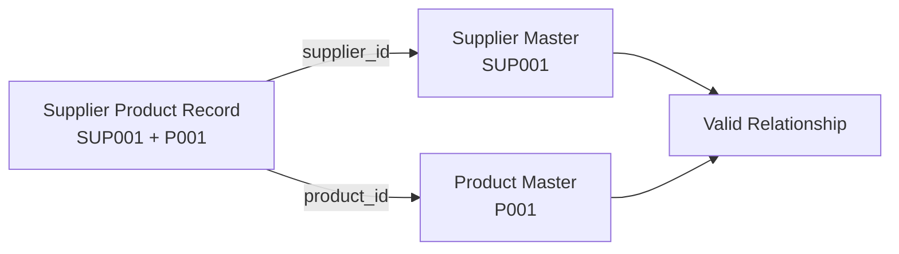
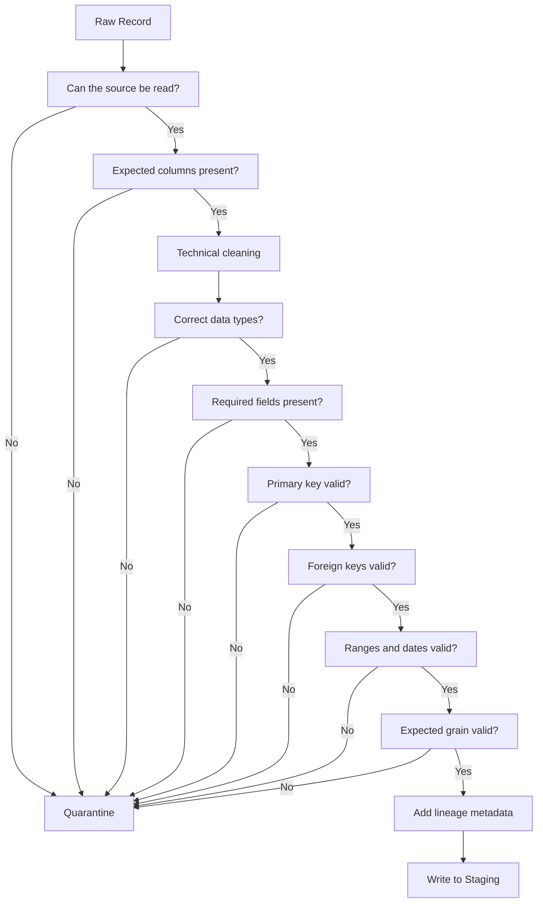

# DATA STAGING LAYER — SUPPLY CHAIN DATA FOUNDATION

## Overview

The Data Staging Layer is the first structured processing layer of the Intelligent Multi-Agent Supply Chain Optimization Framework. Its purpose is to transform the heterogeneous raw source datasets into clean, traceable, and validated staging datasets that can be safely consumed by the subsequent data standardization, entity mapping, data integration, feature engineering, machine learning, and multi-agent processing layers.

The staging process preserves the original business information received from the source systems while applying only technical data preparation and validation. This includes standardizing column names, removing unnecessary whitespace, validating required fields, checking primary and foreign-key integrity, validating dates, numerical ranges and geographic coordinates, identifying duplicate records, and maintaining complete source-level traceability.

The original raw datasets remain immutable and are never modified during this process. Records that fail defined validation rules are separated into a quarantine layer for investigation rather than being silently corrected or deleted.

### Input Layer

`Datasets/raw_dataset/01_RAW_SOURCE/`

Contains the original source datasets used by the project.

### Staging Layer

`Datasets/staging/`

Contains validated and technically cleaned datasets prepared for downstream processing.

### Quarantine Layer

`Datasets/quarantine/`

Contains records that fail one or more staging validation rules, together with information describing the validation failure.

### Data Lineage and Traceability

Each staging record maintains technical metadata including:

- `source_file`
- `source_row_number`
- `ingestion_timestamp`
- `record_hash`

These fields provide traceability from the staged record back to its original source.

### Staging Principles

The staging layer follows these principles:

**Raw data is immutable → Technical cleaning → Validation → Valid staging records + Quarantined invalid records**

No machine-learning features, forecasts, synthetic records, agent reasoning, LLM-generated messages, optimization decisions, or business rules are introduced at this stage.

### Staging Workflow

Raw Source Data  
↓  
Source Inspection  
↓  
Schema and Data-Type Preparation  
↓  
Technical Cleaning  
↓  
Validation  
↓  
Primary-Key / Foreign-Key Checks  
↓  
Business-Grain and Range Checks  
↓  
Valid Staging Data + Quarantine  
↓  
Cross-Dataset Validation  
↓  
Final Staging Quality Report

### Objective

The final objective of this layer is to establish a reliable and auditable data foundation in which every staged record is structurally valid, traceable to its source, and ready for the next stage of the supply-chain data pipeline.


## Beginner Guide: What Is Data Staging and How Does It Work?

### What is Data Staging?

**Data staging** is a controlled temporary layer between the original raw datasets and the later data-processing layers.

In this project, staging takes the original source records, performs **technical cleaning and validation**, and writes a separate staging copy. The original raw files are kept unchanged.

In simple words:

```text
RAW DATA
   ↓
READ + INSPECT
   ↓
TECHNICAL CLEANING
   ↓
DATA-TYPE PREPARATION
   ↓
VALIDATION
   ↓
 ┌───────────────┬────────────────┐
 │ VALID RECORDS │ INVALID RECORDS│
 ↓               ↓
STAGING       QUARANTINE
```

### What Does Staging Actually Do?

Staging answers questions such as:

- Can the source file be read correctly?
- Are the expected columns present?
- Are IDs present and in the correct format?
- Are primary keys unique?
- Are referenced IDs present in the related master table?
- Are dates valid?
- Are numeric values inside valid ranges?
- Does each row represent the expected **grain**?
- Can every staged record be traced back to its original source row?

### What Staging Does Not Do

Staging is **not** the stage for creating new business intelligence. It does not create forecasts, ML features, agent decisions, route decisions, LLM messages, or optimization results.

The purpose is to make the source data **technically trustworthy and traceable**, while preserving its original business meaning.

---

## What Is Grain?

**Grain** means:

> **What exactly does one row represent?**

This is one of the most important ideas in the staging layer.

### Simple Example

If a Product Master has this data:

| product_id | product_name |
|---|---|
| P001 | Rice |
| P002 | Oil |
| P003 | Sugar |

The grain is:

```text
1 row = 1 product
```

For a sales table:

| location_id | product_id | week | units_sold |
|---|---|---|---:|
| LOC001 | P001 | W001 | 120 |
| LOC001 | P002 | W001 | 80 |
| LOC002 | P001 | W001 | 95 |

The grain is:

```text
1 row = 1 location × 1 product × 1 week
```

For inventory:

```text
1 row = 1 warehouse × 1 product × 1 snapshot date
```

For warehouse-picker mapping:

```text
1 row = 1 warehouse × 1 picker
```

### Why Grain Matters

Suppose this is a sales table:

```text
Garia × P001 × W10 = 100 units
```

That is one row.

If another table contains two suppliers for P001 and you join them only on `product_id`, the same sales row could become:

```text
Garia × P001 × W10 × Supplier-01
Garia × P001 × W10 × Supplier-02
```

The row count doubled and the grain changed.

Therefore, staging records and business keys are checked before data is allowed further into the pipeline.

---

## Grain Examples for Every Main Staging Dataset

| Staging Dataset | Grain | Example of One Row |
|---|---|---|
| `stg_product_master` | Product | `P001 = Rice` |
| `stg_location_master` | Location | `LOC001 = Garia` |
| `stg_calendar_week` | Week | `W010 = 2024-03-03 to 2024-03-09` |
| `stg_festival_calendar` | Festival occurrence | `Durga Puja + 2025-10-01` |
| `stg_weather_weekly` | Week | `W010 = one weekly weather record` |
| `stg_warehouse_master` | Warehouse | `WH-KOL-001` |
| `stg_warehouse_location_mapping` | Warehouse × Location | `WH-KOL-001 × LOC001` |
| `stg_warehouse_picker_mapping` | Warehouse × Picker | `WH-KOL-001 × PICK-001` |
| `stg_inventory_position` | Warehouse × Product × Snapshot | `WH-KOL-001 × P001 × 2026-08-31` |
| `stg_storage_assignment` | Warehouse × Product | `WH-KOL-001 × P001 → Shelf-010` |
| `stg_shelf_master` | Shelf | `SHELF-010` |
| `stg_supplier_master` | Supplier | `SUP-001` |
| `stg_supplier_product_catalog` | Supplier × Product | `SUP-001 × P001` |
| `stg_supplier_area_mapping` | Supplier × Location | `SUP-001 × LOC001` |
| `stg_sales_demand` | Region × Product × Week | `Garia × P001 × W010` |
| `stg_demand_agent_training` | Location × Selected Product × Week | `LOC001 × P001 × W010` |
| `stg_inventory_transactions` | Warehouse × Product × Week | `WH-KOL-001 × P001 × W010` |
| `stg_vehicle_master` | Vehicle | `VEH-001` |
| `stg_vehicle_availability` | Vehicle × Week | `VEH-001 × W010` |
| `stg_order` | Order | `ORD-001` |
| `stg_route_network` | Network edge / route segment | `NODE-001 → NODE-002` |

---

# Practical Staging Examples

This section gives a concrete example for each major staging operation used in the notebook.

## 1. Source Inspection Example

Suppose the project finds:

```text
Final product list.xlsx
location_regions.csv
Kolkata_Warehouse_Master_FINAL.xlsx
SELL of past 2 years.xlsx
weather_weekly.csv
festival_calendar.csv
```

The inspection step checks the structure before processing.

Example:

```text
File                         Type        Inspection
---------------------------------------------------
location_regions.csv         CSV         columns + rows
Final product list.xlsx     Excel       sheets + headers
SELL of past 2 years.xlsx   Excel       weekly sheets
```

The purpose is to understand **what is actually present** before staging it.

---

## 2. Column Name Cleaning Example

Raw:

```text
Product ID
Product Name
Selling Price
```

Staged:

```text
product_id
product_name
selling_price
```

This is technical cleanup only.

---

## 3. Whitespace Cleaning Example

Raw:

```text
" P001 "
" Rice "
" Brand A "
```

Staged:

```text
P001
Rice
Brand A
```

The business value has not changed; unnecessary surrounding spaces were removed.

---

## 4. Data-Type Preparation Example

Raw CSV text:

```text
units_sold = "120"
snapshot_date = "2026-08-31"
is_perishable = "TRUE"
```

Staged types:

```text
units_sold     → INTEGER
snapshot_date  → DATE
is_perishable  → BOOLEAN
```

The same business information is represented using the correct technical type.

---

## 5. Primary-Key Validation Example

For `stg_product_master`:

Valid:

```text
P001
P002
P003
```

Invalid:

```text
P001
P002
P002
```

Because the same `product_id` occurs twice, the duplicate record is flagged rather than silently removed.

---

## 6. Foreign-Key Validation Example

Inventory contains:

```text
warehouse_id = WH-KOL-001
product_id   = P001
```

The staging check verifies:

```text
WH-KOL-001 → exists in Warehouse Master? YES
P001       → exists in Product Master?   YES
```

Result:

```text
PASS
```

Invalid example:

```text
warehouse_id = WH-KOL-001
product_id   = P999
```

If `P999` is not in Product Master:

```text
FAIL → QUARANTINE
```

---

## 7. Required-Field Validation Example

Suppose Product Master requires `product_id` and `product_name`.

Valid:

```text
P001 | Rice
```

Invalid:

```text
NULL | Rice
```

The second row fails because the primary identifier is missing.

---

## 8. Null / Missing-Value Example

Raw:

```text
product_id | brand
P001       | ABC
P002       | NULL
```

The staging layer checks whether `brand` is required. If it is optional, the record may remain valid. If it is required by the dataset schema, the record is flagged.

The key idea is:

> A missing value is not automatically an error; it is evaluated against the dataset's defined validation rule.

---

## 9. Range Validation Example

Weather record:

```text
humidity_pct = 72
```

Valid because:

```text
0 <= 72 <= 100
```

Invalid:

```text
humidity_pct = 145
```

because:

```text
145 > 100
```

Similarly:

```text
rainfall_mm >= 0
latitude between -90 and 90
longitude between -180 and 180
```

---

## 10. Date Validation Example

Valid:

```text
2026-08-31
```

Invalid or unstandardized source representation:

```text
31/08/2026
```

The staging layer converts a valid source date representation into the project's standard date representation where appropriate.

---

## 11. Grain Validation Example

Expected inventory grain:

```text
warehouse_id + product_id + snapshot_date
```

Valid:

```text
WH001 | P001 | 2026-08-31
WH001 | P002 | 2026-08-31
WH002 | P001 | 2026-08-31
```

Invalid duplicate:

```text
WH001 | P001 | 2026-08-31
WH001 | P001 | 2026-08-31
```

The same business-grain record appears twice.

---

## 12. Composite-Key Example

For warehouse-picker mapping:

```text
warehouse_id + picker_id
```

Example:

```text
WH-KOL-001 + PICK-001
WH-KOL-001 + PICK-002
WH-KOL-002 + PICK-001
```

These are different records because the warehouse is part of the key.

---

## 13. Geographic Validation Example

Warehouse:

```text
latitude  = 22.500000
longitude = 88.350000
```

Valid because both values fall inside their allowed geographic ranges.

Invalid:

```text
latitude = 120.000000
```

because latitude cannot be greater than 90 degrees.

---

## 14. Boolean Validation Example

Valid:

```text
is_perishable = TRUE
```

or:

```text
is_perishable = FALSE
```

Invalid:

```text
is_perishable = MAYBE
```

when the field is defined as Boolean.

---

## 15. Price and Quantity Validation Example

Product:

```text
cost_price_rs = 42.50
selling_price_rs = 50.00
```

Valid.

Invalid:

```text
units_sold = -15
```

because sales quantity cannot be negative under the staging rule.

Invalid:

```text
cost_price_rs = -20
```

because monetary values must be non-negative.

---

## 16. Lineage Example

A staged row can carry:

```text
source_file = Final product list.xlsx
source_row_number = 152
ingestion_timestamp = 2026-09-28T23:45:10+05:30
```

This means:

```text
Staging Row
    ↓
Final product list.xlsx
    ↓
Original Row 152
```

So an analyst can trace where the record came from.

---

## 17. Record-Hash Example

Business fields:

```text
P001 | Rice | Brand A
```

are passed through SHA-256 to create a fingerprint.

Conceptually:

```text
Business Record
      ↓
   SHA-256
      ↓
Record Hash
```

If the source values change, the resulting fingerprint can change as well.

---

## 18. Quarantine Example

Suppose a supplier record contains:

```text
supplier_id = SUP001
latitude = 250.000000
```

The latitude fails the allowed range.

Instead of deleting the row:

```text
VALIDATION RESULT
        ↓
      FAIL
        ↓
   QUARANTINE
```

Example quarantine information:

```text
supplier_id = SUP001
validation_error = INVALID_LATITUDE
source_file = supplier_master.csv
source_row_number = 88
```

---

## 19. Cross-Table Validation Example

Suppose `Supplier Product Catalog` contains:

```text
supplier_id = SUP001
product_id  = P001
```

The staging layer checks both master tables:



If either master ID is missing, the relationship fails validation.

---

## 20. Sales / Demand Streaming Example

The historical sales workbook is large and contains many weekly sheets.

Instead of loading everything into memory at once:

```text
SELL of past 2 years.xlsx
        ↓
     W001
        ↓
     validate
        ↓
     W002
        ↓
     validate
        ↓
     W003
        ↓
     ...
        ↓
     W139
```

Valid rows are written to the staging output while processing continues.

This is called **streaming ingestion**.

Example row:

```text
Region = Garia
Product = P001
Week = W010
Units Sold = 120
```

The staging process validates the row and writes it without requiring the entire workbook to remain in memory.

---

## 21. Inventory Transaction Provenance Example

If genuine raw inventory transactions exist:

```text
RAW TRANSACTION SOURCE
        ↓
STAGING
```

If they do not exist in the approved raw-source folder:

```text
No genuine raw source
        ↓
NOT_AVAILABLE
```

The staging layer must not silently treat reconstructed or synthetic records as observed raw transactions.

For reconstructed transaction data, provenance is explicitly retained, for example:

```text
record_status = RECONSTRUCTED_SYNTHETIC
```

---

## 22. Technical Cleaning vs Business Transformation

### Technical Cleaning

Example:

```text
" WH-KOL-001 "
        ↓
"WH-KOL-001"
```

This does not change the business meaning.

### Business Transformation

Example:

```text
weekly demand
        ↓
rolling 4-week demand average
```

That creates a new analytical variable and therefore belongs to a later feature-engineering stage, not basic staging.

---

## 23. Full Example: One Product Record Through Staging

Raw record:

```text
Product ID  = " P001 "
Product Name = " Rice "
Brand = " Brand A "
Cost Price = "42.50"
```

Staging sequence:

```text
1. Read raw record
2. Clean whitespace
3. Normalize column names
4. Convert cost price to DECIMAL
5. Check product_id is present
6. Check product_id is unique
7. Add source_file
8. Add source_row_number
9. Add ingestion_timestamp
10. Add record_hash
11. Write to staging
```

Final staged representation:

```text
product_id = P001
product_name = Rice
brand = Brand A
cost_price = 42.50
source_file = Final product list.xlsx
source_row_number = 152
ingestion_timestamp = 2026-09-28T23:45:10+05:30
record_hash = <SHA-256>
```

---

## 24. Complete Staging Decision Flow



---

## 25. Staging in One Sentence

> **Data staging takes immutable raw source data, performs controlled technical preparation and validation, preserves complete traceability, and separates valid records from invalid records without silently changing the underlying business meaning.**

---

# DATA STAGING SCHEMA — COMPLETE REFERENCE

## 1. Purpose of the Staging Schema

The staging schema defines the structure, data types, keys, relationships, and validation rules for every dataset entering the staging layer of the Intelligent Multi-Agent Supply Chain Optimization Framework.

The staging layer acts as a controlled boundary between the immutable raw source data and all downstream processing layers.

### Staging Flow

RAW SOURCE DATA
→ Source Inspection
→ Technical Cleaning
→ Type Preparation
→ Validation
→ Primary/Foreign-Key Checks
→ Grain Validation
→ Valid Staging Dataset
+
Invalid Records → Quarantine

### Core Rules

- Raw source files are never modified.
- Business meaning is preserved.
- No ML features are generated.
- No forecasting is performed.
- No agent messages are generated.
- No LLM reasoning is generated.
- No synthetic records are created.
- Invalid records are quarantined rather than silently corrected.
- Every staged record retains source traceability.

---

# 2. Common Staging Metadata

Every staging table must contain the following technical columns.

| Column | Data Type | Required | Description |
|---|---|---:|---|
| source_file | VARCHAR(255) | YES | Original source filename |
| source_row_number | INTEGER | YES | Original row number in the source file |
| ingestion_timestamp | TIMESTAMP WITH TIME ZONE | YES | Timestamp at which the record entered staging |
| record_hash | VARCHAR(64) | YES | SHA-256 hash of the business/source fields |

### Technical Standards

| Data Element | Staging Standard |
|---|---|
| ID | VARCHAR(50) |
| Name | VARCHAR(255) |
| Description | TEXT |
| Integer quantity | INTEGER |
| Decimal quantity | DECIMAL(14,2) |
| Money | DECIMAL(14,2) |
| Percentage | DECIMAL(5,2) |
| Latitude | DECIMAL(9,6) |
| Longitude | DECIMAL(9,6) |
| Date | DATE |
| Timestamp | TIMESTAMP WITH TIME ZONE |
| Time | TIME |
| Boolean | BOOLEAN |

### Date Standard

`YYYY-MM-DD`

Example:

`2026-08-31`

### Timestamp Standard

`YYYY-MM-DDTHH:MM:SS+05:30`

### Time Standard

`HH:MM:SS`

---

# 3. STG_PRODUCT_MASTER

### Source

`product_master.csv`

### Output

`stg_product_master.csv`

### Grain

One row = one product.

### Primary Key

`product_id`

### Foreign Keys

None at the staging level.

### Schema

| Column | Data Type | Key | Required | Description |
|---|---|---|---:|---|
| product_id | VARCHAR(50) | PK | YES | Unique product identifier |
| category_code | VARCHAR(50) |  | YES | Product category code |
| category_name | VARCHAR(255) |  | YES | Product category |
| product_name | VARCHAR(255) |  | YES | Product name |
| brand | VARCHAR(255) |  | YES | Brand name |
| quality_level | VARCHAR(50) |  | YES | Product quality classification |
| unit_type | VARCHAR(50) |  | NO | Base unit type |
| storage_requirement | VARCHAR(100) |  | NO | Storage condition |
| is_perishable | BOOLEAN |  | NO | Whether the product is perishable |
| unit_size_1 | DECIMAL(14,2) |  | NO | Variant/package size 1 |
| cp_1_rs | DECIMAL(14,2) |  | NO | Cost price for size 1 |
| sp_1_rs | DECIMAL(14,2) |  | NO | Selling price for size 1 |
| unit_size_2 | DECIMAL(14,2) |  | NO | Variant/package size 2 |
| cp_2_rs | DECIMAL(14,2) |  | NO | Cost price for size 2 |
| sp_2_rs | DECIMAL(14,2) |  | NO | Selling price for size 2 |
| unit_size_3 | DECIMAL(14,2) |  | NO | Variant/package size 3 |
| cp_3_rs | DECIMAL(14,2) |  | NO | Cost price for size 3 |
| sp_3_rs | DECIMAL(14,2) |  | NO | Selling price for size 3 |
| unit_size_4 | DECIMAL(14,2) |  | NO | Variant/package size 4 |
| cp_4_rs | DECIMAL(14,2) |  | NO | Cost price for size 4 |
| sp_4_rs | DECIMAL(14,2) |  | NO | Selling price for size 4 |
| unit_size_5 | DECIMAL(14,2) |  | NO | Variant/package size 5 |
| cp_5_rs | DECIMAL(14,2) |  | NO | Cost price for size 5 |
| sp_5_rs | DECIMAL(14,2) |  | NO | Selling price for size 5 |
| source_file | VARCHAR(255) |  | YES | Technical lineage |
| source_row_number | INTEGER |  | YES | Source row |
| ingestion_timestamp | TIMESTAMP WITH TIME ZONE |  | YES | Ingestion timestamp |
| record_hash | VARCHAR(64) |  | YES | Record fingerprint |

### Validation

- `product_id` must not be null or blank.
- `product_id` must be unique.
- Required descriptive fields must not be blank.
- Prices must be >= 0.
- Unit sizes must be > 0 where supplied.
- `is_perishable` must contain valid boolean values.
- No duplicate business records.

---

# 4. STG_LOCATION_MASTER

### Source

`location_regions.csv`

### Grain

One row = one location/region.

### Primary Key

`location_id`

### Schema

| Column | Data Type | Key | Required | Description |
|---|---|---|---:|---|
| location_id | VARCHAR(50) | PK | YES | Unique location identifier |
| location_name | VARCHAR(255) |  | YES | Location/region name |
| region_of_kolkata | VARCHAR(255) |  | NO | Region classification |
| city | VARCHAR(100) |  | NO | City |
| latitude | DECIMAL(9,6) |  | YES | Geographic latitude |
| longitude | DECIMAL(9,6) |  | YES | Geographic longitude |
| area_type | VARCHAR(100) |  | NO | Residential/commercial/etc. |
| source_file | VARCHAR(255) |  | YES | Technical lineage |
| source_row_number | INTEGER |  | YES | Source row |
| ingestion_timestamp | TIMESTAMP WITH TIME ZONE |  | YES | Ingestion timestamp |
| record_hash | VARCHAR(64) |  | YES | Record fingerprint |

### Validation

- `location_id` unique and non-null.
- Latitude between -90 and 90.
- Longitude between -180 and 180.
- Location name must not be blank.
- No duplicate location records.

---

# 5. STG_CALENDAR_WEEK

### Source / Reference

Calendar week source or validated calendar reference.

### Grain

One row = one calendar week.

### Primary Key

`week_id`

### Schema

| Column | Data Type | Key | Required | Description |
|---|---|---|---:|---|
| week_id | VARCHAR(50) | PK | YES | Unique week identifier |
| week_number | INTEGER |  | YES | Week sequence number |
| week_start_date | DATE |  | YES | First day of week |
| week_end_date | DATE |  | YES | Last day of week |
| year | INTEGER |  | YES | Calendar year |
| month | INTEGER |  | NO | Calendar month |
| quarter | INTEGER |  | NO | Calendar quarter |
| source_file | VARCHAR(255) |  | YES | Technical lineage |
| source_row_number | INTEGER |  | YES | Source row |
| ingestion_timestamp | TIMESTAMP WITH TIME ZONE |  | YES | Ingestion timestamp |
| record_hash | VARCHAR(64) |  | YES | Record fingerprint |

### Project Convention

Week definition:

`Sunday → Saturday`

### Validation

- `week_id` unique.
- `week_start_date` unique.
- `week_end_date >= week_start_date`.
- Weekly interval must represent seven calendar days.
- No overlapping week periods.

---

# 6. STG_FESTIVAL_CALENDAR

### Source

`festival_calendar.csv`

### Grain

One row = one festival/holiday occurrence.

### Primary Key

`festival_id`

### Foreign Key

`week_id → stg_calendar_week.week_id`

### Schema

| Column | Data Type | Key | Required | Description |
|---|---|---|---:|---|
| festival_id | VARCHAR(50) | PK | YES | Festival occurrence ID |
| festival_name | VARCHAR(255) |  | YES | Festival name |
| festival_type | VARCHAR(100) |  | NO | Festival classification |
| festival_date | DATE |  | YES | Festival date |
| week_id | VARCHAR(50) | FK | NO | Associated calendar week |
| holiday_flag | BOOLEAN |  | NO | Whether it is a holiday |
| impact_level | VARCHAR(50) |  | NO | Business impact classification |
| source_file | VARCHAR(255) |  | YES | Technical lineage |
| source_row_number | INTEGER |  | YES | Source row |
| ingestion_timestamp | TIMESTAMP WITH TIME ZONE |  | YES | Ingestion timestamp |
| record_hash | VARCHAR(64) |  | YES | Record fingerprint |

### Validation

- Festival ID unique.
- Festival date valid.
- Festival name not blank.
- `week_id` must resolve when supplied.
- No invalid dates.

---

# 7. STG_WEATHER_WEEKLY

### Source

`weather_weekly.csv`

### Grain

One row = one weekly weather observation/summary.

### Primary Key

`weather_id`

### Foreign Key

`week_id → stg_calendar_week.week_id`

### Schema

| Column | Data Type | Key | Required | Description |
|---|---|---|---:|---|
| weather_id | VARCHAR(50) | PK | YES | Weather record ID |
| week_id | VARCHAR(50) | FK | YES | Calendar week |
| week_start_date | DATE |  | YES | Weather week start |
| week_end_date | DATE |  | YES | Weather week end |
| temperature_c | DECIMAL(6,2) |  | NO | Average temperature |
| temperature_max_c | DECIMAL(6,2) |  | NO | Maximum temperature |
| temperature_min_c | DECIMAL(6,2) |  | NO | Minimum temperature |
| rainfall_mm | DECIMAL(10,2) |  | NO | Rainfall |
| humidity_pct | DECIMAL(5,2) |  | NO | Humidity |
| weather_condition | VARCHAR(100) |  | NO | Weather condition |
| source_file | VARCHAR(255) |  | YES | Technical lineage |
| source_row_number | INTEGER |  | YES | Source row |
| ingestion_timestamp | TIMESTAMP WITH TIME ZONE |  | YES | Ingestion timestamp |
| record_hash | VARCHAR(64) |  | YES | Record fingerprint |

### Validation

- Humidity 0–100.
- Rainfall >= 0.
- Minimum temperature <= maximum temperature.
- Valid week relationship.
- Valid dates.

---

# 8. STG_WAREHOUSE_MASTER

### Source

`warehouse_master.csv`

### Grain

One row = one warehouse.

### Primary Key

`warehouse_id`

### Schema

| Column | Data Type | Key | Required | Description |
|---|---|---|---:|---|
| warehouse_id | VARCHAR(50) | PK | YES | Warehouse identifier |
| warehouse_name | VARCHAR(255) |  | YES | Warehouse name |
| area | VARCHAR(255) |  | YES | Warehouse area |
| city | VARCHAR(100) |  | YES | City |
| latitude | DECIMAL(9,6) |  | YES | Latitude |
| longitude | DECIMAL(9,6) |  | YES | Longitude |
| capacity_units | INTEGER |  | YES | Maximum storage capacity |
| weekday_opening | TIME |  | NO | Weekday opening time |
| weekday_closing | TIME |  | NO | Weekday closing time |
| weekend_opening | TIME |  | NO | Weekend opening time |
| weekend_closing | TIME |  | NO | Weekend closing time |
| daily_dispatch_capacity_units | INTEGER |  | NO | Maximum daily dispatch |
| service_radius_km | DECIMAL(8,2) |  | NO | Service radius |
| cycle_count | INTEGER |  | NO | Cycle count |
| bike_count | INTEGER |  | NO | Bike count |
| scooter_count | INTEGER |  | NO | Scooter count |
| electric_scooter_count | INTEGER |  | NO | Electric scooter count |
| auto_count | INTEGER |  | NO | Auto count |
| total_vehicle_count | INTEGER |  | NO | Total vehicles |
| source_file | VARCHAR(255) |  | YES | Technical lineage |
| source_row_number | INTEGER |  | YES | Source row |
| ingestion_timestamp | TIMESTAMP WITH TIME ZONE |  | YES | Ingestion timestamp |
| record_hash | VARCHAR(64) |  | YES | Record fingerprint |

### Validation

- Warehouse ID unique and non-null.
- Coordinates valid.
- Capacity >= 0.
- Dispatch capacity >= 0.
- Vehicle counts >= 0.
- Opening time must precede closing time where both exist.
- Total vehicle count should equal component vehicle counts where all are present.

The project warehouse IDs must remain in the source format:

`WH-KOL-001`, `WH-KOL-002`, ... `WH-KOL-015`.

---

# 9. STG_WAREHOUSE_LOCATION_MAPPING

### Source

Warehouse-location mapping reference.

### Grain

One row = one warehouse × one location relationship.

### Composite Primary Key

`warehouse_id + location_id`

### Foreign Keys

- `warehouse_id → stg_warehouse_master.warehouse_id`
- `location_id → stg_location_master.location_id`

### Schema

| Column | Data Type | Key | Required | Description |
|---|---|---|---:|---|
| warehouse_id | VARCHAR(50) | PK/FK | YES | Warehouse |
| location_id | VARCHAR(50) | PK/FK | YES | Location |
| service_priority | INTEGER |  | NO | Service priority |
| service_radius_km | DECIMAL(8,2) |  | NO | Service radius |
| service_available_flag | BOOLEAN |  | NO | Service availability |
| source_file | VARCHAR(255) |  | YES | Technical lineage |
| source_row_number | INTEGER |  | YES | Source row |
| ingestion_timestamp | TIMESTAMP WITH TIME ZONE |  | YES | Ingestion timestamp |
| record_hash | VARCHAR(64) |  | YES | Record fingerprint |

### Validation

- Composite key unique.
- Warehouse must exist.
- Location must exist.
- Service radius >= 0.
- No duplicate warehouse-location relationship.

---

# 10. STG_WAREHOUSE_PICKER_MAPPING

### Source

Warehouse-picker mapping source.

### Grain

One row = one warehouse × one picker.

### Composite Primary Key

`warehouse_id + picker_id`

### Foreign Key

`warehouse_id → stg_warehouse_master.warehouse_id`

### Schema

| Column | Data Type | Key | Required | Description |
|---|---|---|---:|---|
| warehouse_id | VARCHAR(50) | PK/FK | YES | Warehouse identifier |
| picker_id | VARCHAR(50) | PK | YES | Picker identifier |
| source_file | VARCHAR(255) |  | YES | Technical lineage |
| source_row_number | INTEGER |  | YES | Source row |
| ingestion_timestamp | TIMESTAMP WITH TIME ZONE |  | YES | Ingestion timestamp |
| record_hash | VARCHAR(64) |  | YES | Record fingerprint |

### Validation

- Warehouse exists.
- Picker ID is not blank.
- Composite key is unique.
- Do not invent shift, availability, status, salary, or schedule fields.

---

# 11. STG_INVENTORY_POSITION

### Source

`inventory_position.csv`

### Grain

One row = one warehouse × product × snapshot date.

### Composite Primary Key

`warehouse_id + product_id + snapshot_date`

### Foreign Keys

- `warehouse_id → stg_warehouse_master`
- `product_id → stg_product_master`

### Schema

| Column | Data Type | Key | Required | Description |
|---|---|---|---:|---|
| warehouse_id | VARCHAR(50) | PK/FK | YES | Warehouse |
| product_id | VARCHAR(50) | PK/FK | YES | Product |
| product_name | VARCHAR(255) |  | NO | Product name from source |
| category_name | VARCHAR(255) |  | NO | Category |
| brand | VARCHAR(255) |  | NO | Brand |
| unit_size | DECIMAL(14,2) |  | NO | Product unit size |
| shelf_id | VARCHAR(50) |  | NO | Shelf |
| bin_id | VARCHAR(50) |  | NO | Bin |
| zone_id | VARCHAR(50) |  | NO | Zone |
| rack_id | VARCHAR(50) |  | NO | Rack |
| shelf_level | INTEGER |  | NO | Shelf level |
| slot_no | VARCHAR(50) |  | NO | Slot number |
| slot_capacity_units | INTEGER |  | NO | Slot capacity |
| opening_stock_units | INTEGER |  | NO | Opening stock |
| received_units | INTEGER |  | NO | Received units |
| current_stock_units | INTEGER |  | YES | Current physical stock |
| reserved_stock_units | INTEGER |  | NO | Reserved stock |
| available_stock_units | INTEGER |  | NO | Available stock |
| damaged_units | INTEGER |  | NO | Damaged stock |
| cost_price_rs | DECIMAL(14,2) |  | NO | Cost price |
| selling_price_rs | DECIMAL(14,2) |  | NO | Selling price |
| stock_value_rs | DECIMAL(14,2) |  | NO | Stock value |
| potential_sales_value_rs | DECIMAL(14,2) |  | NO | Potential sales value |
| margin_per_unit_rs | DECIMAL(14,2) |  | NO | Margin per unit |
| avg_weekly_demand_units | DECIMAL(14,2) |  | NO | Historical average demand |
| weeks_of_cover | DECIMAL(10,2) |  | NO | Inventory coverage |
| target_stock_units | INTEGER |  | NO | Target stock |
| shortage_units | INTEGER |  | NO | Shortage |
| reorder_flag | BOOLEAN |  | NO | Reorder indicator |
| stock_status | VARCHAR(50) |  | NO | Stock classification |
| snapshot_date | DATE | PK | YES | Inventory snapshot date |
| source_file | VARCHAR(255) |  | YES | Technical lineage |
| source_row_number | INTEGER |  | YES | Source row |
| ingestion_timestamp | TIMESTAMP WITH TIME ZONE |  | YES | Ingestion timestamp |
| record_hash | VARCHAR(64) |  | YES | Record fingerprint |

### Validation

- Warehouse and product FKs valid.
- Stock quantities >= 0.
- Prices >= 0.
- Slot capacity >= 0.
- Weeks of cover >= 0.
- Snapshot date valid.
- Composite business grain unique.

---

# 12. STG_STORAGE_ASSIGNMENT

### Source

`product_shelf_assignment.csv`

### Grain

One row = one warehouse × one product storage assignment.

### Composite Primary Key

`warehouse_id + product_id`

### Foreign Keys

- warehouse
- product

### Schema

| Column | Data Type | Key | Required | Description |
|---|---|---|---:|---|
| warehouse_id | VARCHAR(50) | PK/FK | YES | Warehouse |
| product_id | VARCHAR(50) | PK/FK | YES | Product |
| zone_id | VARCHAR(50) |  | NO | Zone |
| rack_id | VARCHAR(50) |  | NO | Rack |
| shelf_id | VARCHAR(50) |  | NO | Shelf |
| shelf_level | INTEGER |  | NO | Shelf level |
| bin_id | VARCHAR(50) |  | NO | Bin |
| slot_no | VARCHAR(50) |  | NO | Slot |
| slot_capacity_units | INTEGER |  | NO | Storage capacity |
| source_file | VARCHAR(255) |  | YES | Technical lineage |
| source_row_number | INTEGER |  | YES | Source row |
| ingestion_timestamp | TIMESTAMP WITH TIME ZONE |  | YES | Ingestion timestamp |
| record_hash | VARCHAR(64) |  | YES | Record fingerprint |

### Validation

- Product exists.
- Warehouse exists.
- Storage IDs are not blank where required.
- Capacity >= 0.
- Composite key unique.

---

# 13. STG_SHELF_MASTER

### Source

`shelf_master.csv`

### Grain

One row = one physical shelf/storage unit.

### Primary Key

`shelf_id`

### Foreign Key

`warehouse_id → stg_warehouse_master`

### Schema

| Column | Data Type | Key | Required | Description |
|---|---|---|---:|---|
| shelf_id | VARCHAR(50) | PK | YES | Shelf identifier |
| warehouse_id | VARCHAR(50) | FK | YES | Warehouse |
| zone_id | VARCHAR(50) |  | NO | Zone |
| rack_id | VARCHAR(50) |  | NO | Rack |
| shelf_level | INTEGER |  | NO | Shelf level |
| slot_count | INTEGER |  | NO | Number of slots |
| capacity_units | INTEGER |  | NO | Shelf capacity |
| source_file | VARCHAR(255) |  | YES | Technical lineage |
| source_row_number | INTEGER |  | YES | Source row |
| ingestion_timestamp | TIMESTAMP WITH TIME ZONE |  | YES | Ingestion timestamp |
| record_hash | VARCHAR(64) |  | YES | Record fingerprint |

### Validation

- Shelf ID unique.
- Warehouse exists.
- Capacity >= 0.
- Slot count >= 0.
- No duplicate shelf IDs.

---

# 14. STG_SUPPLIER_MASTER

### Source

`supplier_master.csv`

### Grain

One row = one supplier.

### Primary Key

`supplier_id`

### Foreign Key

`location_id → stg_location_master`

### Schema

| Column | Data Type | Key | Required | Description |
|---|---|---|---:|---|
| supplier_id | VARCHAR(50) | PK | YES | Supplier identifier |
| supplier_name | VARCHAR(255) |  | YES | Supplier name |
| supplier_type_id | VARCHAR(50) |  | YES | Supplier type |
| supplier_type_name | VARCHAR(100) |  | YES | Supplier type name |
| location_id | VARCHAR(50) | FK | YES | Supplier location |
| location_name | VARCHAR(255) |  | NO | Location name |
| city | VARCHAR(100) |  | NO | City |
| supplier_latitude | DECIMAL(9,6) |  | YES | Supplier latitude |
| supplier_longitude | DECIMAL(9,6) |  | YES | Supplier longitude |
| product_category_scope | TEXT |  | NO | Categories supplied |
| minimum_order_qty_units | INTEGER |  | NO | Minimum order |
| max_order_qty_units | INTEGER |  | NO | Maximum order |
| max_ship_qty_at_once_units | INTEGER |  | NO | Maximum shipment |
| supplier_storage_capacity_units | INTEGER |  | NO | Storage capacity |
| vehicle_type | VARCHAR(100) |  | NO | Delivery vehicle type |
| vehicle_count | INTEGER |  | NO | Vehicle count |
| vehicle_load_capacity_units | INTEGER |  | NO | Vehicle carrying capacity |
| lead_time_days | DECIMAL(8,2) |  | NO | Supplier lead time |
| location_note | TEXT |  | NO | Location description |
| source_file | VARCHAR(255) |  | YES | Technical lineage |
| source_row_number | INTEGER |  | YES | Source row |
| ingestion_timestamp | TIMESTAMP WITH TIME ZONE |  | YES | Ingestion timestamp |
| record_hash | VARCHAR(64) |  | YES | Record fingerprint |

### Validation

- Supplier ID unique.
- Location FK valid.
- Coordinates valid.
- Quantities >= 0.
- Vehicle count >= 0.
- Lead time >= 0.
- Minimum order <= maximum order where both exist.

---

# 15. STG_SUPPLIER_PRODUCT_CATALOG

### Source

`supplier_product_catalog.csv`

### Grain

One row = one supplier × one product relationship.

### Primary Key

`supplier_product_key`

### Foreign Keys

- `supplier_id → stg_supplier_master`
- `product_id → stg_product_master`

### Schema

| Column | Data Type | Key | Required | Description |
|---|---|---|---:|---|
| supplier_product_key | VARCHAR(100) | PK | YES | Unique supplier-product key |
| supplier_id | VARCHAR(50) | FK | YES | Supplier |
| supplier_type_id | VARCHAR(50) |  | NO | Supplier type |
| supplier_type_name | VARCHAR(100) |  | NO | Supplier type name |
| product_supplied_id | VARCHAR(50) |  | NO | Source product identifier |
| product_id | VARCHAR(50) | FK | YES* | Standard product identifier |
| product_name | VARCHAR(255) |  | NO | Product name |
| category_code | VARCHAR(50) |  | NO | Category code |
| category_name | VARCHAR(255) |  | NO | Category |
| unit_type | VARCHAR(50) |  | NO | Unit type |
| supplier_cost_price_rs | DECIMAL(14,2) |  | NO | Supplier cost |
| supplied_unit_size | DECIMAL(14,2) |  | NO | Supplied size |
| supply_status | VARCHAR(50) |  | NO | Supply status |
| source_file | VARCHAR(255) |  | YES | Technical lineage |
| source_row_number | INTEGER |  | YES | Source row |
| ingestion_timestamp | TIMESTAMP WITH TIME ZONE |  | YES | Ingestion timestamp |
| record_hash | VARCHAR(64) |  | YES | Record fingerprint |

### Validation

- Supplier-product key unique.
- Supplier exists.
- Product exists where `product_id` is available.
- Cost >= 0.
- Supplied quantity/size > 0 where applicable.
- Supply status uses valid controlled values.

---

# 16. STG_SUPPLIER_AREA_MAPPING / OPTIONS

### Source

`supplier_area_options.csv`

### Grain

One row = one location × one supplier option.

### Composite Primary Key

`location_id + supplier_id`

### Foreign Keys

- location
- supplier

### Schema

| Column | Data Type | Key | Required | Description |
|---|---|---|---:|---|
| location_id | VARCHAR(50) | PK/FK | YES | Area/location |
| supplier_id | VARCHAR(50) | PK/FK | YES | Supplier |
| supplier_type_id | VARCHAR(50) |  | NO | Supplier type |
| supplier_type_name | VARCHAR(100) |  | NO | Supplier type name |
| latitude | DECIMAL(9,6) |  | NO | Supplier latitude |
| longitude | DECIMAL(9,6) |  | NO | Supplier longitude |
| distance_from_location_center_km | DECIMAL(10,2) |  | NO | Distance |
| supplier_option_rank | INTEGER |  | NO | Supplier rank from source |
| service_available_flag | BOOLEAN |  | NO | Service availability |
| source_file | VARCHAR(255) |  | YES | Technical lineage |
| source_row_number | INTEGER |  | YES | Source row |
| ingestion_timestamp | TIMESTAMP WITH TIME ZONE |  | YES | Ingestion timestamp |
| record_hash | VARCHAR(64) |  | YES | Record fingerprint |

### Validation

- Location exists.
- Supplier exists.
- Distance >= 0.
- Option rank >= 1.
- Composite relationship unique.

---

# 17. STG_SUPPLIER_AREA_MASTER

### Source

`supplier_area_master.csv`

### Grain

One row = one supplier service-area master record.

### Primary Key

Use the actual source key after inspection.

### Validation

- Required supplier/location identifiers present.
- Coordinates valid where present.
- No duplicate business-grain records.
- All referenced supplier and location IDs must resolve.

Do not invent a primary key if the source does not provide one.
If required, derive a deterministic technical key only after documenting
that it is a staging key rather than a source business key.

---

# 18. STG_SALES_DEMAND

### Source

`sales_history_source.xlsx`

### Grain

One row = one region × one product × one week.

### Primary Key

`region_product_week_key`

### Foreign Keys

- `region_id → stg_location_master.location_id`
- `product_id → stg_product_master.product_id`
- week reference → `stg_calendar_week.week_id`

### Schema

| Column | Data Type | Key | Description |
|---|---|---|---|
| region_product_week_key | VARCHAR(100) | PK | Business grain key |
| region_week_key | VARCHAR(100) |  | Region-week key |
| week_number | INTEGER |  | Week number |
| week_start_date | DATE |  | Week start |
| week_end_date | DATE |  | Week end |
| region_id | VARCHAR(50) | FK | Region |
| region_of_kolkata | VARCHAR(255) |  | Region name |
| product_id | VARCHAR(50) | FK | Product |
| product_name | VARCHAR(255) |  | Product |
| category_name | VARCHAR(255) |  | Category |
| brand | VARCHAR(255) |  | Brand |
| quality_level | VARCHAR(50) |  | Quality |
| unit_size | DECIMAL(14,2) |  | Unit size |
| opening_inventory_units | INTEGER |  | Opening inventory |
| replenishment_units | INTEGER |  | Replenishment |
| available_inventory_units | INTEGER |  | Available inventory |
| units_sold | INTEGER |  | Units sold |
| closing_inventory_units | INTEGER |  | Closing inventory |
| avg_selling_price_rs | DECIMAL(14,2) |  | Average selling price |
| sales_value_rs | DECIMAL(14,2) |  | Sales value |
| promotion_flag | BOOLEAN |  | Promotion indicator |
| discount_pct | DECIMAL(5,2) |  | Discount |
| stockout_flag | BOOLEAN |  | Stockout indicator |
| holiday_flag | BOOLEAN |  | Holiday indicator |
| festival_event | VARCHAR(255) |  | Festival/event |
| season | VARCHAR(50) |  | Season |
| temperature_c | DECIMAL(6,2) |  | Temperature |
| temperature_max_c | DECIMAL(6,2) |  | Maximum temperature |
| temperature_min_c | DECIMAL(6,2) |  | Minimum temperature |
| rainfall_mm | DECIMAL(10,2) |  | Rainfall |
| humidity_pct | DECIMAL(5,2) |  | Humidity |
| weather_condition | VARCHAR(100) |  | Weather condition |
| demand_score | DECIMAL(14,4) |  | Source-provided demand score |
| demand_rank_200 | INTEGER |  | Source-provided demand rank |
| top5_flag | BOOLEAN |  | Source-provided flag |
| demand_agent_ref | VARCHAR(100) |  | Source reference if supplied |
| demand_agent_source_row | VARCHAR(100) |  | Source row reference |
| demand_agent_lookup_hint | TEXT |  | Source lookup metadata |
| data_source | VARCHAR(100) |  | Source indicator |
| source_file | VARCHAR(255) |  | Technical lineage |
| source_row_number | INTEGER |  | Source row |
| ingestion_timestamp | TIMESTAMP WITH TIME ZONE |  | Ingestion timestamp |
| record_hash | VARCHAR(64) |  | Record fingerprint |

### Validation

- `region_product_week_key` unique.
- Product FK valid.
- Region FK valid.
- Week/date valid.
- Units sold >= 0.
- Inventory quantities >= 0.
- Prices >= 0.
- Discount 0–100.
- Humidity 0–100.
- Rainfall >= 0.
- Minimum temperature <= maximum temperature.
- No duplicate region-product-week records.

### Important

Source fields such as `demand_score`, `demand_rank_200`, and `top5_flag`
are preserved as source attributes at staging level. They are not newly
engineered ML features in this layer.

---

# 19. STG_DEMAND_AGENT_TRAINING

### Source

`demand_agent_training.csv`

### Grain

One row = one training scenario / region-product-week observation.

### Primary Key

Use the actual source training identifier after inspection.
If `region_product_week_key` is unique in the file, it may be used as the
business key.

### Validation

- Required region/product/week references exist.
- Dates valid.
- Demand-related quantities non-negative.
- No duplicate business grain.
- No future target leakage into input fields.
- Preserve source records exactly at staging level.

### Important

This table is a training-oriented source dataset. It must not be treated
as a replacement for the complete historical sales source if the latter
contains a different grain or larger population.

---

# 20. STG_INVENTORY_TRANSACTIONS

### Source

Only create this table if a genuine inventory transaction source exists.

### Grain

One row = one warehouse × one product × one week.

### Primary Key

`warehouse_product_week_key`

### Foreign Keys

- warehouse
- product
- week

### Possible Schema

| Column | Data Type | Key | Description |
|---|---|---|---|
| warehouse_product_week_key | VARCHAR(100) | PK | Business grain |
| warehouse_id | VARCHAR(50) | FK | Warehouse |
| product_id | VARCHAR(50) | FK | Product |
| week_id | VARCHAR(50) | FK | Week |
| week_start_date | DATE |  | Week start |
| week_end_date | DATE |  | Week end |
| received_units | INTEGER |  | Receipts |
| sold_units | INTEGER |  | Sold units |
| transfer_in_units | INTEGER |  | Transfer in |
| transfer_out_units | INTEGER |  | Transfer out |
| adjustment_units | INTEGER |  | Inventory adjustment |
| damaged_units | INTEGER |  | Damaged units |
| closing_stock_units | INTEGER |  | Closing stock |
| data_source | VARCHAR(100) |  | Source indicator |
| source_file | VARCHAR(255) |  | Technical lineage |
| source_row_number | INTEGER |  | Source row |
| ingestion_timestamp | TIMESTAMP WITH TIME ZONE |  | Ingestion timestamp |
| record_hash | VARCHAR(64) |  | Record fingerprint |

### Important

If no genuine source file exists:

`STATUS = NOT_AVAILABLE`

Do not create fabricated inventory transaction history during staging.

---

# 21. STG_VEHICLE_MASTER

### Source

Only create if genuine vehicle-level source data exists.

### Grain

One row = one vehicle.

### Primary Key

`vehicle_id`

### Possible Schema

| Column | Data Type | Key | Description |
|---|---|---|---|
| vehicle_id | VARCHAR(50) | PK | Vehicle identifier |
| vehicle_type | VARCHAR(100) |  | Vehicle type |
| load_capacity_units | INTEGER |  | Capacity |
| warehouse_id | VARCHAR(50) | FK | Assigned warehouse |
| supplier_id | VARCHAR(50) | FK | Assigned supplier |
| operating_status | VARCHAR(50) |  | Operational state |
| source_file | VARCHAR(255) |  | Technical lineage |
| source_row_number | INTEGER |  | Source row |
| ingestion_timestamp | TIMESTAMP WITH TIME ZONE |  | Ingestion timestamp |
| record_hash | VARCHAR(64) |  | Record fingerprint |

### Important

Do not invent vehicle IDs merely because warehouse vehicle counts exist.

---

# 22. STG_VEHICLE_AVAILABILITY

### Grain

One row = one vehicle × one availability date.

### Composite Primary Key

`vehicle_id + availability_date`

### Foreign Key

`vehicle_id → stg_vehicle_master`

### Validation

- Vehicle exists.
- Date valid.
- Availability status controlled.
- No duplicate vehicle-date record.

---

# 23. STG_ORDER

### Source

Only create if genuine order data exists.

### Grain

One row = one customer/order transaction.

### Primary Key

`order_id`

### Possible Schema

| Column | Data Type | Key | Description |
|---|---|---|---|
| order_id | VARCHAR(50) | PK | Order identifier |
| order_date | DATE |  | Order date |
| location_id | VARCHAR(50) | FK | Delivery/customer location |
| product_id | VARCHAR(50) | FK | Product |
| quantity_units | INTEGER |  | Ordered quantity |
| warehouse_id | VARCHAR(50) | FK | Fulfilling warehouse |
| requested_delivery_date | DATE |  | Requested delivery |
| delivery_time_window_start | TIME |  | Start time |
| delivery_time_window_end | TIME |  | End time |
| order_status | VARCHAR(50) |  | Order status |
| source_file | VARCHAR(255) |  | Technical lineage |
| source_row_number | INTEGER |  | Source row |
| ingestion_timestamp | TIMESTAMP WITH TIME ZONE |  | Ingestion timestamp |
| record_hash | VARCHAR(64) |  | Record fingerprint |

### Important

Do not fabricate customer orders when no source exists.

---

# 24. STG_ROUTE_NETWORK

### Source

Only create when actual road-network data is available.

### Grain

One row = one directed origin-node → destination-node edge.

### Composite Primary Key

`origin_node_id + destination_node_id`

### Schema

| Column | Data Type | Key | Description |
|---|---|---|---|
| origin_node_id | VARCHAR(50) | PK | Origin road node |
| destination_node_id | VARCHAR(50) | PK | Destination road node |
| distance_km | DECIMAL(12,4) |  | Road distance |
| travel_time_min | DECIMAL(12,2) |  | Travel time |
| road_type | VARCHAR(100) |  | Road classification |
| one_way_flag | BOOLEAN |  | One-way road |
| source_file | VARCHAR(255) |  | Technical lineage |
| source_row_number | INTEGER |  | Source row |
| ingestion_timestamp | TIMESTAMP WITH TIME ZONE |  | Ingestion timestamp |
| record_hash | VARCHAR(64) |  | Record fingerprint |

### Important

Geometric/Haversine distance must not be labeled as road distance.
Road distance should come from a road-network/routing source such as OSRM
when this layer is implemented.

---

# 25. PRIMARY-KEY VALIDATION

Every staging table must satisfy:

- Primary key is not null.
- Primary key contains no blank values.
- Primary key is unique.
- Composite keys are unique as a combination.
- Duplicate records are quarantined.

---

# 26. FOREIGN-KEY VALIDATION

The following relationships must be validated:

Product:
    sales → product
    inventory → product
    storage → product
    supplier-product → product

Location:
    sales → location
    supplier → location
    warehouse-location → location

Warehouse:
    inventory → warehouse
    storage → warehouse
    picker mapping → warehouse
    warehouse-location → warehouse

Supplier:
    supplier-product → supplier
    supplier-area → supplier

Calendar:
    sales → week
    weather → week
    festival → week
    inventory transactions → week

Unresolved foreign keys must be reported and quarantined.

---

# 27. DATA RANGE VALIDATION

### Quantities

Must generally satisfy:

`quantity >= 0`

### Prices

Must satisfy:

`price >= 0`

### Percentages

Must satisfy:

`0 <= percentage <= 100`

### Latitude

Must satisfy:

`-90 <= latitude <= 90`

### Longitude

Must satisfy:

`-180 <= longitude <= 180`

### Temperature

Must be numerically valid and internally consistent:

`temperature_min <= temperature_max`

### Time

Opening time must precede closing time where both exist.

---

# 28. BUSINESS-GRAIN VALIDATION

The following grains must remain unique:

Product:
    product_id

Location:
    location_id

Calendar:
    week_id

Festival:
    festival_id

Weather:
    weather_id

Warehouse:
    warehouse_id

Warehouse-Picker:
    warehouse_id + picker_id

Warehouse-Location:
    warehouse_id + location_id

Inventory Position:
    warehouse_id + product_id + snapshot_date

Storage Assignment:
    warehouse_id + product_id

Supplier:
    supplier_id

Supplier-Product:
    supplier_product_key

Supplier-Area:
    location_id + supplier_id

Sales/Demand:
    region_product_week_key

Inventory Transactions:
    warehouse_product_week_key

---

# 29. QUARANTINE RULE

A record must be moved to quarantine when one or more validation rules fail.

Each quarantine record should retain:

- All original/staging fields
- `validation_error`

Example:

`DUPLICATE_PRODUCT_ID;`

or:

`INVALID_LONGITUDE;`

or:

`MISSING_PRODUCT_ID;`

Multiple validation errors may be recorded for a single row.

---

# 30. FINAL STAGING QUALITY REPORT

The final report should contain:

| Column | Description |
|---|---|
| dataset_name | Staging dataset |
| source_file | Input source |
| source_available | Source availability |
| source_rows | Source row count |
| staged_rows | Valid staged rows |
| quarantined_rows | Invalid rows |
| primary_key | Primary key definition |
| primary_key_duplicates | Duplicate count |
| required_field_failures | Required field failures |
| foreign_key_failures | FK failures |
| range_failures | Range violations |
| output_file | Staging output path |
| status | PASS / FAIL / WARNING / NOT_AVAILABLE |
| notes | Additional validation information |

### Final Status Definitions

PASS:
    All required validations passed.

WARNING:
    Non-critical issue exists but staging can continue.

FAIL:
    Critical validation failed.

NOT_AVAILABLE:
    Required source dataset does not exist.

---

# 31. STAGING LAYER BOUNDARY

The staging layer ends after:

- Technical cleaning
- Type preparation
- Source traceability
- Primary-key validation
- Foreign-key validation
- Date validation
- Numeric validation
- Grain validation
- Quarantine handling
- Cross-table QA

The following belong to later layers and must NOT be performed here:

- Entity standardization
- Product variant normalization
- Feature engineering
- Forecast target creation
- ML model training
- Synthetic data generation
- Agent prompt generation
- Agent reasoning
- LLM orchestration
- Route optimization
- Kafka streaming
- MongoDB operational state
- Coordinator decisions

---

## BLOCK 3 — Product Master Staging

### Purpose
Prepare the raw Product Master data for downstream processing without modifying the original raw file.

### Operations Performed
1. Read `product_master.csv` from the raw source folder.
2. Standardize column names to lowercase `snake_case`.
3. Remove leading and trailing spaces from text values.
4. Check that all required columns are present.
5. Add technical metadata:
   - `source_file`
   - `source_row_number`
   - `ingestion_timestamp`
   - `record_hash`
6. Validate `product_id`:
   - Must not be blank.
   - Must be unique.
7. Validate required descriptive fields:
   - `category_code`
   - `category_name`
   - `product_name`
   - `brand`
   - `quality_level`
8. Separate valid and invalid records.
9. Save valid records to:
   `Datasets/staging/stg_product_master.csv`
10. Save invalid records to:
    `Datasets/quarantine/product_master_quarantine.csv`

### Staging Principle
**Raw Data → Cleaning → Validation → Valid Staging Data + Quarantine**

### Important
- Raw data remains unchanged.
- No ML features are created at this stage.
- No agent decisions or messages are generated.
- No business values are invented or modified.

---

## BLOCK 4 — Location Master Staging

### Purpose
Prepare the raw Kolkata Location/Region Master data for downstream integration.

### Operations Performed
1. Read `location_regions.csv` from `01_RAW_SOURCE`.
2. Standardize column names to lowercase `snake_case`.
3. Remove leading and trailing spaces from text values.
4. Validate required location fields.
5. Validate `location_id`:
   - Must not be blank.
   - Must be unique.
6. Validate geographic coordinates:
   - Latitude must be between -90 and 90.
   - Longitude must be between -180 and 180.
7. Add technical metadata:
   - `source_file`
   - `source_row_number`
   - `ingestion_timestamp`
   - `record_hash`
8. Separate valid and invalid records.
9. Save valid records to:
   `Datasets/staging/stg_location_master.csv`
10. Save invalid records to:
    `Datasets/quarantine/location_master_quarantine.csv`

### Staging Principle
**Raw Location Data → Cleaning → Validation → Staging + Quarantine**

### Important
- The raw location file remains unchanged.
- Coordinates are validated but not artificially corrected.
- No ML features are created.
- No agent decisions or messages are generated.

---

## BLOCK 5 — Warehouse Master Staging

### Purpose
Stage and validate the authoritative Warehouse Master dataset (`warehouse_master.csv`) with geographical boundary checks and capacity validation without altering raw records.

### Operations Performed
1. Read `warehouse_master.csv` from `01_RAW_SOURCE`.
2. Standardize column names to lowercase `snake_case`.
3. Strip whitespace from text attributes.
4. Enforce Primary Key uniqueness and non-null constraint on `warehouse_id`.
5. Validate geographical coordinates:
   - `latitude` between -90.0 and 90.0
   - `longitude` between -180.0 and 180.0
6. Validate positive warehouse storage capacity (`capacity_units > 0`).
7. Append technical metadata:
   - `source_file`
   - `source_row_number`
   - `ingestion_timestamp`
   - `record_hash` (SHA-256 over business columns)
8. Output valid records to `Datasets/staging/stg_warehouse_master.csv` and quarantine any invalid rows to `Datasets/quarantine/warehouse_master_quarantine.csv`.

---

## BLOCK 6 — Warehouse-Picker Mapping Staging

### Purpose
Stage the warehouse-to-picker assignment relationship (`warehouse_picker_mapping.csv`), verifying cardinality (each picker belongs to exactly one warehouse) and referential integrity against the warehouse master.

### Operations Performed
1. Locate source dataset in `01_RAW_SOURCE` (or `02_DERIVED_REFERENCE`).
2. Clean column headers and values.
3. Validate `picker_id` is unique and non-null.
4. Validate foreign key: `warehouse_id` exists in staged `stg_warehouse_master.csv`.
5. Verify unique composite grain `(warehouse_id, picker_id)`.
6. Append technical lineage metadata.
7. Export valid records to `Datasets/staging/stg_warehouse_picker_mapping.csv` and quarantine invalid records.

---

## BLOCK 7 — Inventory Position Staging

### Purpose
Stage warehouse inventory snapshot positions (`inventory_position.csv`), normalizing snapshot dates and enforcing business grain and inventory domain constraints.

### Operations Performed
1. Read `inventory_position.csv` from `01_RAW_SOURCE`.
2. Standardize column names and strip whitespace.
3. Normalize `snapshot_date`: convert Excel serial numbers (e.g. `46265`) into standard `YYYY-MM-DD` (`2026-08-31`).
4. Enforce business grain uniqueness: `(warehouse_id, product_id, snapshot_date)`.
5. Validate inventory stock quantities (`current_stock_units >= 0`, `damaged_units >= 0`, `available_stock_units >= 0`).
6. Validate foreign key consistency against `stg_warehouse_master` and `stg_product_master`.
7. Append technical lineage metadata (`source_file`, `source_row_number`, `ingestion_timestamp`, `record_hash`).
8. Route clean rows to `Datasets/staging/stg_inventory_position.csv` and quarantine invalid records.

---

## BLOCK 8 — Shelf / Storage Assignment Staging

### Purpose
Stage warehouse bin slotting (`product_shelf_assignment.csv`) and shelf physical configuration (`shelf_master.csv`), validating slot uniqueness, warehouse FKs, and storage capacity limits.

### Operations Performed
1. Ingest `product_shelf_assignment.csv` and `shelf_master.csv`.
2. Standardize headers and trim text fields.
3. Validate slot allocation uniqueness: `(warehouse_id, product_id, shelf_id, bin_id)`.
4. Validate positive slot capacity (`slot_capacity_units > 0`) and shelf capacity (`shelf_capacity_units > 0`).
5. Validate space utilization range: `0 <= space_utilization_pct <= 100`.
6. Append technical lineage metadata to both datasets.
7. Route valid rows to `Datasets/staging/stg_storage_assignment.csv` and `Datasets/staging/stg_shelf_master.csv`.

---

## BLOCK 9 — Supplier Master Staging

### Purpose
Stage supplier profile records (`supplier_master.csv`), validating supplier coordinates, lead-time bounds, minimum/maximum order quantity consistency, and regional location foreign keys.

### Operations Performed
1. Ingest `supplier_master.csv` from `01_RAW_SOURCE`.
2. Standardize column headers and strip whitespace.
3. Validate Primary Key uniqueness on `supplier_id`.
4. Validate geographic coordinates within bounds (-90 to 90 lat, -180 to 180 lon).
5. Validate positive or non-negative lead times (`lead_time_days >= 0`) and order bounds (`max_order_qty_units >= minimum_order_qty_units`).
6. Validate foreign key linkage to `stg_location_master` via `location_id`.
7. Append technical lineage metadata.
8. Output valid records to `Datasets/staging/stg_supplier_master.csv`.

---

## BLOCK 10 — Supplier-Product Catalog Staging

### Purpose
Stage supplier catalog product availability and contract cost pricing (`supplier_product_catalog.csv`), enforcing referential integrity against suppliers and products.

### Operations Performed
1. Read `supplier_product_catalog.csv` from `01_RAW_SOURCE`.
2. Standardize column names and clean string attributes.
3. Validate Primary Key uniqueness on `supplier_product_key`.
4. Validate positive procurement cost pricing (`supplier_cost_price_rs > 0`).
5. Validate foreign key consistency against `stg_supplier_master` and `stg_product_master`.
6. Append technical lineage metadata.
7. Save valid records to `Datasets/staging/stg_supplier_product_catalog.csv`.

---

## BLOCK 11 — Weather Staging

### Purpose
Stage weekly environmental metrics (`weather_weekly.csv`), normalizing observation dates and enforcing meteorological domain boundaries.

### Operations Performed
1. Ingest `weather_weekly.csv` from `01_RAW_SOURCE`.
2. Standardize column names and format dates to `YYYY-MM-DD`.
3. Validate grain uniqueness on `week_start_date`.
4. Validate environmental domain limits:
   - `rainfall_mm >= 0`
   - `0 <= humidity_pct <= 100`
   - `temperature_min_c <= temperature_max_c`
5. Append technical lineage metadata.
6. Export valid records to `Datasets/staging/stg_weather_weekly.csv`.

---

## BLOCK 12 — Festival Calendar Staging

### Purpose
Stage cultural and regional festive events (`festival_calendar.csv`), normalizing event dates and validating event grain uniqueness.

### Operations Performed
1. Read `festival_calendar.csv` from `01_RAW_SOURCE`.
2. Clean column headers and values.
3. Normalize `event_date` to `YYYY-MM-DD`.
4. Validate event grain uniqueness: `(festival_event, event_date)`.
5. Append technical lineage metadata.
6. Output clean records to `Datasets/staging/stg_festival_calendar.csv`.

---

## BLOCK 13 — Calendar Week Staging

### Purpose
Stage enterprise calendar reference week dimension (`calendar_week.csv`), validating week identifiers, date boundaries, and calendar ranges.

### Operations Performed
1. Locate `calendar_week.csv` in `01_RAW_SOURCE` (or `02_DERIVED_REFERENCE`).
2. Standardize column names and format dates to `YYYY-MM-DD`.
3. Validate Primary Key uniqueness on `week_id`.
4. Validate week bounds: `week_number` in [1, 53], `month` in [1, 12], `quarter` in [1, 4].
5. Append technical lineage metadata.
6. Export valid records to `Datasets/staging/stg_calendar_week.csv`.

---

## BLOCK 14 — Sales / Demand Staging (Streaming Ingestion)

### Purpose
Safely stream and stage the large historical sales workbook (`sales_history_source.xlsx`, ~1.1M rows across 139 weekly sheets) into `Datasets/staging/stg_sales_demand.csv`.

### Performance Architecture
- Uses `openpyxl.load_workbook(filename, read_only=True, data_only=True)` to stream sheet-by-sheet with low memory consumption.
- Selects only weekly sales sheets (`W001` through `W139`), ignoring index and summary tabs.
- Normalizes datetime values to standard `YYYY-MM-DD`.
- Computes SHA-256 record hashes over business attributes per row.
- Enforces non-negative sales volume (`units_sold >= 0`) and primary key validity (`region_product_week_key`).
- Streams valid rows directly into `stg_sales_demand.csv` without loading the full workbook into memory.

---

## BLOCK 15 — Inventory Transactions Staging (Source Verification)

### Purpose
Audit and verify the existence of genuine raw inventory transaction history in `01_RAW_SOURCE`.

### Strict Staging Rule
- In strict adherence to raw data immutability and provenance governance, only genuine raw source files located in `01_RAW_SOURCE` may be staged.
- If genuine transaction records are not present in `01_RAW_SOURCE`, the pipeline marks the dataset status as `NOT_AVAILABLE`.
- Under no circumstances is synthetic or reconstructed data fabricated or treated as genuine source data at the staging tier.

---

## BLOCK 16 — Cross-Table Staging QA & Referential Integrity

### Purpose
Conduct comprehensive cross-table referential integrity and entity consistency audits across all staged supply chain dimensions and transactional snapshots.

### Quality Checks Executed
1. **Product Master Integrity**: Verifies all product IDs referenced in Inventory, Catalog, Storage, and Sales resolve to `stg_product_master.csv`.
2. **Location Master Integrity**: Verifies all location IDs referenced in Suppliers and Sales resolve to `stg_location_master.csv`.
3. **Warehouse Master Integrity**: Verifies all warehouse IDs in Inventory, Pickers, and Storage resolve to `stg_warehouse_master.csv`.
4. **Supplier Master Integrity**: Verifies all supplier catalog offerings map to recognized suppliers.
5. **Primary Key Uniqueness**: Verifies zero duplicate primary keys across all staging entities.
6. **Output Report**: Assembles audit metrics into `staging_validation_report` DataFrame.

---

## BLOCK 17 — Final Staging Report

### Purpose
Compile, summarize, and export the official Staging Layer Audit Report to `Datasets/reports/staging_final_report.csv` and display executive summary.

---

# BLOCK 18 — Inventory Transactions Staging (`stg_inventory_transactions.csv`)

### Business Context — Kolkata FMCG Weekly Transaction Records
The Inventory Transactions dataset captures **weekly warehouse × product movement records** across the 15 Kolkata FMCG distribution warehouses. Each record represents a net outward dispatch (SALE/OUT) of a specific product from a specific warehouse during a specific ISO week.

> ⚠️ **Synthetic Provenance**: This dataset is classified `RECONSTRUCTED_SYNTHETIC`.  
> Records were reconstructed from `Inventory_Position.avg_weekly_demand_units` plus deterministic seasonality adjustments — **not** observed from real POS/WMS systems.  
> `record_status` and `source_basis` are preserved throughout all pipeline layers.  
> Downstream ML/agent workflows **must** use this flag to distinguish synthetic from observed transaction behavior.

### Dataset Specification
| Property | Value |
|---|---|
| Source File | `inventory_transactions_reconstructed.csv` |
| Source Folder | `03_SYNTHETIC_SUPPORT/` |
| Classification | `RECONSTRUCTED_SYNTHETIC` |
| Grain | Warehouse × Product × Week |
| Primary Business Key | `warehouse_product_week_key` |
| Total Raw Rows | 417,000 |

### Technical Metadata Added
| Column | Definition |
|---|---|
| `source_file` | Original filename |
| `source_row_number` | Original row number (1-indexed, header = row 1) |
| `ingestion_timestamp` | Local timestamp with IST (+05:30) timezone offset |
| `record_hash` | SHA-256 of all business source columns (excl. metadata) |

### Validation Rules Applied
| Rule | Description |
|---|---|
| Required columns | All 10 business columns present and non-null |
| PK uniqueness | `warehouse_product_week_key` must be unique |
| `sold_units >= 0` | No negative dispatch quantities allowed |
| Date validity | `week_start_date` and `week_end_date` parseable as YYYY-MM-DD |
| FK: `warehouse_id` | Must resolve to `stg_warehouse_master` |
| FK: `product_id` | Must resolve to `stg_product_master` |
| FK: `week_id` | Must resolve to `stg_calendar_week` |

### Pipeline Decision
- Valid rows → `stg_inventory_transactions.csv`
- Invalid rows → `inventory_transactions_quarantine.csv`
- `record_status = RECONSTRUCTED_SYNTHETIC` is preserved as-is

### Deferred Datasets
| Dataset | Status |
|---|---|
| Vehicle Master | `DEFERRED` — awaiting pipeline instruction |
| Order Data | `DEFERRED` — awaiting pipeline instruction |
