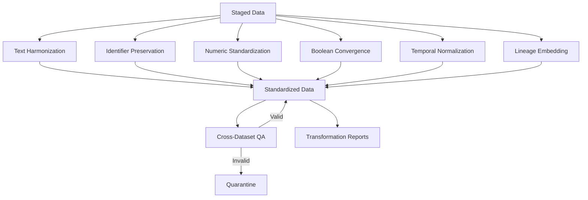
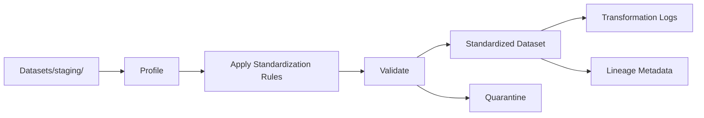
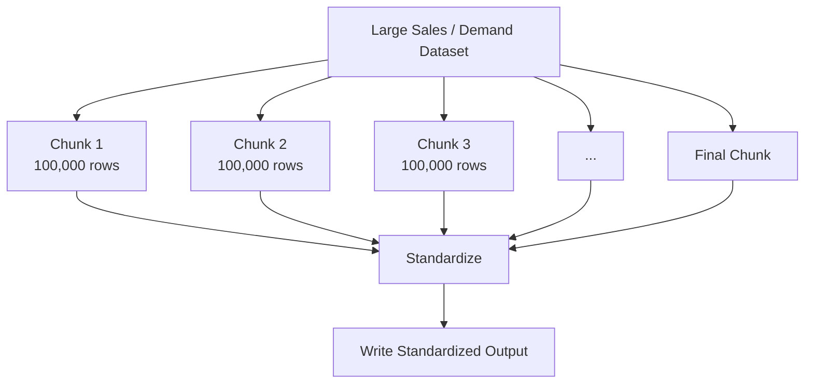
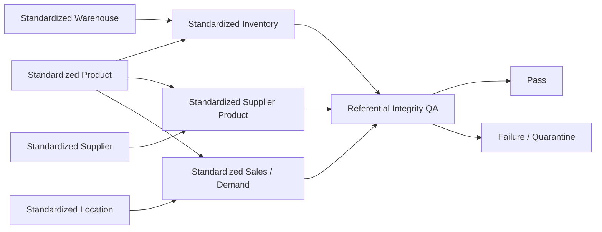
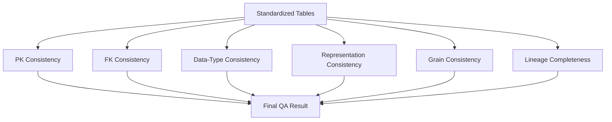
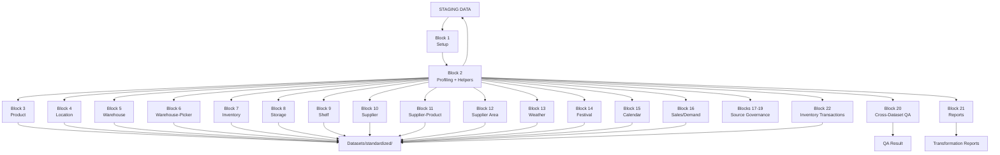

# Data Standardization Layer README

## 1. What is Data Standardization?

**Data Standardization** is the process of making the data representation **consistent and uniform across datasets** after the data has already passed through the staging layer.

In this project:

```text
STAGING
    ↓
Technically valid data
    ↓
STANDARDIZATION
    ↓
Uniform business representation
```

The staging layer answers:

> **"Is the record technically valid?"**

The standardization layer answers:

> **"Is the same kind of value represented consistently everywhere?"**

### Simple Example

Suppose two staged datasets contain the same supplier:

```text
Supplier Master:
" SUP001 "

Supplier Product Catalog:
"SUP001"
```

Both values may already be technically valid, but their formatting is inconsistent.

Standardization converts them to:

```text
SUP001
SUP001
```

The important point is:

> **Standardization changes representation, not business meaning.**

---

# 2. What Does Standardization Do?

The standardization layer performs the following major activities:



---

# 3. Standardization vs Staging

These two stages are related, but they have different purposes.

| Stage | Main Question | Example |
|---|---|---|
| Staging | Is the data technically valid? | Is `product_id` present and unique? |
| Standardization | Is the representation consistent? | Are prices stored as `1250.50` everywhere? |

### Example

Raw/staged values:

```text
" Rice "
"  Rice"
"Rice  "
```

Standardized:

```text
"Rice"
"Rice"
"Rice"
```

Another example:

```text
YES
1
true
```

Standardized:

```text
True
True
True
```

---

# 4. Main Principle

The central rule of this layer is:

```text
Technically Valid Staged Data
            ↓
Consistent Representation
            ↓
Standardized Data
```

The standardization layer **does not**:

```text
✗ Change product IDs
✗ Invent missing business values
✗ Generate synthetic business records
✗ Create ML features
✗ Generate forecasts
✗ Perform optimization
✗ Generate agent decisions
✗ Change the business meaning of a record
```

---

# 5. Input and Output

### Input

```text
Datasets/staging/
```

Example:

```text
Datasets/staging/stg_product_master.csv
Datasets/staging/stg_inventory_position.csv
Datasets/staging/stg_sales_demand.csv
```

### Output

```text
Datasets/standardized/
```

Example:

```text
Datasets/standardized/std_product_master.csv
Datasets/standardized/std_inventory_position.csv
Datasets/standardized/std_sales_demand.csv
```

Additional outputs:

```text
Datasets/quarantine/
Datasets/reports/
```

---

# 6. Standardization Pipeline



---

# 7. Important Terms

This section explains the terminology used in the notebook.

---

# 8. Uniform Representation

### Meaning

A **uniform representation** means the same type of value is stored in the same format across the system.

### Example

Before:

```text
Rs 1,250
₹1250.5
1250.50
INR 1,250.50
```

After:

```text
1250.50
1250.50
1250.50
1250.50
```

The value has not been intentionally changed in business meaning.

Only its representation has been made consistent.

---

# 9. Canonical Representation

### Meaning

A **canonical representation** is the single agreed format used by the project.

For example:

```text
Date:
YYYY-MM-DD

Time:
HH:MM:SS

Currency:
2 decimal places

Boolean:
True / False
```

### Example

Instead of allowing:

```text
31/08/2026
08/31/2026
2026.08.31
```

the standardized representation is:

```text
2026-08-31
```

---

# 10. Text Harmonization

### Meaning

Text harmonization makes text values consistent by removing unnecessary formatting differences.

The notebook's text helper:

```text
clean_text_val()
```

performs operations such as:

- removing leading spaces
- removing trailing spaces
- collapsing repeated internal spaces
- preserving natural punctuation

### Example 1

Before:

```text
"   Basmati    Rice   "
```

After:

```text
"Basmati Rice"
```

### Example 2

Before:

```text
"Kolkata     South"
```

After:

```text
"Kolkata South"
```

---

# 11. Why Text Harmonization Matters

Without harmonization, these could be treated as different strings:

```text
Rice
 Rice
Rice 
Ri ce
```

Standardization removes formatting differences that should not represent different business values.

### Example

```text
Supplier Name

" ABC Foods "
"ABC Foods"
"ABC   Foods"
```

Standardized:

```text
"ABC Foods"
```

---

# 12. Identifier Preservation

### Meaning

Identifiers are different from ordinary descriptive text.

The notebook uses:

```text
clean_identifier_val()
```

to remove surrounding whitespace **without changing the actual identifier characters**.

### Example

Before:

```text
" WH-KOL-001 "
```

After:

```text
"WH-KOL-001"
```

The value:

```text
WH-KOL-001
```

must not be changed to:

```text
WH-001
WH001
WH-KOL-01
```

because those could represent different identifiers.

### Rule

> Clean the formatting of an ID, but preserve the ID itself.

---

# 13. Natural Key

### Meaning

A **natural key** is an identifier supplied by the business/source system.

Examples in the project:

```text
product_id
location_id
warehouse_id
supplier_id
picker_id
```

### Example

```text
product_id = DAI-001
```

The standardization process trims whitespace but does not replace the identifier with a newly invented value.

---

# 14. Numeric Standardization

### Meaning

Numeric standardization ensures quantities, costs, prices, and other numeric values use consistent numeric types and precision.

The notebook uses:

```text
standardize_numeric_str(val, decimals)
```

### Example — Currency

Before:

```text
₹1,250
Rs 1250.5
INR 1,250.50
```

After:

```text
1250.00
1250.50
1250.50
```

### Example — Units

Before:

```text
"1,000"
"1000"
```

After:

```text
1000
1000
```

---

# 15. Currency Precision

### Meaning

Prices are standardized to **two decimal places**.

### Example

```text
1250
```

becomes:

```text
1250.00
```

And:

```text
1250.5
```

becomes:

```text
1250.50
```

The project uses INR monetary representation with:

```text
DECIMAL(..., 2)
```

---

# 16. Integer Standardization

Physical quantities are represented as integers where the source field represents whole units.

### Example

Before:

```text
"1000"
"1,000"
1000.0
```

After:

```text
1000
1000
1000
```

Example fields include:

```text
current_stock_units
received_units
dispatch_capacity
vehicle_count
sold_units
```

---

# 17. Boolean Convergence

### Meaning

Different datasets may represent the same TRUE/FALSE meaning in different ways.

The notebook uses:

```text
standardize_boolean_val()
```

### TRUE Values

The helper recognizes forms such as:

```text
true
1
yes
y
t
```

and converts them to:

```text
True
```

### FALSE Values

Forms such as:

```text
false
0
no
n
f
```

become:

```text
False
```

---

# 18. Boolean Example

Before:

```text
reorder_flag

YES
1
true
Y
```

After:

```text
True
True
True
True
```

Another dataset may contain:

```text
FALSE
0
no
N
```

After:

```text
False
False
False
False
```

This allows downstream systems to interpret boolean fields consistently.

---

# 19. Temporal Normalization

### Meaning

**Temporal normalization** makes dates and time values follow a single agreed format.

The notebook uses:

```text
Date  → YYYY-MM-DD
Time  → HH:MM:SS
```

---

# 20. Date Example

Before:

```text
31/08/2026
08-31-2026
2026/08/31
```

Standardized:

```text
2026-08-31
```

This prevents ambiguity between:

```text
DD/MM/YYYY
MM/DD/YYYY
YYYY/MM/DD
```

---

# 21. Time Example

Before:

```text
9:00
09:00
9 AM
```

Standardized:

```text
09:00:00
```

The project uses this representation for warehouse operating windows.

---

# 22. Timestamp

### Meaning

A timestamp stores both date and time, including timezone information where applicable.

Example:

```text
2026-09-28T23:45:10+05:30
```

This is used for standardization lineage.

---

# 23. Coordinate Standardization

Geographical coordinates are standardized to six decimal places.

### Example

Before:

```text
22.572645123
88.363892987
```

After:

```text
22.572645
88.363893
```

The purpose is consistent representation, not changing the location to another place.

---

# 24. Coordinate Example — Warehouse

Before:

```text
warehouse_id = WH-KOL-001
latitude      = 22.512345678
longitude     = 88.356789321
```

After:

```text
warehouse_id = WH-KOL-001
latitude      = 22.512346
longitude     = 88.356789
```

---

# 25. Grain

## What is Grain?

**Grain means what exactly one row represents.**

This is important in standardization because formatting changes should not change the row meaning.

### Example

Product Master:

```text
1 row = 1 product
```

Sales:

```text
1 row = 1 region × 1 product × 1 week
```

Inventory:

```text
1 row = 1 warehouse × 1 product × 1 snapshot date
```

---

# 26. Grain Example — Product

Product dataset:

```text
product_id = DAI-001
```

One row represents:

```text
One Product
```

Standardization can change:

```text
" DAI-001 "
```

to:

```text
"DAI-001"
```

but the row still represents:

```text
One Product
```

The grain has not changed.

---

# 27. Grain Example — Warehouse Picker

Warehouse-picker dataset:

```text
1 row = 1 warehouse × 1 picker
```

Example:

```text
WH-KOL-001 × PKR-001
WH-KOL-001 × PKR-002
WH-KOL-002 × PKR-051
```

Standardization trims IDs but keeps the same warehouse-picker relationship.

---

# 28. Grain Example — Inventory

Inventory:

```text
1 row = 1 warehouse × 1 product × 1 snapshot date
```

Example:

```text
WH-KOL-001 × DAI-001 × 2026-08-31
```

Standardization may change:

```text
31/08/2026
```

to:

```text
2026-08-31
```

but the record still represents the same inventory snapshot.

---

# 29. Grain Example — Supplier Product

Supplier-product catalog:

```text
1 row = 1 supplier × 1 product
```

Example:

```text
SUP001 × DAI-001
```

Standardization can clean:

```text
" SUP001 "
```

to:

```text
"SUP001"
```

without changing the relationship.

---

# 30. Grain Example — Weather

Weather:

```text
1 row = 1 weekly weather observation
```

Example:

```text
W050
```

Standardization may convert:

```text
31/08/2025
```

to:

```text
2025-08-31
```

but the row remains one weekly observation.

---

# 31. Grain Example — Festival

Festival calendar:

```text
1 row = 1 festival occurrence
```

Example:

```text
Durga Puja + 2025-10-01
```

Standardization can clean the event name and date while preserving the occurrence.

---

# 32. Grain Example — Sales / Demand

Sales:

```text
1 row = 1 region × 1 product × 1 week
```

Example:

```text
KOL-LOC-005 × DAI-001 × W050
```

Standardization may convert:

```text
" KOL-LOC-005 "
```

to:

```text
KOL-LOC-005
```

without creating another sales record.

---

# 33. Cardinality

### Meaning

**Cardinality describes the relationship between records.**

Example:

```text
1 Warehouse → 50 Pickers
```

The notebook explicitly validates the warehouse-picker relationship.

For 15 warehouses:

```text
15 × 50 = 750 pickers
```

Example:

```text
WH-KOL-001
    ├── PKR-001
    ├── PKR-002
    ├── ...
    └── PKR-050
```

---

# 34. Lineage

### Meaning

**Lineage tells us where the standardized record came from.**

The standardization layer preserves:

```text
source_file
source_row_number
ingestion_timestamp
record_hash
```

It also adds:

```text
standardization_timestamp
standardization_rule_version
```

---

# 35. Lineage Example

Suppose a standardized record contains:

```text
product_id = DAI-001
```

Its metadata may show:

```text
source_file = product_master.csv
source_row_number = 152
ingestion_timestamp = 2026-09-28T23:45:10+05:30
record_hash = <SHA-256>
standardization_timestamp = 2026-09-29T00:05:22+05:30
standardization_rule_version = v1.0
```

This makes the transformation traceable.

---

# 36. Rule Versioning

### Meaning

A **standardization rule version** identifies which set of rules was used.

The notebook uses:

```text
standardization_rule_version = v1.0
```

### Example

```text
v1.0
```

means the record was standardized using version 1.0 of the project's defined standardization rules.

This becomes important if the rules change later.

---

# 37. Standardization Timestamp

### Meaning

This records when the standardization operation occurred.

Example:

```text
standardization_timestamp =
2026-09-29T00:05:22+05:30
```

This helps establish an audit trail.

---

# 38. Audit Logging

### Meaning

The standardization process records what transformations were applied and how many records were affected.

Example:

```text
dataset = std_product_master
column = product_name
rule = whitespace_normalization
affected_rows = 84
```

Another example:

```text
dataset = std_inventory_position
column = reorder_flag
rule = boolean_convergence
affected_rows = 210
```

This allows the transformation to be audited.

---

# 39. Transformation Log

A transformation log can conceptually contain:

| Dataset | Column | Rule | Affected Rows |
|---|---|---|---:|
| Product Master | product_name | Text normalization | 84 |
| Product Master | cp_1_rs | Currency precision | 200 |
| Warehouse Master | capacity_units | Integer conversion | 15 |
| Inventory | reorder_flag | Boolean conversion | 210 |
| Weather | rainfall_mm | Decimal precision | 105 |

The exact counts depend on the executed dataset.

---

# 40. Rule: Do Not Change Business Meaning

Suppose:

```text
supplier_id = SUP001
```

Standardization can do:

```text
" SUP001 " → "SUP001"
```

but should not do:

```text
SUP001 → SUP002
```

because that changes the identity of the supplier.

---

# 41. Rule: Do Not Invent Missing Values

Suppose:

```text
lead_time_days = NULL
```

Standardization should not automatically change it to:

```text
3
```

unless the source itself supports that value under an explicitly defined rule.

The standardization layer focuses on representation, not guessing business values.

---

# 42. Rule: No Feature Engineering

Example:

Existing source fields:

```text
temperature
rainfall
humidity
```

Standardization may format them consistently.

It does **not** create:

```text
heavy_rain_flag
rainfall_7_day_average
temperature_anomaly
```

Those are derived features and belong to a later stage.

---

# 43. Rule: No Forecasting

Suppose sales data contains:

```text
units_sold = 100
```

Standardization does not create:

```text
forecast = 125
```

It only ensures the existing value is represented consistently.

---

# 44. Rule: No Synthetic Record Creation

Standardization should not create a new business record just because a dataset has missing combinations.

For example:

```text
SUP001 × P001
SUP001 × P002
```

does not justify inventing:

```text
SUP001 × P003
```

unless that relationship exists in the source or in an explicitly governed source dataset.

---

# 45. Synthetic Provenance

The notebook contains a standardized inventory transaction dataset whose records are explicitly marked:

```text
RECONSTRUCTED_SYNTHETIC
```

This label must remain unchanged.

### Example

Before:

```text
record_status = RECONSTRUCTED_SYNTHETIC
source_basis = inventory movement reconstruction
```

After:

```text
record_status = RECONSTRUCTED_SYNTHETIC
source_basis = inventory movement reconstruction
```

Only the representation is standardized.

The provenance is not removed.

---

# 46. Uppercase Controlled Vocabulary

For the synthetic inventory transaction dataset, some controlled fields are explicitly converted to uppercase.

Examples:

```text
out → OUT
Out → OUT
OUT → OUT
```

Likewise:

```text
reconstructed_synthetic
Reconstructed_Synthetic
RECONSTRUCTED_SYNTHETIC
```

becomes:

```text
RECONSTRUCTED_SYNTHETIC
```

---

# 47. Chunked Streaming

### Meaning

**Chunked streaming** means processing a large dataset in smaller portions rather than loading the complete dataset into memory at once.

The Sales/Demand standardization block uses:

```text
100,000 rows per chunk
```

### Example

Instead of:

```text
1,112,000 rows
      ↓
Load everything into RAM
```

the process is:

```text
100,000 rows
      ↓
Standardize
      ↓
Write to disk

100,000 rows
      ↓
Standardize
      ↓
Write to disk

...

Remaining rows
      ↓
Standardize
      ↓
Write to disk
```

---

# 48. Why Chunked Streaming is Used

The Sales/Demand dataset is very large.

The notebook notes that the dataset is over **500 MB**, so loading the complete dataset at once can cause an Out-Of-Memory problem.

Chunking reduces memory pressure.

---

# 49. Chunked Streaming Visualization



---

# 50. Primary Key Preservation

Standardization must preserve key identity.

### Product

```text
product_id
```

Example:

```text
DAI-001
```

### Location

```text
location_id
```

Example:

```text
KOL-LOC-001
```

### Warehouse

```text
warehouse_id
```

Example:

```text
WH-KOL-001
```

### Supplier

```text
supplier_id
```

Example:

```text
SUP001
```

The values can be trimmed, but the identifiers themselves are not redesigned.

---

# 51. Foreign-Key Consistency

Standardized datasets must continue to reference valid master records.

Example:

```text
Inventory
warehouse_id = WH-KOL-001
```

must still resolve to:

```text
Warehouse Master
warehouse_id = WH-KOL-001
```

Another example:

```text
Supplier Product
product_id = DAI-001
```

must still resolve to:

```text
Product Master
product_id = DAI-001
```

---

# 52. Cross-Dataset Standardization QA

The final QA stage performs cross-dataset foreign-key audits.



---

# 53. Example — Cross-Dataset QA

Inventory record:

```text
warehouse_id = WH-KOL-001
product_id   = DAI-001
```

QA checks:

```text
WH-KOL-001 exists?
        ↓
YES

DAI-001 exists?
        ↓
YES
```

Result:

```text
PASS
```

If:

```text
product_id = XYZ-999
```

and it does not exist in Product Master:

```text
FAIL
```

---

# 54. Dataset-by-Dataset Standardization

The notebook standardizes the following major datasets:

```text
1.  Product Master
2.  Location Master
3.  Warehouse Master
4.  Warehouse-Picker Mapping
5.  Inventory Position
6.  Storage Assignment
7.  Shelf Master
8.  Supplier Master
9.  Supplier-Product Catalog
10. Supplier Area Options
11. Weather Weekly
12. Festival Calendar
13. Calendar Week
14. Sales / Demand
15. Inventory Transactions
```

---

# 55. Product Master Standardization

### Grain

```text
1 row = 1 product
```

### Main rules

```text
product_id → trim only
product_name → text harmonization
category_name → text harmonization
brand → text harmonization
quality_level → text harmonization
unit_type → text harmonization
prices → 2 decimal places
```

### Example

Before:

```text
product_id = " DAI-001 "
product_name = " Full   Cream Milk "
cp_1_rs = "₹65"
sp_1_rs = "Rs 72.5"
```

After:

```text
product_id = "DAI-001"
product_name = "Full Cream Milk"
cp_1_rs = 65.00
sp_1_rs = 72.50
```

---

# 56. Location Master Standardization

### Grain

```text
1 row = 1 location
```

### Main rules

```text
location_id → trim
region name → text harmonization
city → canonical "Kolkata"
```

### Example

Before:

```text
location_id = " KOL-LOC-001 "
city = " Kolkata "
region = "Lake   Gardens"
```

After:

```text
location_id = "KOL-LOC-001"
city = "Kolkata"
region = "Lake Gardens"
```

---

# 57. Warehouse Master Standardization

### Grain

```text
1 row = 1 warehouse
```

### Main rules

```text
warehouse_id → preserve
capacity → integer
dispatch capacity → integer
vehicle counts → integer
operating hours → HH:MM:SS
```

### Example

Before:

```text
warehouse_id = " WH-KOL-001 "
capacity = "50000"
opening_time = "9:00"
```

After:

```text
warehouse_id = "WH-KOL-001"
capacity = 50000
opening_time = "09:00:00"
```

---

# 58. Warehouse-Picker Standardization

### Grain

```text
1 row = 1 warehouse × 1 picker
```

### Main rules

```text
warehouse_id → trim
picker_id → trim
1:50 warehouse-picker relationship → verify
```

### Example

Before:

```text
warehouse_id = " WH-KOL-001 "
picker_id = " PKR-001 "
```

After:

```text
warehouse_id = "WH-KOL-001"
picker_id = "PKR-001"
```

Relationship remains unchanged.

---

# 59. Inventory Position Standardization

### Grain

```text
1 row = 1 warehouse × 1 product × 1 snapshot date
```

### Main rules

```text
stock quantities → integer
monetary values → 2 decimals
reorder_flag → boolean
snapshot_date → YYYY-MM-DD
```

### Example

Before:

```text
warehouse_id = "WH-KOL-001"
product_id = "DAI-001"
current_stock_units = "500"
reorder_flag = "YES"
snapshot_date = "31/08/2026"
```

After:

```text
warehouse_id = "WH-KOL-001"
product_id = "DAI-001"
current_stock_units = 500
reorder_flag = True
snapshot_date = "2026-08-31"
```

---

# 60. Storage Assignment Standardization

### Grain

```text
1 row = 1 warehouse × 1 product storage assignment
```

### Standardized fields

```text
shelf_id
bin_id
zone_id
rack_id
slot_no
```

are whitespace-normalized.

`slot_capacity_units` is standardized as an integer.

### Example

Before:

```text
shelf_id = " SHELF-01 "
bin_id = " BIN-03 "
slot_capacity_units = "100"
```

After:

```text
shelf_id = "SHELF-01"
bin_id = "BIN-03"
slot_capacity_units = 100
```

---

# 61. Shelf Master Standardization

### Grain

```text
1 row = 1 shelf
```

### Main rules

```text
capacity → integer
used units → integer
free units → integer
utilization percentage → 2 decimal places
```

### Example

Before:

```text
capacity_units = "1000"
used_units = "850"
utilization = "85"
```

After:

```text
capacity_units = 1000
used_units = 850
utilization = 85.00
```

---

# 62. Supplier Master Standardization

### Grain

```text
1 row = 1 supplier
```

### Main rules

```text
supplier_id → trim
supplier_type_id → trim
location_id → trim
coordinates → 6 decimal places
MOQ → integer
maximum shipment → integer
lead_time_days → integer
```

### Example

Before:

```text
supplier_id = " SUP001 "
latitude = 22.572645123
longitude = 88.363892987
lead_time_days = "3"
```

After:

```text
supplier_id = "SUP001"
latitude = 22.572645
longitude = 88.363893
lead_time_days = 3
```

---

# 63. Supplier-Product Catalog Standardization

### Grain

```text
1 row = 1 supplier × 1 product
```

### Main rules

```text
supplier_product_key → trim
supplier_id → trim
product_supplied_id → trim
prices → 2 decimal places
```

### Example

Before:

```text
supplier_product_key = " SUP001-P001 "
supplier_cost = "₹1250.5"
```

After:

```text
supplier_product_key = "SUP001-P001"
supplier_cost = 1250.50
```

---

# 64. Supplier Area Options Verification

This block verifies standardized supplier geographical service options and servicing radii.

Typical values include:

```text
supplier_id
location_id
latitude
longitude
distance / service radius
supplier option rank
service availability
```

### Example

Before:

```text
supplier_id = " SUP001 "
location_id = " KOL-LOC-005 "
service_available_flag = "YES"
```

After:

```text
supplier_id = "SUP001"
location_id = "KOL-LOC-005"
service_available_flag = True
```

---

# 65. Weather Weekly Standardization

### Grain

```text
1 row = 1 weekly weather observation
```

### Main rules

```text
week_start_date → YYYY-MM-DD
week_end_date → YYYY-MM-DD
temperature → 2 decimals
rainfall → 2 decimals
```

### Example

Before:

```text
week_start_date = "01/08/2025"
temperature_c = "31"
rainfall_mm = "52.5"
```

After:

```text
week_start_date = "2025-08-01"
temperature_c = 31.00
rainfall_mm = 52.50
```

---

# 66. Festival Calendar Standardization

### Grain

```text
1 row = 1 festival occurrence
```

### Main rules

```text
festival_event → text normalization
year → normalized representation
event_date → YYYY-MM-DD
```

### Example

Before:

```text
festival_event = " Durga   Puja "
event_date = "01/10/2025"
```

After:

```text
festival_event = "Durga Puja"
event_date = "2025-10-01"
```

---

# 67. Calendar Week Standardization

### Grain

```text
1 row = 1 calendar week
```

### Main rules

```text
week_id → verify W001 ... W139
week_number → integer
month → integer
quarter → integer
year → integer
```

### Example

Before:

```text
week_id = "W050"
week_number = "50"
month = "8"
quarter = "3"
year = "2025"
```

After:

```text
week_id = "W050"
week_number = 50
month = 8
quarter = 3
year = 2025
```

---

# 68. Sales / Demand Standardization

### Grain

```text
1 row = 1 region × 1 product × 1 week
```

### Main rules

```text
text fields → text harmonization
IDs → trim and preserve
units → numeric normalization
prices → 2 decimals
boolean fields → True/False
dates → ISO format
```

### Important Implementation Detail

The notebook processes the large sales/demand dataset in:

```text
100,000-row chunks
```

to avoid memory problems.

---

# 69. Sales Example

Before:

```text
region_id = " KOL-LOC-005 "
product_id = " DAI-001 "
units_sold = "1,250"
avg_selling_price = "₹72.5"
promotion_flag = "YES"
week_start_date = "04/08/2025"
```

After:

```text
region_id = "KOL-LOC-005"
product_id = "DAI-001"
units_sold = 1250
avg_selling_price = 72.50
promotion_flag = True
week_start_date = "2025-08-04"
```

The row still represents:

```text
KOL-LOC-005 × DAI-001 × that week
```

---

# 70. Inventory Transactions Standardization

The notebook also standardizes the reconstructed inventory transaction dataset.

### Grain

```text
1 row = 1 warehouse × 1 product × 1 week
```

### Main rules

| Rule | Example |
|---|---|
| Whitespace normalization | `" SUP001 "` → `"SUP001"` |
| Uppercase controlled values | `"out"` → `"OUT"` |
| Date formatting | `31/08/2026` → `2026-08-31` |
| Integer typing | `"100"` → `100` |
| Provenance preservation | `RECONSTRUCTED_SYNTHETIC` remains unchanged |
| Rule versioning | add `v1.0` |

---

# 71. Synthetic Transaction Example

Before:

```text
transaction_type = "sale"
direction = "out"
sold_units = "100"
record_status = "reconstructed_synthetic"
```

After:

```text
transaction_type = "SALE"
direction = "OUT"
sold_units = 100
record_status = "RECONSTRUCTED_SYNTHETIC"
```

The representation changed.

The provenance did not.

---

# 72. Missing Source Verification

The notebook performs a governance audit for datasets that do not have authoritative primary raw files.

The documented deferred datasets are:

```text
Vehicle Master → DEFERRED
Order Data    → DEFERRED
```

The rule is:

> Do not fabricate source data merely to complete the pipeline.

---

# 73. Missing Source Example

Suppose:

```text
vehicle_master
```

does not have an authoritative raw source.

The system does not create:

```text
VEH001
VEH002
VEH003
```

and claim they came from the raw source.

Instead:

```text
Status = DEFERRED
```

The absence is explicitly documented.

---

# 74. Quarantine

### Meaning

Records that fail standardization-related validation are separated from valid standardized records.

Example:

```text
Input:
humidity_pct = "150"
```

If the applicable validation rule rejects this value:

```text
Standardized Dataset
    ↓
Valid Records

Quarantine
    ↓
Invalid Record
```

The problematic record is not silently discarded.

---

# 75. Standardization Quarantine Example

Suppose a controlled boolean field contains:

```text
reorder_flag = "maybe"
```

This is not a recognized boolean representation.

The record can be placed into quarantine with a reason such as:

```text
INVALID_BOOLEAN_REPRESENTATION
```

---

# 76. Final Standardization QA

The final QA stage checks whether standardization preserved the structural relationships.



---

# 77. Final Standardization Report

The notebook generates:

- standardization audit information
- transformation-rule logs
- affected record counts
- lineage information
- QA results

Reports are stored under:

```text
Datasets/reports/
```

---

# 78. Complete Standardization Workflow



---

# 79. Standardization Principles Summary

```text
1. Preserve raw data.
2. Preserve staged data.
3. Standardize representation.
4. Preserve source identifiers.
5. Preserve business meaning.
6. Standardize numeric precision.
7. Standardize boolean representation.
8. Standardize dates and times.
9. Preserve source lineage.
10. Version the rules.
11. Log transformations.
12. Preserve grain.
13. Preserve cardinality.
14. Validate cross-dataset references.
15. Quarantine invalid records.
16. Do not fabricate missing source data.
17. Preserve synthetic provenance.
18. Do not perform ML or business optimization here.
```

---

# 80. Final Mental Model

The easiest way to remember the standardization layer is:

```text
STAGED DATA
     ↓
"What format is each value using?"
     ↓
"Can the same value look different in another dataset?"
     ↓
"Make the representation consistent"
     ↓
"Keep IDs and business meaning unchanged"
     ↓
"Record what was changed"
     ↓
"Run cross-dataset QA"
     ↓
STANDARDIZED DATA
```

---

# 81. One-Line Definition

> **Data Standardization is the controlled process of converting technically valid staged data into a consistent and uniform representation while preserving identifiers, business meaning, source lineage, record grain, and provenance.**


# 82. Notebook Reference — `02_data_standardization.ipynb`

This README is intentionally written as a documentation layer around the implemented **Layer 2 — Data Standardization Pipeline** in `02_data_standardization.ipynb`. The explanations and examples above are supplemented here with direct references to the notebook's named blocks, helper functions, implementation rules, and executed outputs.

## 82.1 Notebook-Level Reference

The notebook defines the standardization pipeline as:

```text
Datasets/staging/stg_*.csv
        ↓
Text Harmonization
        ↓
Identifier Preservation
        ↓
Numeric Standardization
        ↓
Boolean Convergence
        ↓
Temporal Normalization
        ↓
Lineage Embedding
        ↓
Datasets/standardized/std_*.csv
        ↓
Cross-Dataset QA
        ↓
Datasets/reports/
```

This is the core implementation framing used in the notebook.

## 82.2 Notebook Block Reference Map

| Notebook Block | Topic | Reference from the Notebook |
|---|---|---|
| Block 1 | Setup | Creates `STAGING_DIR`, `STANDARDIZED_DIR`, `QUARANTINE_DIR`, and `REPORTS_DIR`; initializes timestamp and rule version `v1.0` |
| Block 2 | Profiling & Helpers | Defines `clean_text_val()`, `clean_identifier_val()`, `standardize_boolean_val()`, and `standardize_numeric_str()` |
| Block 3 | Product Master | Preserves `product_id`, normalizes descriptive text, and standardizes all price fields to 2 decimals |
| Block 4 | Location Master | Cleans `location_id`, harmonizes region text, and normalizes city representation to `Kolkata` |
| Block 5 | Warehouse Master | Preserves `WH-KOL-###`, casts capacity/fleet values to integers, and standardizes operating hours to `HH:MM:SS` |
| Block 6 | Warehouse-Picker | Trims IDs and validates the documented 1:50 warehouse-to-picker cardinality |
| Block 7 | Inventory Position | Normalizes stock quantities, monetary values, `reorder_flag`, and `snapshot_date` |
| Block 8 | Storage Assignment | Normalizes `shelf_id`, `bin_id`, `zone_id`, `rack_id`, `slot_no`, and slot capacity |
| Block 9 | Shelf Master | Standardizes capacity/used/free quantities and utilization percentage |
| Block 10 | Supplier Master | Cleans supplier/location identifiers, rounds coordinates to 6 decimals, and normalizes order constraints and lead time |
| Block 11 | Supplier-Product Catalog | Cleans supplier/product identifiers and standardizes prices to 2 decimals |
| Block 12 | Supplier Area Options | Performs supplier geographic service-option verification |
| Block 13 | Weather | Uses ISO dates and 2-decimal precision for temperature/rainfall |
| Block 14 | Festival Calendar | Normalizes festival name/year and ISO event dates |
| Block 15 | Calendar Week | Verifies `W001`–`W139` and casts week/month/quarter/year to integers |
| Block 16 | Sales / Demand | Uses chunked streaming with **100,000-row chunks** for the large transactional dataset |
| Blocks 17–19 | Missing Source Governance | Audits datasets without authoritative primary source files and records `NOT_AVAILABLE` rather than fabricating data |
| Block 20 | Cross-Dataset QA | Performs referential-integrity checks across standardized datasets |
| Block 21 | Final Report & Logs | Produces the standardization manifest, transformation log, and audit outputs in `Datasets/reports/` |
| Block 22 | Inventory Transactions | Standardizes the reconstructed transaction dataset while preserving `RECONSTRUCTED_SYNTHETIC` provenance |

## 82.3 Notebook Helper-Function Reference

### `clean_text_val(val)`

The notebook describes this helper as the standard text-cleaning function. It strips leading/trailing blanks, collapses repeated internal spaces, and preserves natural punctuation.

Example from the implemented rule:

```text
"   Amul   Vanilla   Ice Cream   "
                    ↓
"Amul Vanilla Ice Cream"
```

### `clean_identifier_val(val)`

The notebook explicitly distinguishes identifiers from ordinary text. The helper trims surrounding whitespace while preserving identifier characters.

Example:

```text
" WH-KOL-001 "
       ↓
"WH-KOL-001"
```

### `standardize_boolean_val(val)`

The notebook maps recognized boolean representations to canonical values.

```text
TRUE INPUTS                     FALSE INPUTS
true / 1 / yes / y / t         false / 0 / no / n / f
        ↓                               ↓
      True                            False
```

### `standardize_numeric_str(val, decimals)`

The notebook uses this helper to remove currency symbols, normalize comma formatting, and apply explicit decimal precision.

Example:

```text
"₹1,250.5"
      ↓
1250.50
```

## 82.4 Executed Notebook Evidence

The notebook contains executed outputs that can be used as implementation evidence. Selected examples are recorded here.

### Block 1 — Setup

The executed setup output records:

```text
STANDARDIZATION_RULE_VERSION = v1.0
```

It also verifies the staging, standardized, quarantine, and reports directories.

### Block 2 — Profiling

The executed profile output reports the staged dataset inventory before transformations. The notebook display is labeled:

```text
[BLOCK 2] Staged Datasets Profile Inventory
```

### Block 3 — Product Master

The executed output records:

```text
Input Staging Records        = 200
Standardized Output Records  = 200
Quarantined Records          = 0
Unique Products              = 200
Product Categories           = 20
Unique Brands                = 98
Currency Precision           = 2 Decimal Places (INR)
Standardization Status       = PASSED
```

A notebook preview also shows standardized product IDs, names, categories, brands, sizes, prices, and `standardization_rule_version = v1.0`.

### Block 16 — Sales / Demand

The notebook documents the sales/demand dataset as **1,112,000 weekly records** and explains that the large dataset is processed in **100,000-row chunks** to avoid out-of-memory failures.

The documented business grain is:

```text
139 weeks × 40 regions × 200 products
```

### Block 22 — Inventory Transactions

The notebook explicitly states that reconstructed inventory transaction records preserve:

```text
record_status = RECONSTRUCTED_SYNTHETIC
```

The block also applies uppercase controlled vocabulary, ISO date formatting, integer typing for `sold_units`, and `standardization_version = v1.0`.

## 82.5 How to Use the Notebook Reference

When reviewing the implementation, use this README together with the notebook:

```text
README
  ↓
Understand the concept and terminology
  ↓
Notebook Block Number
  ↓
Inspect the actual code and executed output
  ↓
Verify the transformation rule
  ↓
Verify the resulting standardized dataset
```

The notebook remains the implementation source of truth for the exact code and executed results, while this README explains the concepts, terminology, rules, and examples in a documentation-friendly format.
